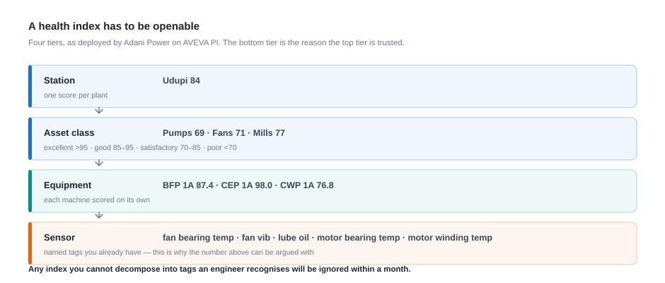

## Chapter 11 — What Other Generators Have Actually Done

### 11.1 Why this chapter exists

The commonest objection to plant AI in an Indian state generating company is not technical but social, and comes in three forms. **"That is something other people do"** — it belongs to companies with different balance sheets. **"Their plants are not like ours"** — American, private, greenfield, irrelevant to a 1979-vintage 210 MW machine at Eklahare. **"It is marketing"** — the brochure numbers are not real.

On the third the sceptic is largely right: most of what circulates as "AI success in power generation" is a press release, an MoU, a contract value, or a percentage with no plant name. On the first two he is wrong, because the one well-documented case — Vistra — is a fleet of ageing coal units cycling hard in a market reshaped by renewables, which is where MAHAGENCO is heading.

#### The evidence standard used throughout

Claims are graded on what has been published and who published it, not on the quality of the organisation.

| Grade | Meaning |
|---|---|
| **A** | Named site, measured independently of the supplier, method published, sustained a year or more |
| **B** | Named site or fleet, self-reported by the operator or the consultant who built it, method not published |
| **C** | Named organisation, but a single event, a single year, or a vendor award submission |
| **D** | Capability described, no quantified benefit; or a benefit at an anonymous customer |
| **E** | Announcement, MoU, contract value or spend figure — an **input**, not a result |

**Nothing in this chapter reaches grade A.** The best our industry offers is grade B: a real operator, a real number, published by people who stood to gain from it being impressive. That is not a reason to do nothing — it is a reason to plan on the low end and distrust any figure quoted without a plant name.

Two rules follow. **An input is not a result**: a ₹125 crore contract is money spent, an MoU an intention. And **absence of published evidence is not absence of activity**: where nothing is published, this chapter says so.

---

### 11.2 The Indian picture

#### 11.2.1 The record, graded

| Organisation | Initiative | What it does | Partner | Published result | Grade |
|---|---|---|---|---|---|
| **NTPC** | NePPS (NETRA e-Power Plant Solutions) | AI operator advisory predicting equipment faults from sensor data | In-house: NETRA, Advanced Computing Center | **None published** | **D** |
| **Tata Power** | Enterprise data and AI platform, 16 GW+ portfolio, announced April 2026 | Seven use cases listed in 11.2.3, plus a "talk-to-data" agent (Databricks Genie) | Databricks | **None — an announcement. Thermal generation is not mentioned** | **E** |
| **Adani Electricity** — Mumbai **distribution**, *not* Adani Power generation | AspenTech deployment, February 2024 | Supports reliable supply to about 3 million customers | AspenTech | Deployment only; **no quantified benefit** | **D** |
| **Coal India** | Satellite dashboard (Jharia, Dhanbad); Integrated Command and Control Centres; "Digi Coal" platform | Monitors underground coal fires; over 500 AI-enabled cameras; 17 AI use cases | ISRO National Remote Sensing Centre (dashboard) | Capability and counts only | **D** |
| **SAIL, Bokaro Steel Plant** | AI-assisted stoichiometric optimisation | Air-to-fuel ratio optimisation | — | **₹3.23 crore a year; 1,500 t CO₂ avoided** | **B** |
| **SAIL** | Enterprise digital transformation agreement, 2025 | Enterprise programme | McKinsey & Company India | None | **E** |
| **NLC India** | MoU for AI, ML and digital transformation | Capability building | IIT Kanpur | None — MoU | **E** |
| **NPCIL** | MoU for AI solutions and operational efficiency | Capability building | IIT Bombay | None — MoU | **E** |
| **ONGC** | Pragya-AIX; three-year digital infrastructure agreement | Integrates over 26 AI applications | — | Application count only; **₹125 crore is a cost, not a saving** | **D / E** |
| **JSW Energy** and **Adani Power** thermal fleets | — | — | — | **No published quantified result found** | **—** |

One row is grade B. Every other Indian entry is a capability description, a deployment count, an announcement or a contract value — and for JSW Energy and Adani Power, nothing at all.

#### 11.2.2 Generation — NTPC and NePPS

NePPS is the nearest thing India has to plant AI built by a generator for generators: an AI operator advisory predicting equipment faults from sensor data, developed at NTPC's NETRA research centre and its Advanced Computing Center. No benefit figure is published — no heat rate, no availability, no avoided outage, no rupees.

The lesson has two halves. **Encouraging:** NTPC did not buy a foreign product and hope. It built a research centre, staffed it, gave it plant access, and developed a system in the vocabulary of Indian coal units burning Indian coal; a performance-and-analytics cell with protected time is the same idea at one-hundredth of the scale. **Warning:** the country's largest generator, with a dedicated research establishment, has still published no number. **If we do not decide in advance how benefit will be measured, and by whom, we will end up with a deployment and no number.**

#### 11.2.3 Transmission and distribution — Adani Electricity and Tata Power

**Adani Electricity.** An AspenTech deployment was reported in February 2024 supporting reliable supply to about three million customers. Be precise: this is the **Mumbai distribution business**, not Adani Power's generation fleet. The problems are network problems — load flow, outage management, restoration, reliability indices — not boiler problems. It says something real about analytics maturity in Indian utilities and nothing about heat rate; the commonest mis-citation in this area is quoting it inside a generation business case.

**Tata Power.** In April 2026 Tata Power announced a collaboration with Databricks for an enterprise-wide data and AI platform across a portfolio of over 16 GW. The seven named use cases are intelligent grid management, power planning and optimisation, billing and collection efficiency, renewable forecasting, solar manufacturing operations, customer experience, and a "talk-to-data" agent.

**Thermal generation is not mentioned in the announcement** — not as a use case, not as a pilot, not in passing. Seven use cases are named and the boiler is not one of them.

Say so plainly whenever it comes up, because it will be waved at every steering committee in the sector for two years. A well-run Indian private utility, given a clean sheet, pointed its first wave of AI at the grid, the customer and the renewables — use cases with cleaner data, faster feedback and no safety boundary. Thermal generation has messy data, slow feedback and a protection system you must never approach. It is the harder problem, which is why the evidence is thinner — and this is an announcement, not a result.

#### 11.2.4 Fuel — Coal India

Coal India's three initiatives are set out in the table above; no benefit figures are published for any of them. The shape is instructive — imagery for a slow spatial problem, cameras for a fast local one, a platform to hold the use cases together. Two of the three are computer vision; none is a physics model. Our own June 2026 fuel problems were GCV loss between loading and unloading of 619 to 941 kcal/kg and a Paras transit loss of 1.924 % against a 0.800 % norm — rake, wagon and stockyard problems, which yield to imagery, weighbridge data and sampling records, not to a turbine model. If Coal India is instrumenting the pit head, the counterpart is instrumenting the receipt end: rake-level reconciliation, stockyard ageing, a GCV soft sensor — none of which needs DCS access.

#### 11.2.5 Adjacent heavy industry — SAIL and ONGC

**SAIL, Bokaro Steel Plant** is the only quantified Indian result here: AI-assisted stoichiometric optimisation reported at **₹3.23 crore annual savings and 1,500 tonnes of CO₂ avoided**. SAIL also signed a 2025 enterprise digital transformation agreement with McKinsey & Company India.

Stoichiometric optimisation is combustion optimisation under another name — getting air-to-fuel right, continuously, against a varying fuel — the physics behind our "excess O₂, 1 % above optimum ≈ 10–15 kcal/kWh" sensitivity. Two cautions: it is self-reported with no published method, so grade B; and ₹3.23 crore is small in power-station terms, less than the monthly heat-rate gap value at Paras alone. Combustion optimisation returns a modest, real, recurring benefit, and anyone quoting a gain an order of magnitude larger should be asked why.

**ONGC** has Pragya-AIX, integrating over 26 AI applications, and a ₹125 crore three-year digital infrastructure agreement. Read those together. The ₹125 crore is **money spent**, not money saved: an input, routinely quoted as an achievement, but honest evidence of the foundation investment a large public-sector enterprise judged necessary before 26 applications could sit on top.

#### 11.2.6 The capability route — NLC India and NPCIL

NLC India has an MoU with IIT Kanpur for AI, machine learning and digital transformation; NPCIL has one with IIT Bombay for AI solutions and operational efficiency. Both are grade E, but the choice they represent is the choice we face:

| Route | What you buy | What you get quickly | What you are left with |
|---|---|---|---|
| **Procurement** | Licences, models, dashboards, support | A working system in months | Dependence; the vendor owns the tuning and the renewal leverage |
| **Capability** | Faculty and student time, joint projects, staff learning | Very little quickly | People who can read a residual, challenge a vendor and retrain a model |
| **Hybrid** | Vendor for the first equipment families, institution for capability, own staff on triage | A system plus a growing internal bench | The only route that survives the contract ending |

Two public-sector organisations in regulated environments much like ours chose the capability leg. Maharashtra has partners of the same calibre, and that leg is cheap, reversible and produces people rather than licences.

#### 11.2.7 The gap that has to be stated

**No published, quantified AI deployment result could be found for JSW Energy's or Adani Power's thermal generation fleets.**

Read that both ways. It does **not** mean nothing is happening — both are large, capable thermal operators, and absence of evidence is not evidence of absence. It means **nothing has been published**, and that is itself the finding. In an industry where every vendor publishes, the operators who run coal units mostly do not. The reasons are ordinary — commercial sensitivity, regulatory caution, the difficulty of proving a counterfactual — plus one less comfortable: you cannot publish a number you never measured.

So **do not benchmark against silence**, and expect to be a source of evidence rather than a consumer of it: measured properly, MAHAGENCO would hold one of very few published Indian thermal numbers in existence.

---

### 11.3 Vistra — the closest analogue to our problem

#### 11.3.1 What was done

Vistra, a large United States generator, deployed a heat-rate optimiser built by McKinsey and its analytics arm QuantumBlack: a multi-layered neural network issuing operating recommendations every 30 minutes.

| Stage | Scope | Result | Reported |
|---|---|---|---|
| **Pilot** | Martin Lake Power Plant, Rusk County, Texas | **2 % heat rate improvement over three months**; **US$ 4.5 million annual saving**; **340,000 t CO₂ abated annually**; model prediction accuracy **99 % or better** | August 2024 |
| **Fleet rollout** | **67 generating units at 26 plants** | **1 % average efficiency improvement**; **US$ 23 million total saving**; **1.6 million t CO₂ avoided per year** | August 2024 |

**Evidence grade B.** Named plant, named county, named fleet size, quantified in energy and money — but reported by the operator and the consultancy that built the system, with no independent verification, no published measurement standard and no published counterfactual. The best-evidenced case in the industry still does not reach grade A.

#### 11.3.2 What a heat-rate optimiser actually is

It is a statistical surrogate for the unit. A physical heat-balance model computes efficiency from first principles — enthalpies, flows, losses, PTC corrections — rigorously, slowly, and only with instrument quality most units cannot sustain hour by hour. An optimiser instead learns from the station's own history the relationship between **the controllables** — excess oxygen, mill combination and loading, burner tilt and secondary-air dampers, soot-blowing sequence, CW pump and cooling-tower fan combination, attemperation sprays — and **the outcome**, heat rate at the load, coal and ambient condition prevailing. It then searches that relationship: at this load, coal, ambient temperature and equipment condition, which setting combination gives the lowest heat rate subject to NOₓ limits, metal temperatures, mill outlet temperature, furnace exit gas temperature and flame stability?

Three consequences. **It knows no physics** — in a condition the unit has never run it may be confidently wrong. **It cannot recommend what history never contained** — it cannot beat the best hour the plant has had, only make the average hour resemble it. **It is an advisory, not a controller**: nothing writes to the DCS, and Chapter 7's boundary rule holds without exception.

#### 11.3.3 What "recommendations every 30 minutes" means on shift

Thirty minutes sits between two plant time constants: longer than a change in excess oxygen or mill bias needs to settle into a heat rate reading, shorter than the drift as slagging builds, ambient temperature moves and coal quality changes with the rake. Faster, and it chases noise and fights the load controller; slower, and it is a shift report.

| Interval | Per hour | Per 8-hour shift | Per day | Per year |
|---|---|---|---|---|
| Advisories per unit | 2 | 16 | 48 | 17,520 |

Across Vistra's 67 units that is roughly 3,200 a day. At Koradi, three 660 MW units means **144 a day** — one every ten minutes, each arriving beside a Desk Engineer who already has a plant to run. Two consequences, neither a software question.

**The operator's job changes shape.** The traditional instruction is "hold it steady"; a half-hourly optimiser asks for continuous small trimming against a moving optimum. That needs the shift charge engineer's agreement, not merely the station head's signature. If the shift does not believe it, the screen is ignored within a fortnight.

**The accuracy figure is an adoption number, not an efficiency number.** Vistra's 99 %-or-better accuracy is often quoted as the benefit; it is the precondition. At 48 advisories a day a 1 % error rate is one questionable advisory every two days; at 10 % it would be five a day, and operators would stop reading within a week, at which point measured benefit is zero. **Accuracy buys attention; attention buys the heat rate.**

#### 11.3.4 The one number that matters — 2 % became 1 %

The pilot delivered 2 %; the fleet delivered 1 %. **That halving is the single most important number in this chapter.**

Every other efficiency claim in our industry is a *pilot* number — vendors pilot, publish and move on. Vistra is the only public case where the same intervention, by the same organisation and consultant, on the same fleet, was measured twice: at one plant under pilot conditions, then across 67 units at 26 plants. It is the industry's only published pilot-to-fleet ratio, and the ratio is **one half**.

Note the pilot's share of the total. If Martin Lake sits inside the 67 units, one plant delivered US$ 4.5 million of the US$ 23 million — about 20 % — and 340,000 of the 1.6 million tonnes of CO₂, about 21 %. One plant out of 26 produced a fifth of the benefit; Section 11.6 explains why pilots are never representative.

**Build a business case on a pilot number and you will overstate the benefit by roughly a factor of two** — and the programme is then judged a failure at exactly the moment it delivers a real, recurring, worthwhile 1 %.

#### 11.3.5 The arithmetic for Koradi Units 8-10

Take the fleet number — 1 %, not the pilot's 2 % — and apply it to the station with our largest heat-rate gap. Inputs from the June 2026 data brief.

| Input | Value | Source |
|---|---|---|
| Actual net heat rate | 2,442 kcal/kWh | Table A |
| Net generation, June 2026 | 897.75 MU | Table A |
| Cost of heat (MOD variable charge ÷ actual net heat rate) | ₹0.001345 per kcal | Table C |
| As-fired GCV | 3,061 kcal/kg | Table C |
| Measured net heat-rate gap against MERC norm | 212 kcal/kWh | Table A |
| Value of that full gap | ₹25.61 crore per month | Table D |

**Step 1 — what 1 % is in engineering units.** 1 % of 2,442 = **24.42 kcal/kWh**, call it 24.

**Step 2 — heat saved in the month.** 24.42 kcal/kWh × 897.75 million kWh = 21,922 million kcal = **2.192 × 10¹⁰ kcal**.

**Step 3 — value it at the station's own cost of heat.** 2.192 × 10¹⁰ × ₹0.001345 = ₹2,94,87,000 → **₹2.95 crore a month**.

**Step 4 — annualise.** × 12 = **₹35.4 crore per year**, assuming June 2026 is typical. It may not be — June sits inside the monsoon, PLF was 66.62 % and availability 72.50 % — so treat ₹35 crore as an order of magnitude, not a budget line.

**Step 5 — cross-check in coal.** 2.192 × 10¹⁰ kcal ÷ 3,061 kcal/kg = 7,162 tonnes a month, about **86,000 tonnes a year**. At the implied as-fired cost of ₹4,116 per tonne that is ₹2.95 crore — the same answer by a different route.

**Step 6 — the honest comparison.**

| Quantity | kcal/kWh | ₹ crore per month |
|---|---|---|
| Measured net heat-rate gap against MERC norm | 212 | 25.61 |
| What a 1 % optimiser would recover | 24 | 2.95 |
| **Fraction of the gap recovered** | **11.5 %** | **11.5 %** |
| Gap remaining after the software has done its work | 188 | 22.66 |

**A heat-rate optimiser delivering the Vistra fleet result closes about one-ninth of Koradi 8-10's measured gap.** That is not disappointing — ₹2.95 crore a month, recurring, from software, is an excellent return — but it is not a solution to 212 kcal/kWh, and presenting it as one sets the programme up to be discredited.

The rest has a different owner. Table B puts the gross gap at 176 kcal/kWh with auxiliary consumption 0.95 points above norm, diagnosed as "mostly boiler/turbine": air preheater leakage, condenser fouling, cylinder efficiency and seal condition all need physical work at an outage. What an optimiser can do — the underrated part — is **tell you continuously, in kcal/kWh, which of them is costing what**, so outage scope is argued from measured loss attribution rather than last year's scope.

---

### 11.4 Duke Energy — the operating model, not the algorithm

#### 11.4.1 What was built

| Dimension | Figure |
|---|---|
| Share of generating fleet monitored | Over **87 %** |
| Models in service | Over **11,000** |
| Data points | Over **500,000** |
| Geographic spread | Assets in **seven** US states |
| Fleet | About **58,000 MW** serving over **7.2 million** customers |
| Central monitoring and diagnostics centre | **Five analysts** |
| Saving from a single early-catch event, 2016 | Over **US$ 34 million** |
| Recognition | Schneider Electric Business Value Award, 2017 |

Duke Energy deployed AVEVA PRiSM predictive asset analytics. **Grade B for the descriptive figures** — coverage, model count and data points are verifiable in principle and are not benefit claims. **Grade C for the US$ 34 million** — one event, one year, surfaced through an award submission.

#### 11.4.2 Why this case matters more than the software

What is remarkable is not PRiSM — that generation of predictive asset analytics is functionally Chapter 2's similarity-based anomaly detection, and several vendors sell it. What is remarkable is the **operating model**: five people, fifty-eight thousand megawatts, seven states.

| Ratio | Value | What it tells you |
|---|---|---|
| Megawatts per analyst | ≈ **11,600 MW** | The centre works only because triage is centralised and analysts never travel |
| Models per analyst | ≈ **2,200** | Nobody reviews 2,200 models. The system must present exceptions, not dashboards |
| Data points per model | ≈ **46** | A model watches roughly 45 tags — one machine, its drivers, its boundary conditions |

The third ratio tells you what to build: thousands of small equipment models at roughly 46 tags each, not one enormous plant model. It also tells you what the historian must deliver — not exotic instrumentation, but the ordinary bearing temperatures, vibrations, currents, pressures and flows we already have, with correct timestamps. The five analysts show what the centre is *for*: not building models and not fixing machines, but **triage** — stage 2 of Chapter 3, section 3.8.

#### 11.4.3 What a central monitoring cell would look like for MAHAGENCO

Duke's 11,600 MW per analyst, applied to the ≈ 6,270 MW represented in this room, implies **less than one analyst**. That is wrong, and why matters: Duke's five people sit on a mature data infrastructure, a vendor-supplied model library, a settled asset hierarchy and a decade of practice. A cell starting from nothing needs **more** people per megawatt, so any proposal quoting Duke's ratio as a staffing target should be rejected on sight.

| Element | Proposal | Reasoning |
|---|---|---|
| **Size** | **Five to six engineers** centrally: lead, rotating machinery, electrical, C&I (also owning data quality), performance/thermal, analytics | Five disciplines, not five clones |
| **Reporting line** | Above station level — Director (Operations) or head of O&M/efficiency | A cell under a station head sees one station and is reassigned in the first emergency |
| **Coverage** | The thirteen thermal groups of Table A, phased: two stations in year one, the rest over years two and three | Thirteen at once means thirteen half-built feeds |
| **Hours** | Working hours, five days, with on-call escalation. **Not 24×7** | Chapter 2's warning times are weeks; a night shift adds cost and no warning |
| **Models at maturity** | At Duke's density (≈ 190 per 1,000 MW), 6,270 MW implies roughly **1,200 models**, perhaps 54,000 tags | The destination, not the start |
| **Models in year one** | **30 to 40** across five families — ID/FD/PA fans, mills, boiler feed pumps, HT motors, transformers — plus one heat-rate loss-attribution model per unit group | Depth on five families beats breadth on thirty |
| **Relation to stations** | Does **not** replace the station condition monitoring engineer of section 3.8; it aggregates, triages, maintains the diagnostic library and runs the monthly review | Duke's analysts triage; the plants act |
| **What it must never have** | Any write path to a DCS, PLC or protection system | Chapter 7, and IEC 62443 |

**Connectivity is treated as the hard obstacle and is not.** Indicative arithmetic: 10,000 tags per station at one sample a minute, roughly 20 bytes a sample, is about 200 kB per minute — of the order of **27 kbit/s**. Even allowing an order of magnitude for overhead and backfill, one station's full historian replication fits in a fraction of a megabit. **Bandwidth is not the constraint; the one-way security architecture, the firewall rules and the sign-off are** — policy work, not capital work.

**Data governance is the hard obstacle.** The minimum set, all internal effort: one **company-wide KKS-based tag dictionary** with one named owner; the **asset hierarchy reconciled across DCS, historian and CMMS/ERP**; a **named data owner at each station** producing a monthly data-quality report on frozen transmitters, compression settings, missing periods and clock drift (Chapter 2, section 2.7); a **retention rule** keeping raw one-minute data three years, so models can train on history spanning a full overhaul cycle; a **written read-only access policy**; and a **standing monthly review** of alerts, triage outcomes, hits, misses and false alarm rate per model. If that meeting stops, the cell is finished whatever the software does.

#### 11.4.4 Handling the US$ 34 million carefully

Duke's most-quoted figure — over US$ 34 million from a **single** early-catch event in 2016 — will be quoted at us. It is one event, in one year, self-reported through an award submission, with no published account of how the avoided cost was computed or how replacement energy was valued; in a merchant US market that valuation is usually where most of such a number comes from.

It is **an existence proof of the upside** — in a large fleet a single catch can be worth more than the programme costs in a decade — but it is not **an expected value**. A case resting on "we might catch a generator rotor before it lets go" is a lottery ticket with a slide deck.

Build the case instead on the audited, recurring numbers we hold. The cumulative fixed-charge disallowance for availability shortfall is **₹100.87 crore**, ₹32.93 crore of it adjusted in the June 2026 bill alone — Koradi 8-10 ₹28.04 crore, Chandrapur 3-7 ₹23.94 crore, Khaperkheda 1-4 ₹21.75 crore. They are in our own filing, they recur, and they are exactly the loss early warning on rotating machinery is meant to reduce.

---

### 11.5 Adani Power — the Indian case, and the difference between capability and benefit

Vistra and Duke are American. This one is not, and it is the nearest neighbour MAHAGENCO has: an Indian thermal fleet on domestic and imported coal, with the same auxiliaries, the same coal variability and the same regulator-facing heat-rate arithmetic. It is also the single most instructive case in this chapter, and not for the reason you would expect.

#### 11.5.1 What was actually deployed

At AVEVA World in Paris in October 2024, Adani Power presented its own operations monitoring programme, with its own screenshots. The scope is not a pilot:

| Element | What they showed |
|---|---|
| Platform | AVEVA PI System (formerly OSIsoft PI), cloud-hosted central server, integrated by CereBulb |
| Scale | **8 thermal locations, 25 units, approximately 150,000 tags** |
| Operating model | A single Energy Network Operation Centre at Ahmedabad, watching the whole fleet |
| Sites named | Mundra, Tiroda, Kawai, **Udupi (1,200 MW)**, Raipur, Raigarh, Mahan, Godda |
| Predecessor | An earlier fleet-wide deployment for deviation settlement and auxiliary power metering, presented in 2023 — Udupi contributing 24 DSM and 175 APC parameters |

Two capabilities are worth describing precisely, because they are things this fleet could build.

**Boiler and turbine efficiency on a rolling window.** Every boiler loss — dry flue gas, unburnt carbon, radiation and the rest — is itemised on screen against **two windows at once: the last 15 minutes and the last 24 hours.** Their live screenshot shows boiler efficiency of 86.72 % on the last 15 minutes against 86.49 % on the last 24 hours, with total losses of 12.51 % and 12.74 %. The turbine screen does the same for heat rate: 1,883 kcal/kWh actual against 1,826 design, on a 15-minute and a daily average, with an explicit validity floor — the 15-minute figures are only shown above 274 MW, and below that the last good values are held.

That last detail is worth more than the headline. Somebody thought about what the number means at low load and decided not to show a figure they could not defend. That is the discipline this course keeps asking for.

**A four-tier Asset Health Index.** Station, then asset class, then equipment, then sensor:

| Tier | What it shows |
|---|---|
| Station | One score per plant — Udupi 84 on the dashboard shown |
| Asset class | Pumps 69 across 16 pumps, fans 71 across 12, mills 77 across 14. Banded: excellent above 95, good 85–95, satisfactory 70–85, **poor below 70** |
| Equipment | Individual machines — BFP 1A at 87.41, CEP 1A at 98.01, CWP 1A at 76.81 |
| Sensor | A radar chart per machine. For an ID fan: fan bearing temperature, fan vibration, fan lube oil, **motor bearing temperature, motor winding temperature** |

*Figure 11.5 — The bottom tier is the reason the top tier is trusted. A score you cannot decompose into tags an engineer recognises will be ignored within a month.*

Note the bottom tier, because it answers the question this course has been circling since Chapter 2. A health index is not a mystery number. It is a small set of named parameters, each scored, each traceable back to a tag you already have. When the pump index drops from 87 to 69, you can open it and see which of five things moved.

#### 11.5.2 Two corrections to how this case is usually described

**The 15-minute efficiency calculation is not machine learning.** Their own slides say what it is: a **thermodynamic module — enthalpy and entropy in PI Asset Framework** — with coal quality entered through a manual logger. That is a continuously running heat balance. It is a genuinely valuable thing, and it is the sort of thing a competent performance department can specify. But it is the ASME-style loss calculation your performance engineer already knows, running every 15 minutes instead of every month. Calling it AI misdescribes both the achievement and the effort required to copy it.

The AI/ML in that deployment is narrower and honestly labelled: *"Python platform is leveraged for AI/ML integration"*, and *"Python code developed for health score calculation for each parameter of equipment"*. That is the health index. Their roadmap slide then lists genuine predictive analytics — AVEVA PRiSM — as a **future** item, not a deployed one, as of late 2024.

**It is a fleet programme, not a Udupi programme.** Udupi is one of the eight sites and appears as a single station-level score. Every detailed dashboard in the presentation is labelled Raipur or Mundra. Adani Power's own annual report attributes the integrated Asset Health Index to **Raigarh**. Udupi does have real machine learning of its own — a combustion-optimisation model recommending setpoints, a selective soot-blowing tool built on principal component analysis, and a best-mill-combination predictor — but the annual report does not connect any of them to the PI System, and they are a separate line of work.

#### 11.5.3 The part that matters most: there is no published number

Search the vendor presentation, AVEVA's customer-story page and Adani Power's own integrated annual report, and you will not find a single quantified outcome for this programme. No kcal/kWh. No percentage point of availability or PLF. No rupees. The results panel reads: *improved operational efficiency, enhanced availability and reliability, optimised operational costs, reduction in carbon footprint.* The merit-order tool is credited with a *"significant improvement in the overall station heat rate"* — with no figure, no baseline and no period.

Now put that beside what the same annual report **does** quantify. The only two heat-rate improvements given in kilocalories are **Kawai, 3.5 kcal/kWh from replacing air-preheater baskets**, and **Korba, 15 to 18 kcal/kWh from cleaning water boxes.** Mechanical work, measured. The digital programme — asset performance management, the health index, AVEVA PI, the machine-learning tools — is listed with no number attached to any of it.

Everything that is counted is an *input*: 8 locations, 25 units, 150,000 tags, 171 DSM and 2,358 APC parameters. Nothing is counted as an *output*.

#### 11.5.4 How to hold this case

| | Verdict |
|---|---|
| Is the deployment real? | **Yes.** Their own slides, their own dated screenshots, corroborated in their statutory annual report and by a named systems integrator |
| Is the architecture worth copying? | **Yes.** Fleet-wide historian, central operations centre, continuous loss accounting, a traceable health index — every element is within reach for a five-station fleet |
| Is the 15-minute efficiency AI? | **No.** It is thermodynamics, and their slides say so |
| Is the benefit documented? | **No.** Nothing, anywhere, from any source |
| Is anything independently verified? | **No.** The detail comes from a conference presentation co-authored by the integrator and hosted by the software vendor |

**This is a well-documented capability case study and an undocumented benefit case study, and the skill this chapter is trying to build is telling those two apart.** It is not an accusation. It is the normal condition of published evidence in this industry — NTPC's own PI System presentation has precisely the same shape, six qualitative benefit bullets and 144,000 tags. Once you have seen the pattern twice you will see it in every vendor deck you are shown.

If you need an Indian thermal number you can actually put in front of a director, use **NTPC Talcher Kaniha**: station heat rate from 2,700 to 2,614 kcal/kWh over five years, auxiliary power from 6.85 % to 6.14 %, specific oil from 0.65 to 0.28 mL/kWh, about USD 35 million of energy cost saved against USD 0.056 million of implementation cost — verified under ISO 50001, reported under the BEE PAT scheme, and audited by the Comptroller and Auditor General. Even there, note the caveat honestly: it is an energy-management programme in which monitoring is one component, and the savings are not decomposed to say what the digital layer contributed on its own.

#### 11.5.5 What to take from it for this fleet

1. **The 15-minute loss accounting is the copyable idea, and it is not an AI project.** It needs a historian, a heat-balance model and coal quality data. Chapter 4 sizes what it is worth here; Chapter 8 shows which station it should start at.
2. **A health index must be openable.** Adani's works because the bottom tier is five named tags. Any index you cannot decompose into tags an engineer recognises will be ignored within a month.
3. **Somebody decided not to display a number below 274 MW.** Copy that instinct.
4. **Ask every vendor who cites this case for the outcome number.** There is not one. Their answer to that question will tell you more about them than their slides will.

**Sources.** Adani Power Limited, *Advanced Monitoring and Optimization Strategies for Enhancing Efficiency and Reliability*, AVEVA World, Paris, 15 October 2024 (presentation PDF, with dated dashboard screenshots). Adani Power Limited, *Enhancing Power System Efficiency Through Effective Monitoring*, AVEVA World, San Francisco, 26 October 2023. Adani Power Limited, Integrated Annual Report FY2024-25, operational performance section. NTPC Talcher Kaniha figures: ISO 50001 Energy Management System case study, published via the Lawrence Berkeley National Laboratory 50001 Insights repository.

### 11.6 Reading a vendor claim

#### 11.6.1 The three questions

| # | Question | Why it works |
|---|---|---|
| **1** | **Which plant?** | Name, rating, vintage, fuel, country. "A leading Asian utility" is not a plant |
| **2** | **What baseline?** | Against what, over how long, after what? A 2 % gain measured against the three months before an overhaul is an overhaul, not an algorithm |
| **3** | **Who measured it?** | Operator, vendor, the consultant who built it, or an independent party? Every case here fails this test — which makes them grade B, not worthless |

Applied to **GE Vernova** — which claims organisations can reduce heat rate by up to 1 % within 12 months of deploying its performance intelligence software, with anonymous customer examples of which one recovered 10 MW at part load — the answers are: no plant, no baseline, vendor-measured. **This is a vendor claim with no named plant and must be labelled as such.** Grade D — though note that the market's most conservative vendor claim lands on the same number as the only published fleet result, Vistra's 1 %.

#### 11.6.2 The vendor meeting checklist

Take this into the room, and note which questions the supplier cannot answer without checking.

| # | Question | What you are testing |
|---|---|---|
| 1 | Which plant, by name, rating, vintage and fuel? | Whether the case exists |
| 2 | What baseline period, and how long? | Whether the comparison is defined |
| 3 | Who measured it — you, the operator, or an independent party? | Independence |
| 4 | By what method — ASME PTC, the regulatory return, or your own dashboard? | Whether we can audit it |
| 5 | What was the counterfactual — coal quality, ambient, load pattern, a recent overhaul? | Attribution versus observation |
| 6 | Was the unit well tuned before you arrived — any performance test, APH overhaul or condenser clean just prior? | Whether we are being sold the overhaul's benefit |
| 7 | Did the result survive twelve months? What was the figure in months 13 to 24? | Decay; most reported gains are three-month gains |
| 8 | What was the false alarm rate, per model, per month? | Whether the queue is workable — Chapter 2, section 2.5 |
| 9 | How many alerts a month did the plant triage, with how many people? | The hidden manpower cost |
| 10 | What proportion of advisories did operators accept, and how was that measured? | Whether anyone acted on the output |
| 11 | Who owns the trained models and derived data at contract end? Can we retrain without you? | Lock-in; ask for the exit clause in writing |
| 12 | What happens after an overhaul or a coal switch? Who retrains, on whose time, at what cost? | Whether year-two support is priced or improvised |
| 13 | Five-year total cost of ownership — licence, connectivity, historian, sensors, integration, retraining, support, our staff time? | Whether the quoted price is the price |
| 14 | May we speak to that plant's performance engineer directly, without you in the room? | Everything |

Question 14 is the most powerful and least used — a vendor with a real reference will arrange the call. Question 6 catches the most inflated claims, because the commonest way to produce a spectacular pilot is to install software on a badly tuned unit about to be tuned anyway.

#### 11.6.3 The claims in this chapter, classified

| Claim | Why not higher | Grade |
|---|---|---|
| Vistra Martin Lake — 2 %, US$ 4.5 m, 340,000 t CO₂ | Named plant, self-reported, method unpublished | **B** |
| Vistra fleet — 1 %, US$ 23 m, 1.6 Mt CO₂, 67 units | Same; no independent audit | **B** |
| SAIL Bokaro — ₹3.23 crore, 1,500 t CO₂ | Named plant, method unpublished | **B** |
| Duke — 87 % coverage, 11,000 models, 500,000 points, 5 analysts | Descriptive, not a benefit claim | **B** |
| Duke — US$ 34 m single catch, 2016 | One event, one year, valuation unpublished | **C** |
| Adani Electricity — AspenTech, ~3 m customers | **Distribution**, not generation; no benefit figure | **D** |
| NTPC NePPS; Coal India dashboards, ICCCs, Digi Coal; ONGC Pragya-AIX | Counts and capabilities only | **D** |
| GE Vernova — up to 1 % in 12 months; 10 MW recovered at part load | **No named plant**; unattributable | **D** |
| Tata Power — Databricks platform, 16 GW, April 2026 | No result; **thermal generation not mentioned** | **E** |
| SAIL–McKinsey 2025; NLC–IIT Kanpur; NPCIL–IIT Bombay | Intentions | **E** |
| ONGC — ₹125 crore digital infrastructure agreement | **A cost, not a benefit** | **E** |
| JSW Energy, Adani Power — thermal generation | Nothing published found; no claim to grade | **—** |

Four grade B, one grade C, **none grade A.**

---

### 11.7 What the evidence actually supports

#### 11.7.1 The gap between brochure and record

| Source of claim | Heat-rate improvement asserted |
|---|---|
| Sales brochures and conference slideware | **5 to 15 per cent** |
| The most conservative vendor claim here (GE Vernova) | **Up to 1 per cent in 12 months** |
| The only published fleet result here (Vistra, 67 units, 26 plants) | **1 per cent** |
| The only published pilot result here (Vistra, Martin Lake) | **2 per cent over three months** |

Consider what 5 to 15 per cent means at Koradi 8-10, whose actual net heat rate is 2,442 kcal/kWh against a MERC norm of 2,230. Ten per cent is 244 kcal/kWh — more than the entire measured 212 kcal/kWh gap, which would put the station 32 kcal/kWh *better than normative*, from software, without touching the air preheater. **The measured gap against the regulator's norm is the ceiling on what any efficiency intervention can deliver, and software gets a fraction of it.**

#### 11.7.2 Why pilots beat fleets — four mechanisms

The halving is not dishonesty. It is structural, and every mechanism is visible in advance.

**1. Selection.** A pilot unit is chosen, not sampled — because it is instrumented, because its station manager is willing, and very often because it is known to be running badly. Roll out to 67 units and you inherit the well-tuned ones, whose recoverable margin was already small.

**2. Intensive expert attention.** During a pilot the unit is surrounded by people: consultants on site, the performance cell watching daily, the best operators on the desk, instruments calibrated, small faults fixed because somebody noticed. Part of every pilot result ever recorded is attention, not algorithm — and attention does not scale to unit 67.

**3. Novelty.** Operators follow a new advisory carefully in month one; compliance then decays, and by month nine the screen is furniture unless acceptance rates are actively reviewed. A three-month pilot measures the peak of that curve, a two-year fleet its average.

**4. No counterfactual.** The largest and least discussed. A pilot compares "after" with "before", almost never against a matched control unit on the same coal and load pattern in the same season. Without a control, every seasonal effect, coal improvement, overhaul benefit and regression to the mean is counted as algorithm. Not fraud — the absence of an experiment.

To which add that **low-hanging fruit is picked once**: the first twelve months clear a stock of accumulated error that does not regenerate.

#### 11.7.3 The number to plan on

**Plan on 1 per cent. Measure honestly. Be pleased if you beat it.** Two independent lines converge on it: the only published fleet result in the industry, and the market's most conservative vendor claim.

Three corollaries. **Approve the business case at 1 %** — if it does not survive at 1 % it should not be approved at 5 %. **Establish the counterfactual before switching anything on** — pick a control unit of similar rating on similar coal and freeze the baseline definition in writing, including period, method and correction basis, before the vendor arrives; mechanism 4 is the one we can defeat, and defeating it would make our result grade A. **Measure in the regulatory return, not the vendor dashboard** — the F10 sheet already reports net heat rate against norm monthly for every station, and a benefit visible there is one nobody can argue with.

#### 11.7.4 What 1 per cent is worth across MAHAGENCO's thermal fleet

**The assumption, stated before the arithmetic.** Cost of heat varies enormously — ₹0.001337 per kcal at Khaperkheda 5 to ₹0.002133 at Nashik, a spread of about 60 % — so there is no single correct figure. What follows uses a **generation-weighted average across the thirteen thermal groups of Table A**, with the sensitivity shown afterwards.

**Step 1 — derive the representative figures.** Weighting each station's cost of heat by its June 2026 net generation gives **₹0.0015257 per kcal**, call it ₹0.001526 — almost exactly mid-fleet Chandrapur 3-7's own ₹0.001525, as a weighted average should be. Weighting actual net heat rate the same way gives **2,516 kcal/kWh**.

| Derived figure | Value | Basis |
|---|---|---|
| Generation-weighted cost of heat | ₹0.001526 per kcal | Table C weighted by Table A net generation |
| Generation-weighted actual net heat rate | 2,516 kcal/kWh | Table A |
| Sum of net generation, 13 thermal groups | 4,402.86 MU | Table A |
| Headline thermal energy sent out, June 2026 | 4,588.47 MU | Data brief headline |

**Step 2 — the two generation figures differ.** The thirteen groups sum to 4,402.86 MU against a headline of 4,588.47 MU. The balance of 185.61 MU lies outside those coal groups — Uran, the gas station, being the obvious candidate — which a coal heat-rate argument arguably should not claim, so both answers are given.

**Step 3 — what 1 % is.** 1 % of 2,516 = **25.16 kcal/kWh**.

**Step 4 — heat saved in the month.** 25.16 kcal/kWh × 4,588.47 million kWh = 115,447 million kcal = **1.1545 × 10¹¹ kcal**.

**Step 5 — value it.** 1.1545 × 10¹¹ × ₹0.001526 = ₹17,61,71,000 → **₹17.62 crore per month**.

**Step 6 — annualise**, on the stated assumption that June 2026 is representative: **₹211 crore per year**.

**Step 7 — the same arithmetic, coal-only basis.** 25.16 × 4,402.86 million kWh × ₹0.001526 = **₹16.90 crore per month**, or **₹203 crore per year**.

**Step 8 — sensitivity to the assumption doing the most work.**

| Cost of heat used | ₹ crore per month | ₹ crore per year |
|---|---|---|
| Cheapest in the fleet — Khaperkheda 5, ₹0.001337/kcal | 15.44 | 185 |
| **Generation-weighted average, ₹0.001526/kcal** | **17.62** | **211** |
| Dearest in the fleet — Nashik, ₹0.002133/kcal | 24.63 | 296 |

The answer is robust: **1 per cent across MAHAGENCO's thermal generation is worth roughly ₹17 crore a month and about ₹200 crore a year**, and no plausible cost of heat moves it outside ₹185 to ₹296 crore annually.

**Step 9 — coal cross-check.** At an indicative fleet as-fired GCV of 3,000 kcal/kg (a rounded mid-point of the actual 2,733 to 3,270 range), that heat is about **38,500 tonnes of coal a month**, roughly **4.6 lakh tonnes a year**.

**Step 10 — set it against the gap we already measure.** The combined net heat-rate gap across the thirteen groups is worth **₹56.35 crore per month**. A 1 % improvement recovers ₹16.90 crore of that on a like-for-like coal basis — **about 30 per cent of the total heat-rate gap value**.

That 30 % is far larger than the 11.6 % for Koradi 8-10, and the reason is instructive: the fleet's generation-weighted gap is about 84 kcal/kWh, Koradi 8-10's is 212. **A fixed percentage improvement recovers a large share of a small gap and a small share of a large one.** Where the gap is large — Koradi 8-10 at 212, Paras 3-4 at 163, Parli 6-7 at 96 — it is telling you about hardware, and no advisory system substitutes for the outage.

Keep it in proportion. ₹17 crore a month is serious, but it is less than a third of the heat-rate gap, and that gap is one of five pain points: auxiliary consumption above norm alone is 81.5 MU and ₹33 crore in a single month. A heat-rate optimiser is not the programme; it is one project inside it.

---

### 11.8 What none of these organisations bought

Lay the cases side by side and ask of each: *what did they actually have to build?*

| Organisation | What is talked about | What was built underneath |
|---|---|---|
| **Vistra** | A neural network heat-rate optimiser | Historian data at 30-minute cadence across 67 units, consistent enough to train on; an embedded analytics partner; and — necessarily, though not reported — control-room acceptance across dozens of shift crews |
| **Duke Energy** | AVEVA PRiSM | **A monitoring and diagnostics centre** — five analysts, 11,000 models, an asset register consistent across seven states. PRiSM is the tool; the centre is the investment |
| **NTPC** | NePPS | A research establishment — NETRA and an Advanced Computing Center — with plant access and permanent staff |
| **Coal India** | AI dashboards | Command and control centres and over 500 cameras — infrastructure, installed before any analytic ran on it |
| **ONGC** | Pragya-AIX and 26+ applications | A **₹125 crore three-year digital infrastructure agreement** — the infrastructure has a public price; the applications sit on top |
| **Tata Power** | AI use cases across 16 GW | **A data platform first** — the announcement is about the platform; the seven use cases are what it should enable |
| **NLC India, NPCIL** | AI solutions | Institutional partnerships with IIT Kanpur and IIT Bombay. People, not licences |
| **SAIL** | Stoichiometric optimisation worth ₹3.23 crore | An enterprise transformation agreement alongside it — one output of a programme, not a purchase |

Read down the right-hand column. Not one bought an outcome. Every one built a **foundation** — larger, slower and less interesting than the software that eventually ran on it. It has three parts, the same three every time.

**1. Data plumbing.** Tags that exist, are historised, are not frozen or compressed to death, carry correct timestamps, and can be joined to the maintenance record. Chapter 8's material and Chapter 2's section 2.7 — unglamorous, needing no capital, and where most programmes quietly die.

Within it sits the blocker named in **Chapter 7: the asset hierarchy mismatch.** The DCS knows a bearing by a KKS tag; the historian knows it by whatever the historian engineer typed; SAP knows the parent equipment by a functional location created independently. Build a perfect anomaly model on ID Fan 1A and you still cannot answer "what maintenance has been done on this fan?" — so you cannot train on failure history, validate an alert against strip-down findings, or measure benefit, because you cannot count what you avoided. Duke's 11,000 models across seven states are an **asset-register achievement** before they are a modelling one. Chapter 7 costs the mapping table at roughly two weeks of a planner's time per station — the cheapest item in the programme and the one most likely to be deferred.

**2. A named team.** Duke's five analysts. NTPC's NETRA. Not a committee, not "the O&M team", not the vendor's support desk, but a person, by name, with protected time, owning the alert queue. Chapter 3, section 3.8 says the same at station level: one condition monitoring engineer per station as a **defined role**, not an extra duty added to a full workload — which is how these roles usually get created and why they usually fail.

**3. A standing process.** The **alert-to-work-order loop** of Chapter 3, section 3.8 — alert, triage, diagnosis, decision, work order with the alert reference recorded in it, execution, and then **stage 7, feedback: strip-down findings recorded against the original alert**. Stage 7 gets skipped and stage 7 makes the difference: without it there is no learning, no measurable hit rate and no evidence with which to defend the budget at renewal. It rests on Chapter 2's alert-quality discipline — a queue nobody triages is a programme that has already ended without anyone announcing it.

The conclusion is arithmetical. Vistra's fleet result was 1 %; ours would be about ₹17 crore a month. Neither comes from a licence key: both come from clean data, a named team and a loop that closes — and **in every case here that investment was larger than the software.**

That is good news. All three parts can be built by our own people, with almost no capital, starting on Monday — and every one of them improves our existing performance monitoring, outage planning and regulatory reporting **whether or not we ever deploy a model at all.**
