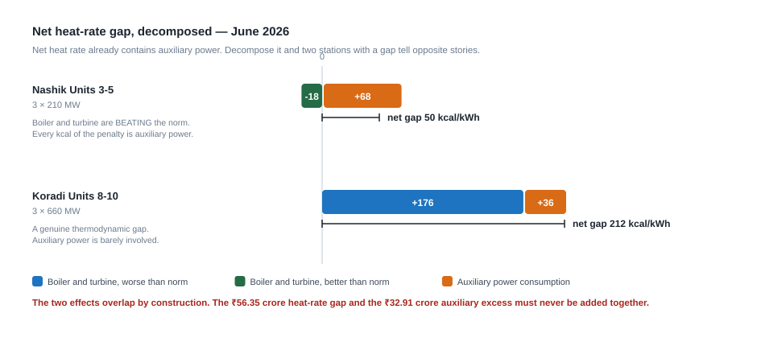

## Chapter 8 — Reading Our Own Numbers: What June 2026 Tells Us

Every chapter so far has argued from general principles. This one argues from our own numbers, for one month, taken from documents MAHAGENCO itself prepared and filed.

Nothing here is a vendor case study. Every figure comes from the June 2026 energy bill, the Part-I Fuel Surcharge Adjustment bill and the MERC Merit Order Dispatch stack for July 2026. If you disagree with a number, the argument is with the Regulatory and Commercial Department, and the correct response is to go and check the sheet.

By the end of this chapter you should be able to look at one row of your own station's regulatory return and say: *this much of my penalty belongs to the boiler, this much to the switchgear, this much to the maintenance planner, and it is worth this many crore rupees a month.* That sentence is the whole of applied performance engineering. AI, when it earns its place, is a way of producing it every hour instead of once a month.

---

### 8.1 Where this data comes from

#### 8.1.1 The three documents

| Document | Reference | What it is for | What matters to an engineer |
|---|---|---|---|
| June 2026 energy bill | Bill 001/2026 and 35/2026 | The invoice raised on MSEDCL for energy supplied and capacity made available | Gross and net generation, availability factor, the fixed-charge claim, and the disallowance where availability fell short |
| Provisional Part-I FSA bill | Bill 43/2026, containing the **F10 ECR calculation sheet** | Reconciles the energy charge billed against what the fuel actually cost | Coal and oil quantities, GCV at loading end, unloading end and as fired, transit loss, stacking loss, oil in ml/kWh, auxiliary consumption, resulting ECR |
| MERC Merit Order Dispatch stack, July 2026 (R0) | Effective 16.07.2026 to 15.08.2026 | Tells the despatcher the order in which to call stations | Each station's variable charge in ₹/kWh and its rank in the MSEDCL stack |

The first tells you what the company was paid. The third tells you whether the company will be asked to generate at all. The second — the F10 sheet — tells you why, and it is the one almost nobody outside the Regulatory cell opens.

#### 8.1.2 Why the F10 sheet is the most valuable performance document in the company

The F10 sheet exists to satisfy a regulator. Its only official job is to justify an energy charge rate. But because MERC requires the calculation to be shown in full rather than asserted, it ends up containing the complete monthly heat and mass balance of every thermal station, in the units engineers actually use: coal burnt by source, GCV at three points, transit loss, stacking loss, secondary oil in ml/kWh, auxiliary consumption, gross and net generation, gross and net heat rate — every one of them against the MERC norm.

That is a monthly performance audit of the entire fleet, already reconciled, already benchmarked. An efficiency cell would take weeks to assemble it by hand. It arrives every month, gets filed, and is read only by people whose interest in it is financial.

The reason is cultural, not technical. The sheet is laid out for a tariff calculation: the columns are in the order a regulator needs, not the order an engineer thinks in. Crucially it reports *net* heat rate — the tariff number — and net heat rate blends two entirely different physical problems into one figure. Section 8.3 pulls them apart, and once they are apart the sheet becomes a diagnostic instrument.

#### 8.1.3 The vocabulary, properly defined

| Term | Full form | What it is | How it is computed | Why it matters to you |
|---|---|---|---|---|
| **Gross heat rate** | Generated heat rate | Heat input per unit generated at the generator terminals | Heat input (kcal) ÷ gross generation (kWh) | The pure boiler-plus-turbine number; the only heat rate that measures the cycle |
| **Net heat rate** | Sent-out heat rate | Heat input per unit exported past the station boundary | Heat input (kcal) ÷ net generation (kWh) | The tariff number. Contains cycle efficiency *and* auxiliary power |
| **APC / Aux** | Auxiliary Power Consumption | Share of gross generation consumed inside the fence by mills, fans, pumps, ESP, lighting, FGD | (Gross − net) ÷ gross, per cent | Every point is energy generated, paid for in coal, never sold |
| **ECR** | Energy Charge Rate | Fuel cost per unit sent out, ₹/kWh | (Coal cost + oil cost) ÷ net generation, in the F10 sheet | Set by heat rate, coal price and GCV — all things you influence |
| **VC** | Variable Charge | The ECR as it appears in the merit-order stack | Essentially the ECR with applicable adjustments | Determines whether your unit is called at all |
| **MOD** | Merit Order Despatch | The SLDC's ranked list of available capacity, cheapest VC first | Sort all available stations by VC ascending; call down the list until demand is met | Your rank is your workload |
| **AFC** | Annual Fixed Cost | The annual return MERC approves for depreciation, interest, return on equity, O&M and working capital | Approved in the Multi-Year Tariff order | The money that pays for the plant, the staff and the overhaul. It must be *earned* |
| **AVF / PAF** | Availability Factor | Proportion of the period the unit was declared capable of full output, called or not | Declared available capacity × hours ÷ (installed capacity × hours) | This, not generation, earns the fixed cost |
| **NAPAF** | Normative Annual Plant Availability Factor | The availability MERC expects before full fixed cost is recovered | Set per station: 85 % for most, 80 % Chandrapur 3-7, 75 % Koradi 6, 40.89 % Uran | Fall below it and fixed cost is disallowed pro-rata |
| **PLF** | Plant Load Factor | Energy generated as a proportion of full-capacity output for the period | Gross generation ÷ (installed capacity × hours) | Availability is what you offer; PLF is what the system takes |
| **FSA** | Fuel Surcharge Adjustment | Monthly true-up between the energy charge billed and what fuel cost | (Actual ECR − billed rate) × energy sent out | A large FSA either way means the billing rate is badly calibrated |
| **GCV** | Gross Calorific Value | Heat from complete combustion of one kg of fuel, kcal/kg | Bomb calorimeter on a prepared sample | GCV is the denominator of everything; 100 kcal/kg moves fuel cost by about 3 % |

Two relationships underpin the whole chapter:

- **Availability earns fixed cost; generation earns variable cost.** Separate revenue streams, separate rules.
- **Heat rate and coal price set the variable charge; the variable charge sets the merit-order rank; the rank sets the PLF.** Efficiency is not only a cost question — it is a workload question.

---

### 8.2 The fleet at a glance, June 2026

#### 8.2.1 Table A — Station performance, June 2026 (actual against MERC normative)

| Station | Cap MW | Avail % | PLF % | Gross gen MU | Net gen MU | Net HR actual | Net HR norm | Net HR gap |
|---|---|---|---|---|---|---|---|---|
| Bhusawal Unit 3 | 210 | 88.91 | 64.40 | 101.50 | 88.60 | 2848 | 2787 | +61 |
| Bhusawal Units 4-5 | 1000 | 90.19 | 76.05 | 551.63 | 512.71 | 2433 | 2375 | +58 |
| Bhusawal Unit 6 | 660 | 79.01 | 70.37 | 335.13 | 312.74 | 2183 | 2139 | +44 |
| Khaperkheda Units 1-4 | 840 | 57.85 | 54.55 | 342.19 | 299.57 | 2715 | 2630 | +85 |
| Khaperkheda Unit 5 | 500 | 87.86 | 82.03 | 299.05 | 279.40 | 2385 | 2375 | +10 |
| Nashik Units 3-5 | 630 | 94.62 | 58.40 | 264.91 | 230.57 | 2804 | 2754 | +50 |
| Chandrapur Units 3-7 | 1920 | 64.88 | 53.56 | 762.50 | 673.36 | 2709 | 2688 | +21 |
| Chandrapur Units 8-9 | 1000 | 74.87 | 66.68 | 486.89 | 453.31 | 2425 | 2375 | +50 |
| Paras Units 3-4 | 500 | 74.83 | 66.92 | 245.15 | 216.73 | 2578 | 2415 | +163 |
| Parli Units 6-7 | 500 | 82.34 | 68.35 | 252.68 | 221.32 | 2511 | 2415 | +96 |
| Parli Unit 8 | 250 | 97.40 | 79.55 | 145.56 | 129.92 | 2461 | 2415 | +46 |
| Koradi Unit 6 | 210 | 75.46 | 65.16 | 98.06 | 86.88 | 2534 | 2456 | +79 |
| Koradi Units 8-10 | 1980 | 72.50 | 66.62 | 964.80 | 897.75 | 2442 | 2230 | +212 |

The net generation column sums to **4,402.86 MU**. The headline figure for total thermal energy sent out in June 2026 is **4,588.47 MU** against a net bill of **₹2,806.55 crore**; the difference of 185.61 MU is generation from stations outside this table, principally the gas station at Uran. Fleet totals below are for these thirteen groups unless stated otherwise.

#### 8.2.2 Availability: a spread of 39.55 percentage points

Availability runs from **57.85 %** at Khaperkheda Units 1-4 to **97.40 %** at Parli Unit 8 — nearly forty percentage points inside one company under one management.

| Station | Avail % | NAPAF % | Above / below |
|---|---|---|---|
| Parli Unit 8 | 97.40 | 85 | +12.40 |
| Nashik Units 3-5 | 94.62 | 85 | +9.62 |
| Bhusawal Units 4-5 | 90.19 | 85 | +5.19 |
| Bhusawal Unit 3 | 88.91 | 85 | +3.91 |
| Khaperkheda Unit 5 | 87.86 | 85 | +2.86 |
| Parli Units 6-7 | 82.34 | 85 | −2.66 |
| Bhusawal Unit 6 | 79.01 | 85 | −5.99 |
| Koradi Unit 6 | 75.46 | 75 | +0.46 |
| Chandrapur Units 8-9 | 74.87 | 85 | −10.13 |
| Paras Units 3-4 | 74.83 | 85 | −10.17 |
| Koradi Units 8-10 | 72.50 | 85 | −12.50 |
| Chandrapur Units 3-7 | 64.88 | 80 | −15.12 |
| Khaperkheda Units 1-4 | 57.85 | 85 | −27.15 |

Six groups met or exceeded their normative availability; seven did not. Parli 8 and Khaperkheda 1-4 are units of comparable vintage. Whatever separates 97.40 % from 57.85 %, it is not the laws of physics.

#### 8.2.3 PLF does not track availability

The instinct is that an available unit generates. Divide PLF by availability and you get **despatch utilisation** — of the hours offered to the grid, what proportion was taken up.

| Station | Avail % | PLF % | Despatch utilisation % |
|---|---|---|---|
| Nashik Units 3-5 | 94.62 | 58.40 | 61.7 |
| Bhusawal Unit 3 | 88.91 | 64.40 | 72.4 |
| Parli Unit 8 | 97.40 | 79.55 | 81.7 |
| Chandrapur Units 3-7 | 64.88 | 53.56 | 82.6 |
| Parli Units 6-7 | 82.34 | 68.35 | 83.0 |
| Bhusawal Units 4-5 | 90.19 | 76.05 | 84.3 |
| Koradi Unit 6 | 75.46 | 65.16 | 86.4 |
| Bhusawal Unit 6 | 79.01 | 70.37 | 89.1 |
| Chandrapur Units 8-9 | 74.87 | 66.68 | 89.1 |
| Paras Units 3-4 | 74.83 | 66.92 | 89.4 |
| Koradi Units 8-10 | 72.50 | 66.62 | 91.9 |
| Khaperkheda Unit 5 | 87.86 | 82.03 | 93.4 |
| Khaperkheda Units 1-4 | 57.85 | 54.55 | 94.3 |

Read the two ends. When Khaperkheda 1-4 is available, the system takes it 94.3 % of the time. Nashik — the second most available station in the fleet — was taken up only 61.7 % of the hours it offered. Section 8.5 explains why, and the explanation is entirely economic.

#### 8.2.4 Net heat rate: a 665 kcal/kWh spread, and the widest gap is inside one station

Net heat rate runs from **2,183 kcal/kWh at Bhusawal Unit 6** to **2,848 kcal/kWh at Bhusawal Unit 3**. The best and the worst heat rates in the fleet are at the same station, 665 kcal/kWh apart.

That is vintage and technology, not performance: Unit 6 is a 660 MW supercritical machine, Unit 3 a 210 MW subcritical unit, and MERC judges them against different norms — 2,139 and 2,787. Every time somebody proposes a fleet-wide heat-rate league table, remember this: raw heat rate ranks technology. Only the **gap against norm** ranks performance.

On gap, the order inverts. Worst: Koradi 8-10 (+212), Paras 3-4 (+163), Parli 6-7 (+96), Khaperkheda 1-4 (+85), Koradi 6 (+79). Best: Khaperkheda 5 (+10), Chandrapur 3-7 (+21), Bhusawal 6 (+44). Koradi 8-10 — the newest, largest and thermodynamically most capable machines in the fleet — carries the worst gap. Bhusawal 6, with the best absolute heat rate in the company, is third best on gap.

Every group in the fleet is above its norm; not one is below. Thirteen out of thirteen, across four stations and four unit sizes, points at something systematic. Section 8.3 identifies a large part of what it is.

---

### 8.3 The decomposition that changes the conversation

*Figure 8.1 — The same question, opposite answers. The two effects overlap by construction, so the two crore figures must never be added.*

#### 8.3.1 The derivation, in full

Net heat rate is the number MERC uses and the number the F10 sheet reports. It is also a composite of two independent problems, and reporting only the composite is why performance meetings go round in circles.

Let **Q** = heat input in the month (kcal), **G** = gross generation (kWh), **N** = net generation (kWh), **a** = auxiliary consumption as a fraction of gross.

By definition of auxiliary consumption:

> N = G × (1 − a)

By definition of the two heat rates:

> HR_gross = Q ÷ G  and  HR_net = Q ÷ N

Substituting the first into the second:

> HR_net = Q ÷ [G × (1 − a)] = (Q ÷ G) ÷ (1 − a) = HR_gross ÷ (1 − a)

which rearranges to the relationship used throughout this chapter:

> **HR_gross = HR_net × (1 − a)**

This is exact, not an approximation. It assumes nothing about coal, load or design. It says only that net heat rate is gross heat rate inflated by the auxiliary power the station consumes on its own account. The same holds for the normative values, since MERC sets a normative net heat rate and a normative auxiliary consumption separately.

**Worked example — Nashik Units 3-5.**

> HR_gross actual = 2,804 × (1 − 0.1296) = 2,804 × 0.8704 = **2,440.4 kcal/kWh**
> HR_gross norm = 2,754 × (1 − 0.1075) = 2,754 × 0.8925 = **2,457.9 kcal/kWh**
> Difference = **−17.5 kcal/kWh**

The source rounds these to 2,440 and 2,458 and states the gap as −18 in one place and 17 kcal/kWh better than norm in another; both are correct roundings of −17.5. This chapter uses −18. Either way the gap is **negative**.

#### 8.3.2 Splitting the net gap into its two parts

Insert an intermediate quantity — the net heat rate the station *would* have achieved on its actual gross heat rate but only normative auxiliary power:

> HR_net_hyp = HR_gross_actual ÷ (1 − a_norm)

Then:

- **Auxiliary-attributable part** = HR_net_actual − HR_net_hyp
- **Boiler-and-turbine part** = HR_net_hyp − HR_net_norm = (HR_gross_actual − HR_gross_norm) ÷ (1 − a_norm)

The two add back to the net gap exactly. For Nashik: HR_net_hyp = 2,440.4 ÷ 0.8925 = 2,734.3. Auxiliary part = 2,804 − 2,734.3 = **+69.7**; boiler and turbine part = 2,734.3 − 2,754 = **−19.7**; sum = **+50.0**, precisely the tabulated net gap.

Nashik's 50 kcal/kWh penalty is a 70 kcal/kWh auxiliary penalty plus a 20 kcal/kWh boiler-and-turbine *credit*.

#### 8.3.3 Table B — Auxiliary power against boiler and turbine

A negative gross gap means the boiler and turbine are beating the norm and the entire penalty is auxiliary power.

| Station | Aux act % | Aux norm % | Aux gap pp | Gross HR act | Gross HR norm | Gross HR gap | Diagnosis |
|---|---|---|---|---|---|---|---|
| Bhusawal Unit 3 | 12.71 | 10.96 | +1.75 | 2486 | 2482 | +4 | Both, roughly balanced |
| Bhusawal Units 4-5 | 7.06 | 6.00 | +1.06 | 2261 | 2232 | +28 | Both, roughly balanced |
| Bhusawal Unit 6 | 6.68 | 5.75 | +0.93 | 2037 | 2016 | +21 | Both, roughly balanced |
| Khaperkheda Units 1-4 | 12.44 | 9.70 | +2.74 | 2377 | 2375 | +2 | Both, roughly balanced |
| Khaperkheda Unit 5 | 6.57 | 6.00 | +0.57 | 2228 | 2232 | −5 | Auxiliary power is the whole problem |
| Nashik Units 3-5 | 12.96 | 10.75 | +2.21 | 2440 | 2458 | −18 | Auxiliary power is the whole problem |
| Chandrapur Units 3-7 | 11.69 | 8.67 | +3.02 | 2393 | 2455 | −62 | Auxiliary power is the whole problem |
| Chandrapur Units 8-9 | 6.90 | 6.00 | +0.90 | 2258 | 2232 | +25 | Both, roughly balanced |
| Paras Units 3-4 | 11.59 | 9.30 | +2.29 | 2279 | 2190 | +89 | Mostly boiler/turbine |
| Parli Units 6-7 | 12.41 | 9.30 | +3.11 | 2199 | 2190 | +9 | Both, roughly balanced |
| Parli Unit 8 | 10.74 | 8.50 | +2.24 | 2197 | 2210 | −13 | Auxiliary power is the whole problem |
| Koradi Unit 6 | 11.37 | 10.81 | +0.56 | 2246 | 2190 | +56 | Mostly boiler/turbine |
| Koradi Units 8-10 | 6.95 | 6.00 | +0.95 | 2272 | 2096 | +176 | Mostly boiler/turbine |

Applying the split of 8.3.2 to every row, in kcal/kWh on the net basis:

| Station | Net HR gap | Auxiliary-attributable | Boiler/turbine-attributable |
|---|---|---|---|
| Bhusawal Unit 3 | +61 | +56.0 | +4.5 |
| Bhusawal Units 4-5 | +58 | +27.4 | +30.9 |
| Bhusawal Unit 6 | +44 | +21.5 | +22.3 |
| Khaperkheda Units 1-4 | +85 | +82.4 | +2.2 |
| Khaperkheda Unit 5 | +10 | +14.5 | −4.3 |
| Nashik Units 3-5 | +50 | +69.4 | −20.2 |
| Chandrapur Units 3-7 | +21 | +89.6 | −67.9 |
| Chandrapur Units 8-9 | +50 | +23.2 | +27.7 |
| Paras Units 3-4 | +163 | +65.1 | +98.1 |
| Parli Units 6-7 | +96 | +86.1 | +9.9 |
| Parli Unit 8 | +46 | +60.2 | −14.2 |
| Koradi Unit 6 | +79 | +15.9 | +62.8 |
| Koradi Units 8-10 | +212 | +24.7 | +187.2 |

Residuals of one or two kcal/kWh against the tabulated gap arise because Table B's gross figures are rounded to whole numbers.

#### 8.3.4 The cases that matter

**Nashik Units 3-5 — the entire penalty is in the switchgear.** Gross heat rate 2,440 against a normative 2,458. On 210 MW units commissioned between 1979 and 1981, running at 58.40 % PLF, the boiler and turbine are beating the MERC norm by 17 kcal/kWh. That deserves saying out loud at Nashik, because the *net* number — 2,804 against 2,754 — currently reads as a failure and is treated as one.

The whole of that 50 kcal/kWh penalty, and more, comes from auxiliary consumption at **12.96 % against 10.75 %**. The operational conclusion is blunt and unusual: **no amount of combustion tuning will fix Nashik's number.** Optimising excess oxygen, chasing unburnt carbon, tightening APH leakage are all worthwhile and all aimed at a part of the plant that is already ahead of its norm. The 50 kcal/kWh sits in the auxiliary switchgear — CW pumps, PA and ID fans, mill motors, ash handling, ESP field energisation, compressed air. That is an electrical and operations problem, and the people who can solve it are on a different corridor from the people currently being asked to.

**Chandrapur Units 3-7 — the largest auxiliary gap in the fleet.** The net gap of +21 kcal/kWh, second best in the fleet, is entirely misleading. Gross heat rate is **2,393 against 2,455 — better by 62 kcal/kWh**, one of the strongest cycle performances against norm anywhere in the company. Auxiliary consumption is **11.69 % against 8.67 %, a gap of 3.02 percentage points**, the largest in the fleet.

Decomposed: +89.6 kcal/kWh auxiliary penalty against a −67.9 kcal/kWh cycle credit, netting to +21.7. The station's excellent boiler house is silently paying for its auxiliary consumption, and because only the net figure is reported neither fact is visible. On 762.50 MU gross:

> 762.50 MU × 3.02 % = **23.03 MU in a single month** — 28 % of the entire fleet's auxiliary excess

A caveat developed in 8.10: Chandrapur 3-7 ran at 53.56 % PLF, and auxiliary consumption as a percentage rises structurally when a unit is backed down. Some fraction of that 3.02 points is a consequence of low despatch rather than inefficiency, and quantifying that fraction is itself one of the best analytics projects available at this station.

**Koradi Units 8-10 — the single largest thermodynamic loss in the company.** The opposite case. Auxiliary consumption 6.95 % against 6.00 % is unremarkable. Gross heat rate is **2,272 against a normative 2,096 — a gap of 176 kcal/kWh**, or +187.2 on the net basis against just +24.7 of auxiliary. **This one is not auxiliary power.** It is combustion, steam temperature, condenser vacuum, feedwater heating, turbine internal efficiency, APH performance, or some combination — on the fleet's largest, newest and most capable machines.

Scale matters. Koradi 8-10 sent out 897.75 MU in June, the largest output in the fleet by a wide margin. Section 8.4 values the gap at **₹25.61 crore in one month**. For orientation against the sensitivity table used earlier in this course, on a supercritical 660 MW unit a 1 % boiler efficiency drop is worth about 25 kcal/kWh, 10 mmHg of back pressure 7 to 10, and 1 % excess oxygen 8 to 12. A 187 kcal/kWh gap is not one cause. It is five or six, each individually within what a shift engineer would tolerate, and it will not be found by looking at any one in isolation. That is exactly the problem online loss attribution exists to solve.

**Paras Units 3-4 — both problems at once.** Second-worst net gap at +163 kcal/kWh, and unlike every other station no offsetting credit anywhere: gross heat rate 2,279 against 2,190, a **gap of +89**, and auxiliary 11.59 % against 9.30 %, a **gap of +2.29 percentage points**. Decomposed, +98.1 boiler and turbine, +65.1 auxiliary. Paras is where a single-discipline programme will disappoint, because fixing either half leaves the other untouched.

#### 8.3.5 Why this matters: it tells you who owns the problem

A net heat-rate gap reported on its own is un-actionable. It arrives at a monthly review as a single number, and the meeting that follows is a negotiation about whose fault it is. Nobody can prove anything, because the number does not distinguish a fouled condenser from an over-sized CW pump running on both machines when one would do.

Decomposed, the same number becomes an instruction.

| Diagnosis | Who owns it | What they work on |
|---|---|---|
| Gross gap positive, auxiliary gap small | Operations and Boiler/Turbine Maintenance | Combustion tuning, excess air, unburnt carbon, steam temperatures, condenser cleanliness, APH leakage, feedwater heaters, turbine internal efficiency |
| Gross gap negative, auxiliary gap large | Electrical Maintenance and Operations | Pump and fan combinations, motor loading, VFD opportunity, ESP field energisation, compressed-air leakage, ash-handling scheduling |
| Both gaps positive | Both, with an explicit sequencing decision | All of the above, prioritised by value per rupee of effort |

Applied to June 2026: Nashik, Chandrapur 3-7, Parli 8 and Khaperkheda 5 are electrical problems. Koradi 8-10 and Koradi 6 are boiler-and-turbine problems. Paras is both. That is a completely different set of work instructions from what a net heat-rate league table would produce, and it took one algebraic rearrangement of figures already on the sheet.

Now consider the cadence. This attribution was done once, on a monthly average, for a group of units, five weeks after the events it describes, by reading a regulatory spreadsheet. An online loss-accounting model does the same arithmetic — and a much finer version of it, unit by unit and loss by loss — **every hour**, from data already flowing out of the DCS and the historian. It needs no new instrument and no research project. It needs somebody to decide the question is worth asking more than twelve times a year.

---

### 8.4 What the fuel is actually costing us

#### 8.4.1 Deriving the cost of heat from the station's own money

The temptation is to value a kcal/kWh at a standard coal price. Every station then argues about the price, and the argument replaces the work. There is no need. Each station's own variable charge is its fuel cost per unit sent out:

> **Cost of heat (₹/kcal) = MOD variable charge (₹/kWh) ÷ actual net heat rate (kcal/kWh)**

The units cancel correctly and no assumption is introduced. From it:

> **Implied as-fired coal cost (₹/tonne) = cost of heat × as-fired GCV (kcal/kg) × 1,000**

> Nashik: 5.9800 ÷ 2,804 = **₹0.002133/kcal**; 0.002133 × 2,915 × 1,000 = **₹6,217/tonne**
> Khaperkheda 5: 3.1890 ÷ 2,385 = **₹0.001337/kcal**; 0.001337 × 2,733 × 1,000 = **₹3,655/tonne**

#### 8.4.2 Table C — Fuel economics from the station's own MOD variable charge

| Station | MOD VC Jul-26 ₹/kWh | Bill rate Jun-26 ₹/kWh | As-fired GCV kcal/kg | Cost of heat ₹/kcal | Implied as-fired coal ₹/tonne |
|---|---|---|---|---|---|
| Bhusawal Unit 3 | 4.9470 | 5.329 | 3039 | 0.001737 | 5,280 |
| Bhusawal Units 4-5 | 4.0610 | 4.404 | 3127 | 0.001669 | 5,220 |
| Bhusawal Unit 6 | 3.4410 | 3.668 | 3081 | 0.001576 | 4,856 |
| Khaperkheda Units 1-4 | 3.6490 | 3.840 | 2755 | 0.001344 | 3,703 |
| Khaperkheda Unit 5 | 3.1890 | 3.428 | 2733 | 0.001337 | 3,655 |
| Nashik Units 3-5 | 5.9800 | 5.401 | 2915 | 0.002133 | 6,217 |
| Chandrapur Units 3-7 | 4.1330 | 4.658 | 3149 | 0.001525 | 4,804 |
| Chandrapur Units 8-9 | 3.6260 | 3.617 | 3158 | 0.001495 | 4,721 |
| Paras Units 3-4 | 3.9470 | 4.202 | 2940 | 0.001531 | 4,501 |
| Parli Units 6-7 | 4.1340 | 5.530 | 3268 | 0.001646 | 5,380 |
| Parli Unit 8 | 4.1330 | 5.393 | 3270 | 0.001679 | 5,491 |
| Koradi Unit 6 | 3.5200 | 3.703 | 2767 | 0.001389 | 3,843 |
| Koradi Units 8-10 | 3.2840 | 3.378 | 3061 | 0.001345 | 4,116 |

#### 8.4.3 A 70 % spread in coal cost inside one company

Implied as-fired coal runs from **₹3,655/tonne at Khaperkheda 5 to ₹6,217/tonne at Nashik**:

> 6,217 ÷ 3,655 = 1.701 — **70 % more expensive**

Same company, same fuel supply framework, same national coal system. The drivers are identifiable:

| Driver | Mechanism | Where it bites |
|---|---|---|
| **Rail lead** | Freight is charged by distance and is a large share of delivered cost | Nashik (Eklahare) is furthest from the Vidarbha coalfields; Chandrapur, Koradi and Khaperkheda are close |
| **As-fired GCV** | Delivered cost per tonne is spread over the heat in the tonne | Fleet spread **2,733 (Khaperkheda 5) to 3,270 kcal/kg (Parli 8)** — about 20 % |
| **Imported-coal blending** | Imported coal at 4,624 to 4,709 kcal/kg as fired costs far more per tonne | Khaperkheda 1-4, Khaperkheda 5, Nashik, Chandrapur 3-7, Chandrapur 8-9, Koradi 8-10 |
| **Washed coal** | Raises GCV and lowers ash and freight per useful kcal, but adds a washing charge | In the blend alongside domestic and imported |
| **Transit loss** | Coal paid for and never received. Fleet range −0.082 % to 1.924 % | Paras at 1.924 % against 0.800 % normative |
| **Stacking loss** | Calorific value lost in the yard; taken at **85 kcal/kg for all stations** | Uniform, so it does not explain the spread, but it depresses every as-fired GCV |
| **Biomass co-firing** | Different price per kcal, different handling | Bhusawal 4-5 (3,210 kcal/kg), Bhusawal 6 (3,271); Khaperkheda 1-4 shows a biomass entry at 2,950 |

Nashik's position is a combination, not one cause: an as-fired GCV of 2,915 kcal/kg that is only middling, multiplied by the longest rail lead in the group.

#### 8.4.4 What one kcal/kWh is worth, and why it differs by station

One kcal/kWh saved on 1 MU sent out is 1,000,000 kcal, valued at the station's own cost of heat.

| Station | Cost of heat ₹/kcal | Value of 1 kcal/kWh per MU | Relative to Khaperkheda 5 |
|---|---|---|---|
| Nashik Units 3-5 | 0.002133 | ₹2,133 | 1.60 × |
| Bhusawal Unit 3 | 0.001737 | ₹1,737 | 1.30 × |
| Parli Unit 8 | 0.001679 | ₹1,679 | 1.26 × |
| Bhusawal Units 4-5 | 0.001669 | ₹1,669 | 1.25 × |
| Parli Units 6-7 | 0.001646 | ₹1,646 | 1.23 × |
| Bhusawal Unit 6 | 0.001576 | ₹1,576 | 1.18 × |
| Paras Units 3-4 | 0.001531 | ₹1,531 | 1.15 × |
| Chandrapur Units 3-7 | 0.001525 | ₹1,525 | 1.14 × |
| Chandrapur Units 8-9 | 0.001495 | ₹1,495 | 1.12 × |
| Koradi Unit 6 | 0.001389 | ₹1,389 | 1.04 × |
| Koradi Units 8-10 | 0.001345 | ₹1,345 | 1.01 × |
| Khaperkheda Units 1-4 | 0.001344 | ₹1,344 | 1.01 × |
| Khaperkheda Unit 5 | 0.001337 | ₹1,337 | 1.00 × |

A kcal/kWh saved at Nashik is worth **1.60 times** what the same kcal/kWh is worth at Khaperkheda 5 — approaching twice as much, and on a per-tonne basis the spread is a full 70 %. Identical engineering, identical effort, sixty per cent more money.

But volume usually beats unit value. Ten kcal/kWh at each station, annualised on June's output:

> Nashik: 10 × 230.57 × 10⁶ kWh × 12 × ₹0.002133/kcal = **₹5.90 crore a year**
> Koradi 8-10: 10 × 897.75 × 10⁶ kWh × 12 × ₹0.001345/kcal = **₹14.49 crore a year**

The same technical achievement is worth two and a half times more at Koradi despite Koradi's cheaper coal, purely because of volume. **Pilot selection should follow the money, and the money is the product of unit value, volume and the size of the gap** — not any one of the three alone. Section 8.9 puts all three together.

---

### 8.5 The merit order is a scoreboard

#### 8.5.1 How the stack works

The State Load Despatch Centre sorts every available station by variable charge, cheapest first, and calls down that list until demand is met. Everything below the cut-off in a given hour generates; everything above it does not. That single mechanism converts a thermodynamic quantity into a commercial outcome:

> **Net heat rate × cost of heat = variable charge → rank in the MERC stack → hours called → PLF → the volume over which fixed cost is recovered**

Each arrow is arithmetic, not opinion.

#### 8.5.2 Nashik: available, and not being called

Nashik Units 3-5 has a variable charge of **₹5.98/kWh** — the **most expensive coal station in the MSEDCL merit order stack**, ranked **10th overall**, with only gas stations above it. Every other coal station is called before Nashik.

| Nashik Units 3-5, June 2026 | Value | Fleet position |
|---|---|---|
| Availability | 94.62 % | 2nd highest |
| PLF | 58.40 % | Among the lowest |
| Despatch utilisation | 61.7 % | Lowest in the fleet |
| Gross heat rate against norm | 2,440 against 2,458 | Better than norm |
| Variable charge | ₹5.98/kWh | Highest coal station in the stack |

This must be said carefully, because it is easily and wrongly heard as criticism. **The station is available and is not being called.** Nashik declared itself capable for 94.62 % of June, well above its 85 % NAPAF. Its boiler and turbine beat their norm. Its people did what was asked. And it still ran at 58.40 % PLF, because its variable charge places it near the top of the stack and the despatcher, correctly and by rule, called cheaper stations first. The low PLF is not an operational failure. It is a commercial position, and nothing the shift charge engineer does on a given night changes it.

#### 8.5.3 The consequence, stated honestly

Nashik's variable charge is the product of a net heat rate of 2,804 kcal/kWh and a cost of heat of ₹0.002133/kcal — the first high because of 12.96 % auxiliary consumption, the second because of rail lead, GCV and imported blending.

Work the sensitivity. At the normative 10.75 % auxiliary consumption with gross heat rate unchanged:

> Net heat rate = 2,440 ÷ (1 − 0.1075) = 2,734 kcal/kWh, a reduction of 70 kcal/kWh
> Variable charge = 2,734 × 0.002133 = **₹5.83/kWh** — about 15 paise per unit lower

Fifteen paise does not move Nashik from tenth to first. But the merit order is a *stack*: what matters is the number relative to whoever is immediately above and below. In a tight stack fifteen paise is several ranks, and several ranks in a high-demand month is thousands of despatched hours.

Hence the conclusion every engineer at Nashik should carry away: **for a station in this position, every kcal/kWh and every rupee per tonne is not just an efficiency number, it is a despatch number.** Efficiency at Nashik does not merely reduce cost per unit — it buys back the right to generate at all, and with it the volume over which fixed cost is recovered. The reverse holds for Khaperkheda 5 at ₹3.189/kWh, the cheapest station in the fleet, called 93.4 % of the hours it was available. Cheap stations run. Expensive stations wait.

#### 8.5.4 Parli 6-7, and what a large negative FSA means

Parli Units 6-7 billed at **₹5.530/kWh**; its calculated variable charge without FGD is **₹4.134/kWh**. The difference of ₹1.396 per unit was over-recovered and must be returned. On net generation of 221.32 MU:

> 221.32 × 10⁶ kWh × ₹1.396 = ₹308,963,000 = approximately **₹30.90 crore** to be given back

That figure is illustrative — the formal working in Bill 43/2026 applies to scheduled and billed energy with its own adjustments — but the mechanism is exact. Applying the same subtraction fleet-wide:

| Station | Bill rate | Variable charge | Difference ₹/kWh | Net gen MU | Implied over/(under) recovery ₹ cr |
|---|---|---|---|---|---|
| Bhusawal Unit 3 | 5.329 | 4.9470 | +0.382 | 88.60 | +3.38 |
| Bhusawal Units 4-5 | 4.404 | 4.0610 | +0.343 | 512.71 | +17.59 |
| Bhusawal Unit 6 | 3.668 | 3.4410 | +0.227 | 312.74 | +7.10 |
| Khaperkheda Units 1-4 | 3.840 | 3.6490 | +0.191 | 299.57 | +5.72 |
| Khaperkheda Unit 5 | 3.428 | 3.1890 | +0.239 | 279.40 | +6.68 |
| **Nashik Units 3-5** | 5.401 | 5.9800 | **−0.579** | 230.57 | **−13.35** |
| Chandrapur Units 3-7 | 4.658 | 4.1330 | +0.525 | 673.36 | +35.35 |
| Chandrapur Units 8-9 | 3.617 | 3.6260 | −0.009 | 453.31 | −0.41 |
| Paras Units 3-4 | 4.202 | 3.9470 | +0.255 | 216.73 | +5.53 |
| **Parli Units 6-7** | 5.530 | 4.1340 | **+1.396** | 221.32 | **+30.90** |
| Parli Unit 8 | 5.393 | 4.1330 | +1.260 | 129.92 | +16.37 |
| Koradi Unit 6 | 3.703 | 3.5200 | +0.183 | 86.88 | +1.59 |
| Koradi Units 8-10 | 3.378 | 3.2840 | +0.094 | 897.75 | +8.44 |

The provisional FSA actually filed for June 2026 is **minus ₹101.44 crore** — a withdrawal, because most stations' actual ECR ran below the rate billed. The rough calculation above gives ₹124.9 crore of over-recovery: same direction, same order. The difference arises because the formal working uses scheduled energy rather than net generation, includes Uran and other stations outside Table A, and applies adjustments this subtraction does not. Agreement within about a fifth is a reasonable cross-check, and it is better to show the disagreement than hide it.

Two rows deserve attention. **Nashik carried a positive FSA** — it billed at ₹5.401 against a fuel cost of ₹5.980, under-recovering by 57.9 paise per unit. Nashik and Uran were the only exceptions to the fleet-wide withdrawal; Chandrapur 8-9 came within nine-tenths of a paisa of joining them. And **Parli 6-7 and Parli 8 show the largest over-recoveries per unit**, at ₹1.396 and ₹1.260.

A large FSA in either direction is a calibration failure, not a performance failure. It means the rate at which energy was billed was set from an outdated view of fuel cost. That is a cash-flow problem, an audit exposure and a tariff-credibility problem — and it is fixable with better forward estimation of coal cost and heat rate, which is a straightforward forecasting problem.

---

### 8.6 The availability penalty — the biggest single number in this document

#### 8.6.1 The mechanism, in plain terms

MERC approves an **Annual Fixed Cost** for each station covering depreciation, interest, return on equity, O&M and interest on working capital. It is the money that pays for the asset, the workforce and the overhaul programme, and it has nothing to do with how much energy is generated.

It is not paid unconditionally. It is paid against a **Normative Annual Plant Availability Factor** — 85 % for most stations, 80 % for Chandrapur 3-7, 75 % for Koradi 6, 40.89 % for Uran. The logic is that a generator's obligation is to be *available*; what the system does with that availability is the despatcher's business. Availability is the deliverable, and fixed cost is the payment for it. Fall short and it is disallowed pro-rata:

> **Fixed cost recoverable = AFC × (AVF ÷ NAPAF)** where AVF < NAPAF
> **Disallowance = AFC × (1 − AVF ÷ NAPAF)**

Three consequences follow. The penalty is **proportional, not a cliff** — every point of availability lost costs a calculable share. It is **completely independent of coal price** — unlike everything in 8.3 to 8.5, it does not shrink when coal gets cheaper. And **the money has already been spent**: depreciation incurred, interest payable, salaries drawn, overhaul done. The disallowance is not a reduced cost; it is unrecovered expenditure.

#### 8.6.2 The June 2026 rate of disallowance

Computed directly from Table A availability against each station's NAPAF:

| Station | Avail % | NAPAF % | AVF ÷ NAPAF | Share of fixed cost disallowed |
|---|---|---|---|---|
| Bhusawal Unit 3 | 88.91 | 85 | 1.046 | nil |
| Bhusawal Units 4-5 | 90.19 | 85 | 1.061 | nil |
| Bhusawal Unit 6 | 79.01 | 85 | 0.9295 | 7.05 % |
| Khaperkheda Units 1-4 | 57.85 | 85 | 0.6806 | **31.94 %** |
| Khaperkheda Unit 5 | 87.86 | 85 | 1.034 | nil |
| Nashik Units 3-5 | 94.62 | 85 | 1.113 | nil |
| Chandrapur Units 3-7 | 64.88 | 80 | 0.8110 | **18.90 %** |
| Chandrapur Units 8-9 | 74.87 | 85 | 0.8808 | 11.92 % |
| Paras Units 3-4 | 74.83 | 85 | 0.8804 | 11.96 % |
| Parli Units 6-7 | 82.34 | 85 | 0.9687 | 3.13 % |
| Parli Unit 8 | 97.40 | 85 | 1.146 | nil |
| Koradi Unit 6 | 75.46 | 75 | 1.006 | nil |
| Koradi Units 8-10 | 72.50 | 85 | 0.8529 | **14.71 %** |

Khaperkheda Units 1-4 forfeited nearly a third of their fixed-cost entitlement in a single month.

#### 8.6.3 The headline: ₹100.87 crore

| Station | AFC disallowance ₹ crore |
|---|---|
| Koradi Units 8-10 | **28.04** |
| Chandrapur Units 3-7 | **23.94** |
| Khaperkheda Units 1-4 | **21.75** |
| Chandrapur Units 8-9 | 11.75 |
| Bhusawal Unit 6 | 7.88 |
| Paras Units 3-4 | 5.74 |
| Parli Units 6-7 | 1.53 |
| Koradi Unit 6 | 0.25 |
| Bhusawal Unit 3, Bhusawal 4-5, Khaperkheda 5, Nashik 3-5, Parli 8 | 0.00 each |
| **Total** | **100.87** |

**₹100.87 crore of cumulative fixed-charge disallowance, of which ₹32.93 crore was adjusted in the June 2026 bill alone.** The three worst account for 73 % of it:

> 28.04 + 23.94 + 21.75 = **₹73.73 crore**

Two points of interpretation. These are **cumulative** figures: Koradi Unit 6 carries ₹0.25 crore despite being marginally *above* its 75 % NAPAF in June, which can only mean the amount accrued earlier and is still being carried. And 100.87 ÷ 32.93 = **3.06**, consistent with accumulation over roughly three months at a steady rate — the first quarter of the financial year. The document does not state the period, so treat that as an inference.

#### 8.6.4 Why this number, and not the heat-rate number, should worry the room most

The heat-rate loss (₹56.35 crore in the month) and the auxiliary loss (₹32.91 crore) are, oddly, forgiving: they shrink if coal gets cheaper and they scale with how much you generate. The availability disallowance has neither property. It is a straight forfeit of money already committed, indifferent to the coal market, and it cannot be recovered later.

#### 8.6.5 The connection to predictive maintenance

Availability is lost in blocks of hours. A three-day forced outage on a 660 MW unit removes 72 hours, and 72 out of roughly 720 hours in a month is 10 percentage points of that unit's availability. Against Koradi 8-10's shortfall of 12.50 points, a single avoided three-day forced outage on one of three units is worth roughly a third of the entire gap.

> **Every forced outage hour avoided is availability. Availability is fixed-cost recovery. Fixed-cost recovery is ₹100.87 crore of already-spent money the company is currently not getting back.**

That is the business case for predictive maintenance here, and it requires no assumption about coal price, load growth, tariff revision or technology maturity. It requires only that early warning converts a forced outage into a planned intervention — which is precisely what the boiler feed pump, coal mill, fan, transformer and HT motor cases earlier in this course describe.

One honesty check, developed in 8.10: the June filing records availability shortfall but **does not distinguish planned overhaul from forced outage**, and predictive maintenance addresses only the second. Before any target is set against ₹100.87 crore, the split must be established from the outage records. That is a week's work with the log books and it should be the first thing anybody does with this chapter.

---

### 8.7 The oil bill nobody talks about

#### 8.7.1 The normative and the actual

| Station | Actual ml/kWh | Normative ml/kWh | Difference | Gross gen MU |
|---|---|---|---|---|
| Chandrapur Units 3-7 | 3.23 | 1.00 | **+2.23** | 762.50 |
| Parli Units 6-7 | 2.87 | 0.50 | **+2.37** | 252.68 |
| Bhusawal Unit 6 | 0.95 | 0.50 | +0.45 | 335.13 |
| Koradi Unit 6 | 1.73 | 2.81 | **−1.08** | 98.06 |

Chandrapur 3-7 consumed more than three times its normative oil; Parli 6-7 nearly six times. Koradi Unit 6 consumed **less** than its norm and should be credited for it.

#### 8.7.2 Converting ml/kWh into kilolitres, with the arithmetic

One MU is 10⁶ kWh; one kilolitre is 10⁶ ml. So:

> Kilolitres = (ml/kWh) × (MU) × 10⁶ ÷ 10⁶ = **(ml/kWh) × (MU)**

The two factors of a million cancel exactly — a convenient rule of thumb.

> **Chandrapur 3-7:** (3.23 − 1.00) = 2.23 ml/kWh × 762.50 MU = **1,700.4 kl in one month**
> **Parli 6-7:** (2.87 − 0.50) = 2.37 × 252.68 = **598.9 kl**
> **Bhusawal 6:** (0.95 − 0.50) = 0.45 × 335.13 = **150.8 kl**
> **Koradi 6 (a saving):** (2.81 − 1.73) = 1.08 × 98.06 = **105.9 kl saved**

The three stations above norm burnt **1,700.4 + 598.9 + 150.8 = 2,450.1 kilolitres** beyond norm in June 2026; net of Koradi 6's saving, 2,344.2 kl. That is roughly a hundred and twenty road tankers, in one month, at three stations.

#### 8.7.3 Putting a value on it — clearly labelled as indicative

The June 2026 documents do not contain the landed price of secondary fuel oil, so no rupee figure here is from source. The table below is **indicative only** and each station must substitute its own stores rate.

| Indicative landed rate ₹/kl | Chandrapur 3-7 ₹ cr/month | Parli 6-7 ₹ cr/month | Three stations ₹ cr/month |
|---|---|---|---|
| 40,000 | 6.80 | 2.40 | 9.80 |
| 50,000 | 8.50 | 2.99 | 12.25 |
| 60,000 | 10.20 | 3.59 | 14.70 |

Middle row at Chandrapur 3-7: 1,700.4 kl × ₹50,000/kl = ₹85,020,000 = ₹8.50 crore. Whatever rate is used, the conclusion holds: secondary oil at these stations is a meaningful monthly cost that appears in no performance review, because the number is reported in millilitres and nobody multiplies it out.

#### 8.7.4 Why oil runs high, and what AI can predict

| Cause | What is happening | Can AI predict or reduce it? |
|---|---|---|
| **Sustained low-load operation** | Below the boiler's stable minimum, oil guns stay in service continuously | Partly — a stability model can find the true oil-free minimum load for the current coal and mill set, which is often lower than the operating instruction assumes |
| **Flame instability** | Flickering scanners, low furnace temperature, high excess air, wet coal: the operator inserts oil as insurance | **Yes — the strongest case.** Scanner intensity, furnace pressure fluctuation, secondary air distribution, mill outlet temperature and coal quality together predict instability minutes ahead |
| **Poor and variable coal** | Low GCV, high moisture and ash are harder to ignite and burn out | Partly — a GCV soft sensor lets combustion setup match the coal actually in the mill rather than last week's analysis |
| **Frequent starts** | Every cold, warm or hot start consumes a large fixed oil charge | Yes — start-up sequence optimisation cuts oil per start; better outage and despatch anticipation cuts the number of starts |
| **Mill outages** | Losing a mill forces the rest into a corner of the envelope and triggers oil support | Yes — mill wear, choking and fineness signatures are among the most tractable prediction problems in the plant |

Note how much of the oil bill turns out to be a *predictive maintenance* and *low-load* problem rather than a fuel problem. Chandrapur 3-7 ran at 53.56 % PLF with 64.88 % availability; Parli 6-7 at 68.35 % PLF. The oil is telling the same story as the auxiliary consumption: these units are operating a long way from the load at which they were designed to be efficient, and that single fact links 8.3, 8.6 and this section together.

---

### 8.8 Coal quality and transit loss

#### 8.8.1 The three GCV numbers

The F10 sheet reports GCV at three points, and the differences are pure loss. **Loading end** (sampled at the colliery) to **unloading end** (sampled on receipt) is transit loss: pilferage, spillage, moisture pick-up, degradation and sampling disagreement. Unloading end to **as fired** is stacking loss: oxidation and moisture change in the yard.

In the June 2026 filing:

- **GCV loss between loading and unloading runs from 619 to 941 kcal/kg**, against a MERC allowance of **750**. Stations at the low end are inside the allowance; stations at the high end absorb up to 191 kcal/kg of unallowed loss.
- **Stacking loss is taken at 85 kcal/kg for all stations** — a flat administrative figure, not a measured one.
- **Transit loss on quantity** ranges from **−0.082 % at Chandrapur 3-7 to 1.924 % at Paras**, against a normative 0.800 %. A negative transit loss means more coal was weighed in than despatched, which is a weighbridge question rather than a physical one.

#### 8.8.2 What these losses are worth

Monthly coal consumption can be derived from Tables A and C: **coal tonnage = (net generation × net heat rate) ÷ (as-fired GCV × 1,000)**.

> Paras: 216.73 × 10⁶ kWh × 2,578 kcal/kWh = 5.587 × 10¹¹ kcal; ÷ (2,940 × 1,000) = **190,044 tonnes in June**

| Station | Net gen MU | Net HR | As-fired GCV | Derived coal t/month |
|---|---|---|---|---|
| Bhusawal Unit 3 | 88.60 | 2848 | 3039 | 83,032 |
| Bhusawal Units 4-5 | 512.71 | 2433 | 3127 | 398,920 |
| Bhusawal Unit 6 | 312.74 | 2183 | 3081 | 221,588 |
| Khaperkheda Units 1-4 | 299.57 | 2715 | 2755 | 295,221 |
| Khaperkheda Unit 5 | 279.40 | 2385 | 2733 | 243,823 |
| Nashik Units 3-5 | 230.57 | 2804 | 2915 | 221,790 |
| Chandrapur Units 3-7 | 673.36 | 2709 | 3149 | 579,273 |
| Chandrapur Units 8-9 | 453.31 | 2425 | 3158 | 348,093 |
| Paras Units 3-4 | 216.73 | 2578 | 2940 | 190,044 |
| Parli Units 6-7 | 221.32 | 2511 | 3268 | 170,053 |
| Parli Unit 8 | 129.92 | 2461 | 3270 | 97,778 |
| Koradi Unit 6 | 86.88 | 2534 | 2767 | 79,564 |
| Koradi Units 8-10 | 897.75 | 2442 | 3061 | 716,206 |
| **Total** | | | | **≈ 3,645,000 tonnes** |

These are derived approximations, not audited receipt quantities.

**Paras transit loss, valued.** Paras exceeded the 0.800 % norm by 1.124 percentage points:

> 190,044 t × 1.124 % = **2,136 tonnes**; × ₹4,501/t = ₹9,614,000 = **₹0.96 crore in one month**

Coal paid for at the colliery and never reaching the bunker, at one station, at about ₹11.5 crore a year.

**Unallowed GCV loss, valued.** On Paras's tonnage, each 100 kcal/kg lost beyond the 750 allowance is:

> 100 kcal/kg × 190,044 t × 1,000 kg/t = 1.90 × 10¹⁰ kcal; × ₹0.001531/kcal = **₹2.91 crore in one month**

A station at the 941 kcal/kg end absorbs 191 kcal/kg of unallowed loss — of the order of ₹5.5 crore a month on that tonnage. The document does not identify which station sits at 941, so this illustrates magnitude, not blame.

The point is not the precise rupee figure. It is that **GCV is the denominator of the entire fuel economics of the company**, and a hundred kilocalories per kilogram — a quantity laboratory staff argue about routinely and operations staff generally ignore — is worth several crore a month at one medium-sized station.

#### 8.8.3 The as-fired spread and the blend

As-fired GCV runs from **2,733 kcal/kg (Khaperkheda 5) to 3,270 kcal/kg (Parli 8)** — 537 kcal/kg, about 20 %.

| Fuel stream | As-fired GCV kcal/kg | Where |
|---|---|---|
| Imported coal | 4,624 to 4,709 | Khaperkheda 1-4, Khaperkheda 5, Nashik, Chandrapur 3-7, Chandrapur 8-9, Koradi 8-10 |
| Biomass pellets | 3,210 / 3,271 / 2,950 | Bhusawal 4-5, Bhusawal 6, and a biomass entry at Khaperkheda 1-4 |
| Domestic and washed coal | Balance of the blend | All stations |

Note the tension. Imported coal is nearly 60 % richer than the fleet's as-fired average and is the most effective lever on GCV — but it is the most expensive stream and a driver of the cost spread in 8.4. Biomass co-firing at Bhusawal is a policy obligation with its own moisture, grindability and slagging consequences. The blend is an optimisation with a cost objective and hard physical constraints, and at present it is solved largely by judgement.

#### 8.8.4 The analytics opportunities

**GCV soft sensing between laboratory results.** GCV is determined in a bomb calorimeter hours after the coal has been burnt; in between the plant operates blind on an assumed value. A soft sensor infers GCV in real time from mill power and differential pressure, feeder speed, air flow, flue-gas oxygen, unburnt carbon and the heat balance itself, calibrated against each laboratory result as it arrives. The value is that combustion setup, mill loading and oil-support decisions can then match the coal actually in the mill. The data already exists in the historian.

**Rake-level transit-loss analytics.** Transit loss is reported as a monthly station average but generated rake by rake, and rakes differ enormously by source colliery, route, season, loading contractor and siding time. Paras at 1.924 % is not losing coal uniformly across every rake; it is almost certainly losing it on a subset, and identifying that subset is a straightforward, commercially and contractually actionable data problem.

**Blend optimisation against mill and ESP constraints.** The blend is currently chosen on cost and availability. It should be chosen on cost, availability, mill capacity, mill outlet temperature, grindability, ash content, ESP collection efficiency, slagging propensity and boiler heat absorption. That is a constrained optimisation with a dozen interacting variables — precisely where a model outperforms judgement, not because the judgement is poor but because no human weighs a dozen constraints consistently every day for a hundred consecutive days.

---

### 8.9 The opportunity map

#### 8.9.1 Table D — Value at stake, June 2026 alone

| Station | Net HR gap value ₹ cr/mth | Aux excess MU/mth | Aux excess value ₹ cr/mth | AFC disallowance ₹ cr |
|---|---|---|---|---|
| Bhusawal Unit 3 | 0.93 | 1.78 | 0.88 | 0.00 |
| Bhusawal Units 4-5 | 4.94 | 5.85 | 2.37 | 0.00 |
| Bhusawal Unit 6 | 2.17 | 3.12 | 1.07 | 7.88 |
| Khaperkheda Units 1-4 | 3.42 | 9.38 | 3.42 | 21.75 |
| Khaperkheda Unit 5 | 0.36 | 1.70 | 0.54 | 0.00 |
| Nashik Units 3-5 | 2.45 | 5.85 | 3.50 | 0.00 |
| Chandrapur Units 3-7 | 2.19 | 23.03 | 9.52 | 23.94 |
| Chandrapur Units 8-9 | 3.41 | 4.38 | 1.59 | 11.75 |
| Paras Units 3-4 | 5.41 | 5.61 | 2.22 | 5.74 |
| Parli Units 6-7 | 3.50 | 7.86 | 3.25 | 1.53 |
| Parli Unit 8 | 1.01 | 3.26 | 1.35 | 0.00 |
| Koradi Unit 6 | 0.95 | 0.55 | 0.19 | 0.25 |
| Koradi Units 8-10 | 25.61 | 9.17 | 3.01 | 28.04 |
| **TOTAL** | **56.35** | **81.5** | **32.91** | **100.87** |

#### 8.9.2 How the columns are computed, and one warning about adding them

**Net heat-rate gap value** = net HR gap × net generation × cost of heat.

> Koradi 8-10: 212 × 897.75 × 10⁶ × 0.001345 = ₹255,984,000 = **₹25.61 crore**
> Nashik: 50 × 230.57 × 10⁶ × 0.002133 = ₹24,590,000 = **₹2.46 crore**

**Auxiliary excess MU** = gross generation × auxiliary gap in percentage points.

> Chandrapur 3-7: 762.50 × 3.02 % = **23.03 MU**; Khaperkheda 1-4: 342.19 × 2.74 % = **9.38 MU**

**Auxiliary excess value** = auxiliary excess MU × the station's own variable charge.

> Chandrapur 3-7: 23.03 × 10⁶ × ₹4.133 = ₹95,183,000 = **₹9.52 crore**
> Nashik: 5.85 × 10⁶ × ₹5.980 = ₹34,983,000 = **₹3.50 crore**

**The warning: the first and third columns are not additive.** Net heat rate is measured on energy *sent out* and therefore already contains the auxiliary penalty in full. The auxiliary column is not a separate loss; it is the auxiliary portion of the first column re-expressed in energy units. The decomposition of 8.3.2, valued at each station's cost of heat, proves it:

| Component of the net heat-rate gap | Value ₹ crore, June 2026 |
|---|---|
| Auxiliary-attributable | 32.10 |
| Boiler-and-turbine-attributable | 24.32 |
| **Total** | **56.42** |

That total reproduces the tabulated ₹56.35 crore to within 0.1 %, and the auxiliary component reproduces Table D's separately computed ₹32.91 crore to within about 2.5 %. They are the same money by two routes. So the correct statement is:

> **₹56.35 crore per month of fuel cost above norm**, of which roughly **₹32 crore is auxiliary power** and roughly **₹24 crore is boiler and turbine** — plus the availability disallowance, which is genuinely separate and does add on top.

Annualised, if June is typical: 56.35 × 12 = **₹676 crore a year** above MERC norms across the thirteen groups.

Make this distinction in front of the room. The temptation to add ₹56 crore, ₹33 crore and ₹33 crore into a headline of ₹122 crore a month is strong, and doing so is the fastest way to lose a finance director's confidence.

#### 8.9.3 The five pain points, ranked

| # | Pain point | Evidence from June 2026 | Worst affected | AI response |
|---|---|---|---|---|
| 1 | **Availability shortfall** | ₹100.87 crore cumulative fixed-charge disallowance; Khaperkheda 1-4 at 57.85 % availability, Chandrapur 3-7 at 64.88 %, Koradi 8-10 at 72.50 % | Koradi 8-10 (₹28.04 cr), Chandrapur 3-7 (₹23.94 cr), Khaperkheda 1-4 (₹21.75 cr) | Predictive maintenance, early-warning anomaly detection, outage scope optimisation |
| 2 | **Auxiliary power** | 81.5 MU above norm in one month; Parli 6-7 at 12.41 % against 9.30 %, Chandrapur 3-7 at 11.69 % against 8.67 %, Nashik at 12.96 % against 10.75 % | Chandrapur 3-7, Parli 6-7, Nashik 3-5 | Mill, fan and CW pump combination optimisation, ESP field energisation, soft-sensor-driven scheduling |
| 3 | **Boiler and turbine heat rate** | Koradi 8-10 gross heat rate 2,272 against 2,096 normative, a 176 kcal/kWh gap on 964.8 MU | Koradi 8-10, Paras 3-4, Koradi 6 | Combustion optimisation, online loss attribution, condenser and APH analytics |
| 4 | **Secondary fuel oil** | Chandrapur 3-7 at 3.23 ml/kWh against 1.00 normative; Parli 6-7 at 2.87 against 0.50 | Chandrapur 3-7, Parli 6-7, Koradi 6 | Flame-stability prediction, low-load oil support avoidance, start-up optimisation |
| 5 | **Coal quality and transit loss** | GCV loss between loading and unloading of 619 to 941 kcal/kg; Paras transit loss 1.924 % against 0.800 % normative; as-fired GCV spread from 2,733 to 3,270 kcal/kg | Khaperkheda, Paras, Bhusawal 6 | GCV soft sensor, rake-level transit-loss analytics, blend optimisation |

#### 8.9.4 Assigning each pain point: station, owner, technique, time and confidence

Time to first value means the point at which a working model produces an output an engineer acts on — not a completed project, and not a validated saving.

| # | Pain point | Lead station for a pilot | Owning department | AI technique | Time to first value | Confidence and why |
|---|---|---|---|---|---|---|
| 1 | Availability shortfall | Koradi 8-10 (₹28.04 cr) | Maintenance Planning, with C&I for data | Multivariate anomaly detection on critical auxiliaries; residual-based early warning; outage scope optimisation | 4 to 6 months to first credible alert; 12 to 18 months to a demonstrated availability effect | **Medium.** Technique mature, data exists, but benefit depends on the alert-to-work-order loop functioning and on the shortfall being forced rather than planned |
| 2 | Auxiliary power | Chandrapur 3-7 (23.03 MU/month) | Electrical Maintenance, with Operations | Pump, fan and mill combination optimisation; ESP field energisation control; soft-sensor-driven auxiliary scheduling | 3 to 4 months | **Medium-high.** Responds quickly to operating discipline and the measurement is unambiguous — but part of the gap is structural to low PLF and will not respond at all |
| 3 | Boiler and turbine heat rate | Koradi 8-10 (₹25.61 cr/month) | Operations and Efficiency, with B&T Maintenance | Online loss attribution and heat balance; combustion advisory; condenser cleanliness and APH analytics | 3 to 5 months to attribution; 6 to 9 months to a measurable heat-rate effect | **Medium.** Attribution will certainly locate the 187 kcal/kWh; closing it may need capital work — condenser clean, APH seals, turbine overhaul — that analytics identifies but does not deliver |
| 4 | Secondary fuel oil | Chandrapur 3-7 (1,700 kl/month) | Operations, with Boiler Maintenance | Flame-stability prediction from scanner and furnace data; oil-free minimum load determination; start-up optimisation | 4 to 6 months | **Medium-low.** The prediction is achievable, but reducing oil requires an operator to accept running without oil support at low load — a confidence and safety judgement no model makes for them |
| 5 | Coal quality and transit loss | Paras 3-4 (transit); Khaperkheda (GCV) | Fuel Management, with Chemistry | Rake-level transit-loss analytics; GCV soft sensor; constrained blend optimisation | 2 to 3 months for transit analytics; 5 to 7 months for a calibrated soft sensor | **Medium-high for transit analytics** (descriptive work on existing data), **medium for the soft sensor** (needs a laboratory calibration campaign first) |

No entry has high confidence; that is deliberate. And the fastest time to first value belongs to the least glamorous item — rake-level transit-loss analytics — because it needs no model, no calibration and no behaviour change, only somebody willing to analyse data already being collected.

#### 8.9.5 How much is realistically achievable — be conservative

Everything in Table D is the value of closing the gap **entirely** against norm. That framing is right for sizing an opportunity and wrong for setting a target, and the distinction must be made before anybody takes a number from this chapter into a budget meeting.

**No programme closes a gap entirely**, for five reasons that all apply here:

1. **Part is structural.** Auxiliary consumption at 53 % PLF is inherently higher than at 85 %. Some of Chandrapur 3-7's 3.02 points cannot be recovered while the station is backed down.
2. **Part needs capital, not analytics.** A condenser needing retubing, an APH with worn seals, eroded turbine blading — analytics finds these; a shutdown and a budget fix them.
3. **Part is measurement.** Some of the gap is instrumentation error, sampling error and reconciliation convention: real on paper, not real in the furnace.
4. **Part is regulatory construction.** Norms are negotiated, not thermodynamic optima, and there is no guarantee a given norm is achievable on a given machine in its current condition.
5. **Improvements decay** unless embedded in a control loop or a standard operating procedure.

**A defensible first-year planning assumption is 15 to 25 per cent of the identified gap.**

> 15 % of ₹56.35 crore/month = ₹8.45 crore/month = **₹101 crore a year**
> 25 % of ₹56.35 crore/month = ₹14.09 crore/month = **₹169 crore a year**

Why 15 to 25 and not 5 or 50? Because that is what the structure of the gap supports. About a third of the fleet's net heat-rate gap is auxiliary power, the most responsive of the three components to operating discipline and the least capital-hungry. A large further share sits at one station, Koradi 8-10, where the gap is so large — 187 kcal/kWh on the net basis — that even a partial diagnosis captures a big absolute number. Against that, the five reasons above are real and cumulative. Capturing one gap in five or six in the first year is ambitious without being fanciful, and it survives contact with a sceptical audit.

The same conservatism applies to the availability disallowance, with an extra step: **the ₹100.87 crore must first be split between planned and forced outage hours**, because only the forced part is addressable by prediction. Until that split exists, no percentage of ₹100.87 crore should be quoted as a target by anybody.

State the target in this form and no other:

> "The identified gap against MERC norms is ₹56 crore a month on fuel and ₹100.87 crore cumulative on fixed-cost disallowance. We propose a first-year objective of capturing 15 to 25 per cent of the fuel gap, subject to a prior analysis separating structural from addressable causes, and we will report progress against the same F10 sheet that produced these numbers."

That last clause matters most. The measurement instrument for the programme should be the document that identified the problem: independent of the programme, prepared by a different department, audited, and impossible to accuse of being written to make the project look good.

---

### 8.10 What this chapter does not tell you

Everything above is arithmetic on figures MAHAGENCO itself filed. That makes it hard to dispute and easy to over-interpret. The limits below are not a formality — the credibility of the preceding nine sections depends on stating them plainly, in the room, before somebody in the audience states them for you.

#### 8.10.1 One month is not a trend, and June is not a typical month

Every figure here comes from a single month: a sample of one, containing whatever overhauls, trips, coal shortages, grid constraints and weather happened to fall inside it, none of which is visible in a monthly average.

June is also a **low-demand-season month** in Maharashtra. Monsoon suppresses agricultural and industrial load, hydro comes on, and thermal stations are backed down. Low despatch inflates auxiliary consumption as a percentage, worsens heat rate through part-load operation, increases secondary oil, and is a convenient month in which to take a planned overhaul. Every one of the four largest findings is affected by that seasonality, in the direction of making the fleet look worse than it would in February.

The correct treatment is to repeat this analysis for twelve consecutive months before drawing any structural conclusion, and to compare like months across years rather than consecutive months within a year. That is a week of work with twelve F10 sheets.

#### 8.10.2 Normative values are regulatory constructs, not thermodynamic optima

Throughout, "gap against norm" has been treated as though it were "loss against achievable". It is not. A MERC norm is the outcome of a tariff process: design data, historical performance, the regulator's view of reasonable efficiency, and a negotiation. It is a fair benchmark for tariff purposes. It is not a measurement of what a particular machine, in its current condition, at its current load, on its current coal, can achieve.

This cuts both ways and both appear in the data. Khaperkheda 5, Nashik, Chandrapur 3-7 and Parli 8 are all beating their gross heat-rate norms — either a genuine achievement or an indication that those norms are soft. Koradi 8-10's normative gross heat rate of 2,096 kcal/kWh is demanding, and part of its 176 kcal/kWh gap may be the difference between a design-basis norm and the real condition of a machine in service. Neither can be resolved from this document; it needs a proper performance guarantee test.

#### 8.10.3 Availability shortfall is not the same as forced outage

This is the most consequential limitation, because it sits directly under the largest number.

The filing records **availability**. It does not distinguish a unit unavailable for planned annual overhaul from one unavailable through forced outage, reserve shutdown or fuel constraint. All depress the availability factor identically and all attract the same pro-rata disallowance.

Predictive maintenance addresses forced outage and only forced outage. It has no effect on a planned overhaul — indeed a good analytics programme may *lengthen* one by identifying additional scope. If the bulk of Khaperkheda 1-4's 27.15-point shortfall turns out to be a planned capital overhaul, then the ₹21.75 crore of disallowance is not an analytics opportunity at all; it is the cost of maintaining a forty-year-old station and it was correctly incurred.

The split is not in this document. It is in the station outage records, and anyone quoting ₹100.87 crore as an AI opportunity without establishing it is overselling.

#### 8.10.4 A group average conceals the unit that is actually in trouble

Table A reports thirteen *groups*, not units. Chandrapur 3-7 is five units on one line; Khaperkheda 1-4 is four; Koradi 8-10 is three.

If Koradi Units 8 and 9 were running at 2,150 kcal/kWh gross and Unit 10 at 2,520 because of a condenser problem, the group average is 2,272 — exactly what appears in Table B. Every conclusion in 8.3 about "Koradi 8-10" would then be wrong in an important way: the problem is not distributed across the station, it is one machine, and it is much larger on that machine than the group figure suggests.

The same applies to time. A monthly average conceals whether a unit ran at 2,272 every day or at 2,150 for three weeks and 2,700 for one bad week. Those two histories have different causes and different remedies, and the F10 sheet cannot distinguish them.

Unit-level and hourly data exist in the DCS and the historian at every one of these stations. That is the argument for doing this analysis online rather than monthly — not because the monthly analysis is wrong, but because it is averaged past the point where it can tell you what to fix.

#### 8.10.5 Auxiliary consumption at low PLF is structurally higher

Auxiliary consumption is a percentage of gross generation, and the numerator does not fall in proportion to load. CW pumps often run on a fixed configuration. ID and FD fans have a minimum stable point. ESP fields are energised for emissions compliance regardless of load. Lighting, ventilation, compressed air and ash handling are broadly constant. When the denominator falls, the percentage rises even if nothing has got worse.

| Station | PLF % | Aux act % | Aux norm % | Aux gap pp |
|---|---|---|---|---|
| Chandrapur Units 3-7 | 53.56 | 11.69 | 8.67 | +3.02 |
| Khaperkheda Units 1-4 | 54.55 | 12.44 | 9.70 | +2.74 |

These are the two lowest PLFs in the fleet and two of the three largest auxiliary gaps. That is not a coincidence, and presenting their gaps as pure inefficiency would be dishonest. **A material part of the auxiliary gap at Chandrapur 3-7 and Khaperkheda 1-4 is a consequence of being backed down, not of running badly.**

How much? This chapter cannot say, and neither can the F10 sheet. But the question is answerable, and answering it is one of the most valuable analytics projects in the company:

> Regress auxiliary consumption in MW against unit load in MW over one to two years of hourly historian data, per unit. The intercept is the load-independent auxiliary demand; the slope is the load-dependent part. With those two numbers, expected auxiliary consumption at any PLF can be computed, and actual compared against a **load-corrected** expectation rather than a flat normative percentage. What remains after that correction is genuine inefficiency, and it is the only part worth pursuing operationally.

That project needs no new instrumentation, no machine learning and about a fortnight of a competent engineer's time. It would put a defensible number on the structural share of a ₹33 crore monthly loss and tell two stations how much of their gap they can actually be held responsible for. It is the natural first project arising from this chapter.

#### 8.10.6 Smaller limitations, for completeness

| Limitation | Consequence |
|---|---|
| MOD variable charges are for **July 2026**; bill rates and performance are for **June 2026** | The cost-of-heat calculations mix two adjacent periods. The mismatch is small but real, and it partly explains why the implied fleet FSA of ₹124.9 crore does not reproduce the filed ₹101.44 crore |
| The FSA reconciliation in 8.5.4 uses **net generation**; the formal working uses scheduled and billed energy | The per-station figures illustrate magnitude, not exact amounts |
| Coal tonnages in 8.8 are **derived** from heat input ÷ as-fired GCV | They approximate but do not equal audited receipt quantities |
| **Oil price is not in the source documents** | Every rupee figure in 8.7 is indicative and must be replaced with the station's own landed rate |
| Stacking loss is a **flat 85 kcal/kg for all stations** | Real stacking loss varies with residence time, stack height, rainfall and coal type; the convention conceals genuine differences in yard management |
| Disallowance figures are **cumulative** and the period is not stated | The three-month inference in 8.6.3 is an inference. Koradi 6 carries ₹0.25 crore despite being above NAPAF in June, confirming that some of the total predates June |
| Table D's heat-rate and auxiliary columns **overlap substantially** | They must not be added; see 8.9.2 |

#### 8.10.7 What survives all of it

Four statements remain standing after every caveat above, and each is arithmetic on MAHAGENCO's own filing rather than an interpretation of it.

1. **Nashik's boiler and turbine beat their norm, and the station's entire net heat-rate penalty is auxiliary power.** The gross heat rate of 2,440 against 2,458 follows directly from the reported net heat rate and the reported auxiliary consumption. No seasonal or averaging caveat changes the sign of that number.
2. **Koradi 8-10 carries a 176 kcal/kWh gross heat-rate gap on the fleet's largest output.** Even if the group average conceals a single bad unit, the ₹25.61 crore monthly loss is unaffected — it merely becomes more concentrated, and therefore easier to attack.
3. **The company forfeited ₹100.87 crore of already-spent fixed cost through availability shortfall**, regardless of coal price, load or tariff.
4. **The company's own coal costs between ₹3,655 and ₹6,217 a tonne depending on which station burns it**, so the same technical improvement is worth 70 % more at one end of the fleet than the other, and any pilot selection ignoring that leaves money on the table.

Those four sentences are the chapter. Everything else is the working that gets you to them — and, more importantly, the method that lets you produce the same four sentences from next month's filing, without anybody's help.
