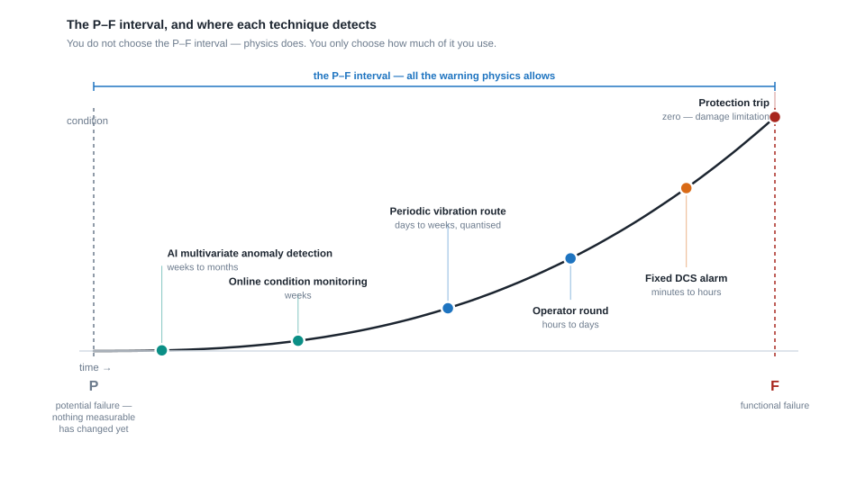
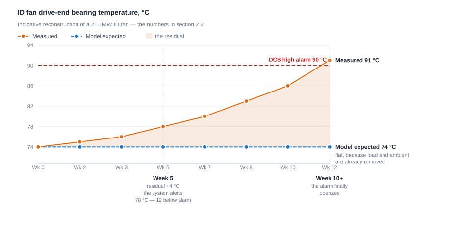

## Participant Handout — Part 1 (Topics 1 to 4)

**AI in Power Plants: From Data to Decisions**
MAHAGENCO Training Centre, Nashik · Hybrid session · Participants from Nashik (Eklahare), Koradi, Khaperkheda, Bhusawal and Paras

This is the written companion to the one-hour session. It is longer than the slides because the slides must be readable over a video link and this need not be. Nothing here asks you to take a claim on trust; where a number appears, the basis is stated so that you can substitute your own station's figures and see whether the argument still stands.

**Every rupee and kcal/kWh figure in this handout is indicative.** All economics use one basis, stated once and reused throughout:

> **Standard basis: PLF 65 %, as-fired GCV 3,400 kcal/kg, landed coal ₹4,000/tonne → cost of heat ₹0.001176 per kcal.**

| Unit size | Annual generation @ 65 % PLF | Value of **1 kcal/kWh** | Value of **10 kcal/kWh** | Coal saved @ 10 kcal/kWh |
|---|---|---|---|---|
| 210 MW | 1.196 million MWh | ₹14.1 lakh/yr | **₹1.41 crore/yr** | 3,517 t/yr |
| 250 MW | 1.424 million MWh | ₹16.7 lakh/yr | **₹1.67 crore/yr** | 4,187 t/yr |
| 500 MW | 2.847 million MWh | ₹33.5 lakh/yr | **₹3.35 crore/yr** | 8,373 t/yr |
| 660 MW | 3.758 million MWh | ₹44.2 lakh/yr | **₹4.42 crore/yr** | 11,053 t/yr |

If your PLF is 55 % and not 65 %, scale down by the ratio. If your landed coal is ₹4,800/tonne, scale up. The arithmetic is deliberately simple so that you can redo it on the back of a log sheet and argue with it.

**Who is in the session.**

| Station | Units | Capacity represented | Technology |
|---|---|---|---|
| Nashik TPS (Eklahare) | 3 × 210 MW (Units 3–5) | 630 MW | Subcritical, ageing (1979–81 vintage) |
| Koradi TPS | 3 × 660 MW | 1,980 MW | Supercritical |
| Khaperkheda TPS | 4 × 210 MW + 2 × 500 MW | 1,840 MW | Subcritical |
| Bhusawal TPS | 2 × 660 MW | 1,320 MW | Supercritical |
| Paras TPS | 2 × 250 MW | 500 MW | Subcritical |
| **Total** | **13 units** | **≈ 6,270 MW** | Mixed |

That mix matters. What is true for a 1979-vintage 210 MW drum unit is not automatically true for a 660 MW once-through supercritical machine on two shifts. Where the difference is material, this handout says so.

---

## Chapter 1 — AI Fundamentals for Power Plant Engineers

### 1.1 Why this matters now, and not five years ago

A fair question from anyone with twenty years on the floor: we have run these units for decades with a DCS, a vibration route, an efficiency cell and experienced people. What has changed? Five things, and they have changed together.

#### Cycling and two-shifting on machines designed for baseload

Eklahare Units 3–5 were commissioned between 1979 and 1981 on the assumption that they would be synchronised and left there. The 500 and 660 MW units have more load-following capability, but "more" is not "unlimited". Today the merit order, the solar window and the evening ramp mean units back down in the afternoon, ramp hard in the evening, and in some cases shut overnight.

Cycling damages a plant differently from steady operation: **thermal fatigue in thick sections** — drum shells and header stubs on the subcritical units, thick-section headers, separator vessels and turbine rotors on the supercritical machines; repeated wet-to-dry transitions on once-through boilers; more BFP, mill and valve cycles; chemistry excursions during start-up that never occur on a machine left alone.

The point for this session: **cycling damage is cumulative, slow and invisible to a fixed alarm.** A drum being fatigued by an excessive ramp rate raises no alarm. It fails years early. The only way to see it is to compute it from data you already have.

#### Ageing 210 MW assets alongside new supercritical units

The fleet spans forty-five years of technology, and the business case differs across it:

| | Ageing 210 MW subcritical | New 660 MW supercritical |
|---|---|---|
| Dominant concern | Availability, forced outage, ageing auxiliaries | Heat rate, ramp capability, thick-section life |
| Biggest AI payoff | Early warning on rotating plant; avoided forced outage | Combustion and heat-rate optimisation; creep and fatigue life tracking |
| Data situation | Older DCS, fewer tags, more historian compression | Modern DCS, more tags, better historisation |
| Instrument trust | Verify tag by tag | Better, but still verify |

#### Tightening emission norms

Revised PM, SOx and NOx norms have moved emissions from an annual-return item to an operating constraint. NOx in particular is now a **combustion tuning problem coupled directly to heat rate**: the tilt, excess air and over-fire air settings that minimise NOx are not those that minimise unburnt carbon or hold reheat temperature. Where we once optimised one objective, we now trade off four or five simultaneously, at varying load and varying coal. That is a problem a person cannot solve by hand every fifteen minutes and a model can.

#### Coal quality variability

An as-fired GCV swinging between roughly 3,100 and 3,800 kcal/kg, with ash and moisture varying, changes mill loading, mill outlet temperature, PA flow, furnace exit gas temperature, ESP ash loading and the whole heat balance. Settings correct for one coal are wrong for another. The plant is effectively a different plant every rake. A model that learns the relationship between coal, mills and boiler performance can re-optimise; a laminated card on the control desk cannot.

#### The retirement of tacit knowledge

In every station represented here there is someone who can stand in front of a mill and tell you from the sound that the roller journal is going, or who remembers that this BFP always did that after a hot restart in 2009 and it was the recirculation valve. That knowledge is in no manual. When that person retires, it leaves with them.

Two consequences. First, much of what we call industrial AI is **an attempt to encode in models and searchable knowledge systems the pattern recognition that experienced engineers do intuitively**. Second, and bluntly: the value of these tools is highest exactly where experience is thinnest. A 27-year-old shift engineer with an anomaly-detection screen is not equal to a 55-year-old with thirty years on the unit — but the gap is smaller than it would otherwise be.

### 1.2 What AI, machine learning, deep learning and generative AI actually are

Most confusion in this field is vocabulary, not concept.

> **AI contains ML. ML contains DL. Generative AI sits alongside, drawing mostly on DL.**

- **Artificial Intelligence** is the outermost box: any technique that makes a machine do something we would call intelligent in a person. Much of it involves no learning at all. Your **interlock logic is AI in the oldest sense** — expert rules encoded in a machine. A 1990s boiler expert system with 400 IF-THEN rules written by a commissioning engineer is AI and learns nothing.
- **Machine Learning** is the subset where the machine **derives the rules from data instead of being given them**. Nobody writes the rule; you show it years of history and it works out the relationships. Almost everything in Chapters 2 to 4 lives here.
- **Deep Learning** is a subset of ML using many-layered neural networks. It excels where the input is large and unstructured — images, sound, vibration waveform. It needs far more data and is harder to explain. **For most plant tasks you do not need it**; conventional ML on well-chosen process tags will outperform it and will be defensible in a review meeting.
- **Generative AI** sits alongside, not inside, the monitoring stack. It is a **language and knowledge tool**, not a process-monitoring tool. It will not tell you a BFP bearing is degrading. It will find, in seconds, the three previous RCA reports where one did, and draft the work order.

| Term | Engineering analogy |
|---|---|
| Rule-based AI | The interlock and protection logic sheet. A human decided every rule; the machine executes it and never learns |
| Machine learning | A performance curve fitted from actual test data rather than taken from the OEM datasheet — **derived from measurements**. ML is this, with fifty variables instead of two |
| Deep learning | An operator recognising an abnormal flame pattern through the peephole. Nobody can write down the rule, and he needed years of looking |
| Generative AI | A very well-read junior engineer who has memorised every manual and circular — fast, articulate, occasionally and confidently wrong, always needing checking |
| Digital twin | Your performance cell's heat-balance model, continuously updated from live data instead of run once a quarter |

**Two phases, often confused.** **Training** happens once and then periodically: the model is given historical data offline and finds the relationships. It takes hours or days and touches nothing on the plant. **Inference** happens continuously: the trained model receives current values and produces an output in milliseconds. When told "the AI learns from the plant in real time", ask which is meant. Continuous online retraining is rarely wise on a power plant, because **a model that keeps retraining on recent data will quietly learn that the degraded condition is normal.**

### 1.3 The single most important concept: expected versus actual

Take one idea from this session and take this one.

#### The bearing that tells you nothing

An ID fan bearing reads **70 °C**. Good or bad? You cannot answer, and every engineer here knows why, because your first questions would be: what load? what ambient? what cooling water temperature, and is the cooler fouled? what damper or IGV position? just started or steady for eighteen hours? **And what did it read last week at this same load and ambient?** That last question is the one your DCS cannot answer.

#### What the fixed alarm does

The DCS has a high alarm at, say, 90 °C. That setting must not nuisance-alarm on the worst legitimate day of the year — full load, 45 °C ambient, warm cooling water. So it is set **above the worst normal condition**, and is therefore structurally incapable of telling you anything until the machine is already in distress. Its basis is one thing only: **an absolute value compared with a constant.**

#### What the residual model does

A residual model has learned from your own history:

> expected bearing temperature = f(load, ambient, CW temperature, IGV position, fan current, hours since start, and thirty other signals)

and computes, every minute:

> **residual = actual − expected**

The alarm asks *"is this value beyond a constant?"*. The residual asks *"is this value what it should be, given everything else the machine is telling me right now?"* Those are different questions, and only the second one has a useful answer at part load, in winter, or while something is slowly drifting.

When the residual goes positive and stays positive, something is either removing heat less effectively or generating heat that was not there. Deciding which — lubrication, cooler fouling, an incipient bearing defect, instrument drift — is engineering work, not AI work. The model's entire contribution is to tell you, early, that there is something to diagnose.

> **How early, and how much below the alarm?** Chapter 2.2 walks this exact bearing through a real degradation week by week, with the numbers. Read it before you decide what this is worth.

This is not new to you. It is exactly what the performance engineer does comparing actual condenser back pressure against the expected value from CW inlet temperature and load using OEM correction curves. AI-based monitoring is that idea applied to **several hundred tags at once**, with the expectation learned from your own plant rather than a datasheet, updated every minute rather than every month. The rest is engineering.

### 1.4 Three ways machines learn

#### Supervised — learning from labelled examples

You give inputs **and** correct answers; the model learns the mapping. Like teaching a trainee with a worked answer book. The scarce resource on a power plant is **labels**: you have millions of rows of process data and very few rows where someone wrote "roller bearing failure on Mill C, confirmed on strip-down".

- **Predicting mill outlet temperature or mill differential pressure** from coal flow, PA flow, damper positions and coal moisture. Here the label is the measured value itself, available for every historical minute — which is why such models are easy to build.
- **Estimating unburnt carbon in fly ash** from combustion parameters, calibrated against periodic laboratory analysis. Labels are few — perhaps one per shift — and the value is turning an occasional lab result into a continuous online estimate.

#### Unsupervised — learning what normal looks like

You give data with **no answers**. The model finds structure: which signals move together, what a typical operating state looks like. Anything not fitting is flagged. This is the workhorse of condition monitoring precisely because it needs no failure labels — you need only a period of healthy operation.

- **Multivariate anomaly detection on a BFP or fan**: the model learns how bearing temperatures, vibration, flow, discharge pressure, current and lube oil temperature normally move together, and flags the day one stops fitting.
- **Clustering operating states** to discover, unprompted, that the unit actually runs in seven distinct regimes (three-mill full load, four-mill full load, part load with Mill A out, start-up, and so on) — then used for mode-aware alarming and like-for-like performance comparison.

#### Reinforcement — learning by trying and being scored

The model acts, receives reward or penalty, and learns a policy. Be careful: this is **the most oversold category in industrial AI.** You cannot let an algorithm experiment on a live 660 MW boiler. Genuine applications train against a simulator or a learned plant model, then deploy with hard constraints. Both examples below are **emerging, not proven**, in Indian generation:

- **Combustion set-point optimisation**, reward combining heat rate, NOx and steam-temperature deviation; actions are small biases to excess O₂, tilt and dampers — trained against a model of the boiler, not the boiler.
- **Soot-blowing sequencing**, reward being heat-transfer recovery minus steam consumed and tube-erosion penalty.

| Paradigm | What you must supply | Typical plant use | Maturity in Indian generation |
|---|---|---|---|
| Supervised | Inputs and known correct outputs | Soft sensors, performance prediction, life estimation | Proven |
| Unsupervised | Healthy operating history only | Anomaly detection, condition monitoring, mode discovery | Proven |
| Reinforcement | A simulator or plant model, plus a reward definition | Combustion and soot-blowing optimisation | Emerging |

### 1.5 Where this layer sits: advisory, not protection

Chapter 2 compares detection timing in detail — when each technique fires, and how much warning it buys. There is one distinction that belongs here instead, because it decides how the whole thing is engineered rather than how well it performs.

| | Conventional DCS alarm and protection | AI-based monitoring |
|---|---|---|
| **Response requirement** | Milliseconds. It is part of control and protection, and it must act whether or not anyone is looking | Minutes are fine. It is an advisory layer, deliberately outside the protection path |
| **What happens if it is wrong** | A spurious trip. Lost generation, a thermal cycle on the machine, and a report to write | An engineer wastes an hour |

**That asymmetry is the entire argument for where AI belongs.** A protection system must be conservative because the cost of a false positive is a trip and the cost of a false negative is a wrecked machine. An advisory layer can afford to be sensitive, because the worst case is a wasted inspection. Push AI into the protection path and you inherit the protection system's risk budget, which means you must detune it until it detects nothing useful.

So: AI-based monitoring does not replace your alarms, your interlocks or your protection. It sits alongside them, sees things they were never designed to see, and hands the result to a human. Chapter 7 returns to this as a hard rule with a defined boundary.

### 1.6 What AI is NOT

**Not a replacement for protection systems.** Nothing here goes into protection logic. Turbine overspeed, generator differential, boiler MFT, drum level trip, motor protection relays — all remain deterministic, tested, certified and independent of any model. The reason is engineering logic, not conservatism: protection must have **provable, repeatable behaviour under all conditions**, and a learned model does not have that property. An AI system that is wrong writes a bad advisory; a protection system that is wrong destroys a machine or hurts a person.

**Not a substitute for engineering judgement.** Anomaly detection tells you Mill B is behaving differently from how Mill B used to behave. It will not tell you the coal changed, the roller was replaced with a different vendor's part, or the hot air damper actuator is sticky. The tool narrows the search; it does not conclude the investigation. A plant that treats the alert as the answer rather than the question will get poor results and will blame the software.

**Not magic that works without data.** If a tag is not instrumented, no model can infer it reliably. If it is not historised, no model can be trained on it. If the historian compresses aggressively, the small deviations the model needs were discarded before it ever saw them. If a transmitter has been frozen at a plausible value for six months, the model will learn that value is normal. **The quality ceiling of any AI system is the quality of the plant's instrumentation and data collection.** No vendor's algorithm raises that ceiling.

**Not a substitute for maintenance.** Someone still has to attend to the finding, with spares, an outage window and a competent fitter. A station with excellent alerts and no spares gets excellent documentation of its own failures.

**Not a one-time project.** An overhaul, a new coal source, a retrofit, a replaced transmitter — each invalidates part of what the model learned. Budget for maintaining models as you budget for maintaining an instrument.

### 1.7 Vocabulary you will hear

| Term | Plain meaning for a plant engineer |
|---|---|
| **Model** | A learned relationship between plant signals — a fitted multi-variable performance curve derived from your own history |
| **Training** | The offline derivation of that relationship from historical data. Done on a copy of historian data; does not touch the plant |
| **Feature** | An input to the model. Usually a tag, sometimes a derived quantity — a difference, ratio or rate of change. Derived features are often where the value is |
| **Label** | The known correct answer used in supervised learning: a confirmed failure mode, a laboratory result |
| **Residual** | Actual minus expected. The single most important quantity in this subject |
| **Anomaly** | A persistent, unexplained residual, or a combination of residuals not matching learned behaviour. Not the same as a fault |
| **Drift** | Slow change over time — of the plant (genuine degradation) or of the model (expectations no longer matching a legitimately changed plant) |
| **False positive** | An alert with nothing behind it. The currency in which operator trust is spent |
| **False negative** | A real problem missed. Rarer, but far more damaging to credibility |
| **Precision** | Of the alerts raised, what fraction were real. "When it cries wolf, is there a wolf?" |
| **Recall** | Of the real problems, what fraction were caught. You cannot maximise both; you choose the balance deliberately |
| **Digital twin** | A live, data-updated model of a machine or unit, used to compute what you cannot measure — hot-spot temperature, thick-section thermal stress, cumulative fatigue |
| **LLM** | A model trained on very large volumes of text that produces language. Knows language and general knowledge; knows nothing about your plant unless you give it your documents |
| **RAG** | Retrieval-augmented generation: making an LLM answer **from your documents** — manuals, SOPs, RCA reports, circulars — by retrieving relevant passages first and requiring the answer to cite them. This turns a general assistant into a plant assistant |
| **Inference** | Running a trained model on current data. Fast, cheap, continuous |
| **Edge** | Computation done at the plant rather than in a remote data centre. Preferred where latency, connectivity or cyber-security boundaries matter — which in a generating station is most of the time |

---

## Chapter 2 — From Conventional Monitoring to Intelligent Monitoring

### 2.1 The P–F curve, in language for this plant

*Figure 2.1 — Every technique detects somewhere along the P–F interval. You do not choose the interval; you choose how much of it you use.*

Consider any component that degrades rather than failing instantaneously. At some point **P (potential failure)** it ceases to be healthy — a micro-crack in a race, a film of deposit, a loosening bolt — and at that moment **no conventional parameter has changed measurably**. Degradation then grows and becomes detectable, first by sensitive techniques and finally by crude ones. At **F (functional failure)** the component can no longer do its job.

The **P–F interval** is the total warning time physics allows. Every technique detects somewhere along it. **You do not choose the P–F interval — physics does. You only choose how much of it you use.**

| Technique | Where it detects | Typical warning available (indicative) | What it costs |
|---|---|---|---|
| **AI-based multivariate anomaly detection** | Earliest of the routine techniques — detects a change in relationships before any single parameter is abnormal | Weeks to a few months for slow degradation | Data infrastructure and model engineering; no new sensors if tags exist |
| **Online condition monitoring** (continuous vibration, online DGA, temperature trending) | Early — once the parameter itself changes measurably | Weeks | Hardware per machine; significant across a fleet |
| **Periodic vibration route** | Middle — detects a developed defect, but only when the route happens to run | Days to weeks, **quantised by route frequency**: a fault developing in three weeks may be missed entirely on a monthly route | Analyst time |
| **Operator round** | Middle to late — a skilled operator detects real things, with variable coverage and no trend record unless written down | Hours to days | Already paid for; grossly underexploited |
| **Fixed DCS alarm** | Latest — an absolute limit set for the worst legitimate condition | Minutes to hours | Already installed |
| **Protection trip** | At or after F | Zero — damage limitation, not warning | Already installed |

Two conclusions. The fixed alarm sits at the far right **by design**; criticising it for being late is like criticising a fire alarm for not detecting a frayed cable. And the periodic route has a **quantisation problem** rarely stated: if the route is monthly and a defect goes from undetectable to failure in five weeks, you have roughly a one-in-five chance of catching it.

### 2.2 Why a fixed threshold is structurally late — a worked ID fan bearing example

This is the bearing from 1.3, followed through an actual degradation. The concept there was one subtraction; here is what that subtraction is worth in weeks.

First, the comparison the rest of this chapter rests on:

| | Fixed alarm | Residual model |
|---|---|---|
| Question answered | "Is the value beyond a constant?" | "Is the value what it should be, given everything else?" |
| Basis | One tag against a conservatively chosen constant | Many tags against an expectation that moves with load, ambient and operating mode |
| At part load | Poor — a value abnormal at 120 MW is far below the alarm | Good — the expectation moves with load |
| In winter | Poor — the alarm is set for summer | Good — the expectation moves with ambient |
| Gradual drift | Not detected | Detected; this is what it is for |
| Change in the relationship between two signals | Not detected | Detected |
| What it tells you | That a number crossed a line | Which signals no longer behave as they used to, by how much, and for how long |
| False alarms | Very high in aggregate — most control rooms live with hundreds of standing and nuisance alarms | Must be engineered down; see 2.5, which decides whether any of this survives |
| History required | None — works from day one | Needs a period of known-good history |

*Figure 2.2 — The expected line stays flat because load and ambient have already been removed. The whole story is the widening gap, not the rising line: the residual reaches +4 °C in week 5, when the measured value is still 12 °C below the alarm.*

All figures below are **indicative**, typical of a 210 MW ID fan. DCS high alarm 90 °C, high-high 95 °C. Learned expectation at 165 MW, 32 °C ambient, 33 °C CW: 74 °C.

**Week 0.** Healthy. Actual 74 °C, expected 74 °C, residual 0. Nothing anywhere.

**Week 3.** Something has begun — degraded oil supply, or early race damage. Actual 76 °C, expected 74 °C, **residual +2 °C.** The absolute value is unremarkable, 14 °C below alarm; the residual is now consistently positive rather than scattering about zero.

**Week 5.** Actual **78 °C**, expected 74 °C, **residual +4 °C sustained over several days and across multiple load points.** The system alerts.

Note what this means. **78 °C is 12 °C below the DCS alarm.** No operator would look twice. 78 °C has occurred hundreds of times on this machine — at full load on a summer afternoon, entirely normally. The point is that **at this load and this ambient, 78 °C is abnormal**, and only a model that knows the expected value can say so. The absolute number carries no information; the residual carries all of it.

**Week 7.** Residual +6 °C, actual ≈ 80 °C. Vibration has just begun to rise, 2.8 → 3.4 mm/s — still acceptable and unlikely to be flagged on a route.

**Week 10.** Actual 86 °C at full load on a warm day, vibration 5.1 mm/s. The operator notices, because the number is now near the alarm.

**Week 10+.** 90 °C. **The DCS alarm finally operates.** The bearing is in advanced distress. Options: run to failure on the standby, or take a forced outage.

| Detection route | Week detected | Lead time before DCS alarm |
|---|---|---|
| Residual model | 5 | **≈ 5 weeks** |
| Vibration route (if it fell in week 8 or 9) | 8–9, or missed | 1–2 weeks, or zero |
| Operator noticing the absolute value | 10 | Days |
| DCS fixed alarm | 10+ | Zero — it *is* the deadline |

Five weeks is the difference between **a planned intervention with the spare in hand and the standby lined up** and **a forced outage decided under pressure**. One avoided three-day forced outage is **15,120 MWh (210 MW)** or **47,520 MWh (660 MW)** not generated. Take your own view of what a MWh is worth; the argument does not need the number to be large, only non-zero — and the cost of detecting it five weeks earlier was a model running on tags you already record.

**Why not simply lower the alarm to 78 °C?** Because 78 °C is entirely normal at full load on a summer afternoon. Lower it and you create a standing nuisance alarm every hot day, which within a fortnight is inhibited or ignored. **A fixed alarm cannot be made earlier without being made useless, because it has one number and the plant has many operating conditions.** That is not a configuration failing; it is the structural limit of comparing an absolute value with a constant, and it is exactly what the residual approach removes.

### 2.3 How anomaly detection actually works — without the mathematics

**Step 1 — Choose a period of known-good operation.** This is an **engineering judgement, not a software setting**, and it determines success more than any other step. Typically 12 to 24 months, and it must span the **full load range** the unit actually operates over; **both seasons** (a model trained on winter data alarms all summer); **all normal equipment configurations** — three-mill and four-mill, both CW pumps and one, each fan combination; and **no period of known degradation**. Include six months during which the bearing was already degrading and the model learns that the degraded state is normal, and will never flag it again. This is the commonest way these projects fail quietly.

**Step 2 — Build a memory of how the signals move together.** The model records **patterns of joint behaviour**: how bearing temperature relates to load, ambient, CW temperature and running hours; how discharge pressure relates to flow and speed. It is not learning thresholds; it is learning a **shape** — the set of reading-combinations the healthy machine actually produced. The most widely used family is **similarity-based modelling**: a set of representative healthy states is stored, and a prediction is made by finding which stored states most resemble the present condition and blending them. Think of a very large, automatically indexed logbook: "the last several hundred times the plant looked like this, here is what this bearing read." Systems of this family have been deployed for two decades on Indian and international generating fleets, on gas turbines, nuclear plant and large rotating auxiliaries. This is proven technology, not a research idea.

**Step 3 — Predict what each signal should be right now.** The model takes the **current values of all the other signals** and produces an expected value for each. Note the subtlety: it predicts each signal *from the others*. It is not extrapolating a trend; it is asking "given everything else the machine is telling me at this instant, what should this sensor read?" Then **residual = actual − expected**, every signal, every minute.

**Step 4 — Flag persistent, unexplained deviation.** A single minute with a large residual is noise. What matters is **persistence and pattern**: the residual exceeding a statistically derived band for a sustained period, or a group of related residuals moving together in a recognised way.

The output is not "bearing failure". It is: *"On ID Fan A, over the last nine days, NDE bearing temperature is consistently 4 °C above expected and lube oil outlet temperature 2 °C above expected, while vibration and current remain as expected. The deviation is present across the load range."* That says what changed, by how much, for how long, and what did **not** change — often the most diagnostic part. It cannot tell you the cause. It narrows a hundred possibilities to five; you close the last five.

### 2.4 Operating-mode segmentation — a first-order issue for this fleet

A predictable failure that still happens on most first deployments. The model is trained on full-load steady operation because that data looks cleanest. It performs beautifully. Then the unit backs down for the solar window or takes a cold start, and the screen goes red — every signal deviating, because the plant is in a state the model has never seen. The operator sees fifty simultaneous alerts, correctly concludes they are nonsense, and stops looking. **You have destroyed the system's credibility in one start-up.**

This fleet **cycles**, which makes the problem first-order rather than cosmetic. Transient and part-load conditions are now a large fraction of operating time; they are also **exactly when things go wrong** — thermal stress, chemistry excursions, mill trips, drum-level and separator transitions all cluster around load changes and starts. The periods you most need monitored are the ones a naively trained model handles worst.

| Approach | What it does | Comment |
|---|---|---|
| **Mode-specific models** | Separate models for start-up, low load, part load, full load, shutdown | Cleanest and most common. Needs enough healthy history in each mode — often the constraint |
| **Mode as an input** | Load, ramp rate and configuration flags given to the model as features | Simpler; works where transitions are gentle |
| **Transient suppression** | Alerting inhibited during defined transients and a settling period | Necessary, but use sparingly — suppress too much and you are blind during the riskiest hours |
| **Configuration-aware modelling** | The model knows which mills, fans and pumps are in service and expects different behaviour | Essential on multi-train auxiliaries; often neglected |

**The question to ask a vendor:** *"Show me your model's residuals during a cold start and during an evening ramp from 60 % to 100 % on a unit of this size — not full-load steady state."* The answer tells you more than any brochure.

### 2.5 Alert quality — the thing that decides whether any of this survives

**Lead time.** How far ahead of the conventional indication did the alert arrive? Measure it per alert, in days. This is the benefit side of the ledger. Record it from day one, because in eighteen months, when you are asked to justify the budget, nobody will remember.

**False alarms per model per month.** The cost side, and the metric that kills programmes.

| Alerts per model per month | Practical consequence |
|---|---|
| Under 1 | Sustainable. Each alert gets genuine engineering attention. A reasonable mature target |
| 1 to 3 | Manageable if most are real and triage is defined |
| Over 5 | The engineer stops reading them. Effectively the system is off |

Multiply by the number of models: 60 models at three alerts each is 180 alerts a month, six a day, for one person to triage. Nobody does that for long. **Alert budget is a real constraint and must be designed for explicitly**, not discovered after go-live.

**Precision and recall.** You cannot maximise both. Tighten thresholds and precision rises while recall falls — you miss things. Loosen them and you drown in noise. The setting is **a business decision, not a technical one, and it should differ by machine**: on a critical single-train machine with a nine-month spare lead time, accept more false alarms; on a redundant auxiliary with a cheap failure mode, tighten it.

> **An alert that nobody acts on is worse than no alert at all.**

Worse for three reasons. It consumes attention that belongs elsewhere. It **trains the organisation to ignore the system**, and that training generalises to the alert that mattered. And it creates a record that the plant was warned and did nothing — in an RCA, "the system flagged this eleven weeks ago and no action was taken" is a considerably worse position than having had no system. The corollary is uncomfortable but firm: **do not deploy more models than you can triage.** Ten well-tuned models on your ten most critical machines, with a named engineer reviewing every alert, deliver far more than three hundred nobody reads.

### 2.6 What intelligent monitoring can and cannot detect

| Can detect reliably | Cannot detect |
|---|---|
| Gradual thermal degradation — bearings, coolers, heat exchangers, windings | Any failure with no instrumented precursor (most fasteners and gaskets, sudden brittle fracture) |
| Fouling and heat-transfer loss where flows and temperatures are measured | Faults in equipment not instrumented or not historised |
| Change in the relationship between two normal-looking signals — often the earliest indication of all | Failure modes absent from training history (flagged as *unusual*, but not named) |
| Performance and efficiency drift against expectation | Rapid catastrophic events — that is protection's job, and it is faster |
| Instrument drift, freeze and calibration error — a genuine and underrated benefit | Anything happening between historian samples if scan or compression is coarse |
| Progressive valve and damper problems visible in demand-versus-feedback behaviour | Root cause. It localises; it does not conclude |
| Abnormal operating practice — shift-to-shift differences, unnecessarily conservative set points | Consequences of decisions the plant has never taken before |
| Developing imbalance, misalignment and looseness where vibration is monitored continuously | Sub-surface material condition without a dedicated NDT technique |

### 2.7 The data pathologies that will bite you

Every one of these has derailed a real deployment. Put them in the pilot scope rather than discovering them in month five.

#### Historian compression and exception deviation — the silent killer

Historians save space by not storing every sample. **Exception deviation** at the interface reports a new value only if it differs from the last by more than a band. **Compression deviation** in the archive discards values lying close enough to a straight line through retained points. Both are sensible for disk space and **catastrophic for residual monitoring**, because the method depends on detecting 2–4 °C deviations, and a 1 % compression band on a 0–150 °C bearing tag is a 1.5 °C dead band that erases exactly the signal you need.

The cruellest part: the trend on your screen **still looks perfectly smooth and plausible**. Compression leaves no visible gaps. You cannot detect this by looking at a trend; you must check the configuration.

| Check | What to look for |
|---|---|
| Exception deviation per tag | A fraction of the deviation you intend to detect |
| Compression deviation per tag | The same. For critical PdM tags, consider switching compression off entirely |
| Actual stored sample interval | Count real archived values in a day. 400 stored values for 1,440 minutes on a temperature tag is a problem |
| Interface scan rate | A 1-minute scan cannot see a 10-second event |

Identify your PdM-critical tags — a few hundred, not tens of thousands — and configure tight or zero compression on **those specific tags**. Storage is cheap; a missed bearing is not.

#### Frozen transmitters reading a plausible constant

A transmitter reading zero or off-scale is caught at once. One that **stops updating and holds its last plausible value** is invisible and poisonous. A bearing RTD frozen at 71 °C teaches the model that the bearing is remarkably stable, and — because that value is also an *input* to other predictions — corrupts those too. Detection is easy once you look: flag any analogue tag whose value has not changed at all over a period when plant condition changed materially. This check is cheap, catches a surprising number of instruments on any plant, and **pays for itself in instrument maintenance alone**, independently of any AI.

#### Timestamp misalignment

DCS, vibration system, CEMS, coal analyser, LIMS and ash handling PLC often carry different clocks. A 30-second offset destroys any attempt to correlate a vibration event with a load change; a manual clock correction creates a step the model may read as a plant event. Require **all sources NTP-synchronised to a common reference**, documented time-zone handling, and a check for duplicate or non-monotonic timestamps after any clock adjustment. Laboratory results must carry the **sample time, not the analysis time** — this single point invalidates a great deal of chemistry-related analysis.

#### "It is in the DCS" does not mean "it is being historised"

A tag can be perfectly visible on the operator screen and absent from the archive. Common causes: never added to the historian point list; added but the interface point is stopped or in error; point-count licensing capped collection and somebody chose which tags to drop years ago without documentation; collected but at a much coarser rate than the DCS scan; or the tag lives in a local PLC — mill, ash handling, CHP, ESP — never integrated with the plant historian at all. That last case is very common for exactly the auxiliaries in Chapter 3.

**Before any pilot:** take your required tag list and, for each tag, pull **actual archived data for a specific past week** and look at it. Not the tag list — the data. Count the samples, check the range, check it moves. Two engineers for a fortnight routinely find that 15 to 30 % of assumed-available tags are not usable as they stand. Finding that in week two is a scope adjustment; finding it in month five is a failed project.

| # | Data-readiness check | Pass criterion |
|---|---|---|
| 1 | Required tags exist in the historian | 100 % of the critical list, verified against archived data |
| 2 | Compression and exception settings on PdM tags | Tight or off; dead band well below the deviation to be detected |
| 3 | Stored sample interval | 1 minute or better for process tags on critical machines |
| 4 | Frozen-value scan across analogue tags | No unexplained constants over a period of changing plant condition |
| 5 | Clock synchronisation across all sources | Common NTP reference; documented |
| 6 | Healthy history spanning load range and seasons | 12–24 months preferred |
| 7 | Equipment configuration and running status as tags | Which mill, fan, pump is in service |
| 8 | Maintenance and outage history retrievable and dated | Needed to exclude degraded periods from training |
| 9 | Laboratory data with sample timestamps | Coal, ash, oil and water chemistry |
| 10 | Read-only extraction path agreed with C&I and IT security | No write path from analytics to the control system |

---

## Chapter 3 — AI for Predictive Maintenance

Each section gives the engineering context, the signals used, what the model detects, a realistic lead time, and an honest note on limitations. **All lead times are indicative** and vary enormously with failure mode, machine condition and instrumentation quality. **Proven** means widely deployed on operating fleets with reproducible results; **Emerging** means it works in some installations but an adopting station should expect to do development work. One rule applies throughout: **the model narrows the search; the engineer closes it.**

### 3.1 Boiler feed pumps

The BFP is the machine that most reliably costs a unit its availability: high-energy, close to saturation at suction, and fast-moving once a failure mode starts. Two configurations are represented here, and the difference changes what you monitor.

| Configuration | Units | Monitoring implications |
|---|---|---|
| **Motor-driven (MDBFP)** | Nashik 210 MW, Khaperkheda 210 MW, Paras 250 MW | Motor current is a rich, free, continuously historised diagnostic. Scoop position or VFD speed is a key input |
| **Turbine-driven (TDBFP)**, with motor-driven standby | Khaperkheda 500 MW, Koradi and Bhusawal 660 MW | No motor current on the main pumps. Speed varies continuously, so **every model must be speed-normalised**. Adds the drive turbine as a monitored machine: steam admission valves, exhaust conditions, gland sealing, lube oil, and auxiliary-to-extraction steam changeover |

On the supercritical units the BFP is not merely a pump: in once-through operation, **feedwater flow is a primary control variable for steam temperature**, so pump misbehaviour propagates straight into the main steam temperature loop. That coupling makes early detection worth more on a 660 MW unit than the repair cost alone suggests.

**Signals used.** Bearing metal temperatures (radial and thrust, both bearings), shaft and casing vibration, axial displacement; lube oil supply/return temperature and pressure, oil cooler temperatures both sides, filter differential pressure; suction and discharge pressure and temperature, feedwater and booster flow, differential head, deaerator level and pressure, computed NPSH available; motor current and winding temperatures with scoop or VFD position (MDBFP) or turbine speed, steam conditions and governor valve position (TDBFP); seal or gland leak-off flow and temperature, seal water differential; recirculation valve position and demand; balance leak-off temperature.

| Failure mode | Signature | Indicative lead time |
|---|---|---|
| **Radial and thrust bearing degradation** | Bearing metal temperature above expectation for flow, speed and oil inlet temperature; oil return temperature rising; vibration rising later | 3–8 weeks |
| **Mechanical seal wear** | Leak-off flow drifting outside its learned relationship with discharge pressure and speed; seal chamber temperature rising; seal-water differential deviating | 2–6 weeks |
| **Cavitation / NPSH margin loss** | Computed NPSH available falling towards required; suction pressure abnormal for deaerator level and pressure; broadband vibration energy rising; correlation with deaerator transients during ramps | Days to weeks — **but during a fast transient, minutes** |
| **Recirculation (min-flow) valve problems** | Valve not opening at the learned flow set point; flow and power inconsistent with valve position; **a stuck-open valve shows as a persistent unexplained rise in pump power at unchanged feed flow** — a pure, quantifiable energy loss | 1–4 weeks; the stuck-open case is detectable immediately once modelled |
| **Performance curve drift** (wear-ring clearance, internal recirculation, impeller erosion) | Developed head below expectation at given flow and speed; specific power rising; balance-drum leak-off temperature increasing | 1–3 months — a slow cumulative loss, often the largest auxiliary power item nobody tracks |
| **Lube oil system degradation** | Cooler effectiveness falling (oil ΔT versus water ΔT); filter DP trending; oil pressure deviating | 2–8 weeks |

**Limitations.** Cavitation during a fast transient can damage the pump inside minutes; a model on 1-minute historian data sees it after the event — if this is a known problem, you need faster data, not a better algorithm. Wear-ring clearance cannot be measured; it is inferred from head and power, and separating genuine wear from a flow-meter error needs an engineer. On TDBFPs, poor speed normalisation produces residuals that are simply a function of speed and alarms on every ramp. Suction-side instrumentation is frequently poor, and unreliable suction data makes NPSH-related detection unreliable, full stop. **Maturity: Proven.**

### 3.2 Coal mills and pulverisers

Mills are the most maintenance-intensive rotating plant on the unit, the most directly coupled to combustion performance, and often the **worst instrumented relative to their importance** — frequently sitting on a mill-local PLC never integrated with the plant historian. Bowl mills on the 210/250 MW units, larger bowl or roller mills on the 500/660 MW units; the failure physics is common, only the scale differs.

Three things make mills a strong candidate. Several nominally identical mills per unit means **mill-to-mill comparison at matched loading is available free** and is highly diagnostic. Mill condition drives fineness, which drives unburnt carbon, worth **10–15 kcal/kWh per 1 % increase** (indicative, both technologies). And mill events cause load losses out of proportion to the equipment cost.

**Signals used.** Mill motor current and power, feeder rate and speed, mill differential pressure, grinding/spring loading, mill level; PA flow and header pressure, hot and cold air damper positions, mill inlet and **outlet** temperature, seal air differential; mill and gearbox bearing temperatures, gearbox oil temperature, pressure and filter DP, mill vibration where fitted; classifier vane position or dynamic classifier speed; mill outlet CO and outlet temperature rate-of-rise, inerting system status; coal moisture and GCV from the lab, bunker source, running hours since overhaul, roller and table replacement dates.

| Failure mode | Signature | Indicative lead time |
|---|---|---|
| **Grinding element and roller wear** | For a given coal flow and grinding pressure, mill power drifts from its learned value; the DP relationship shifts; fineness deteriorates; **the affected mill separates from its sister mills at matched loading** | 1–3 months |
| **Mill choking and pluggage** | Mill DP rising at steady coal flow; outlet temperature falling; current rising then erratic; PA flow falling for a given damper position | Slow build-up: hours to days. Fast choke: 10–45 minutes — enough for the operator to act, which is the value |
| **Fineness deterioration** | Inferred from mill power, classifier position, DP and PA flow, calibrated against periodic isokinetic sampling; detected as drift from expectation | Weeks — the real value is a **continuous estimate between quarterly sampling campaigns** |
| **Mill outlet temperature control problems** | Damper demand versus achieved temperature diverging; hot air damper saturating; the loop working harder for the same result. Indicates damper or actuator wear, PA duct leakage, or an air heater problem upstream | 2–6 weeks |
| **Feeder calibration drift** | Indicated coal flow inconsistent with mill power, mill DP and the unit heat and mass balance; **the sum of feeder flows inconsistent with boiler heat input back-calculated from steam flow and coal GCV**. One of the highest-value findings available, because feeder error corrupts every efficiency calculation, every mill loading decision and every combustion optimisation the plant attempts | Detectable within days of commissioning the model, then trackable continuously |
| **Mill fire precursors** | Outlet temperature above expectation for the current air/coal ratio and coal moisture; abnormal rate of rise; outlet CO rising; the condition persisting after coal flow is cut. Highest risk during start-up, shutdown and idling with coal in the mill, and with high-volatile or long-stored coal | Minutes to tens of minutes. A **warning, not a prediction** — but minutes matter here |

**Limitations.** Coal quality variation is the dominant noise source: without moisture and GCV as inputs the model will attribute coal changes to equipment degradation. Fineness cannot be measured online on most mills; any "online fineness" is an inferred estimate needing recalibration against isokinetic sampling after every overhaul. **Mill fire detection is not a protection function** — the inerting system, fire interlocks and operating procedure remain the safeguards, and no model should ever be presented as a fire protection layer. Check historisation of mill-local PLC data first; it is the commonest blocker. **Maturity: Proven for wear, choking and feeder drift; Emerging for online fineness and fire precursors.**

### 3.3 ID, FD and PA fans

Fans are large, consume a substantial share of auxiliary power, and on the ID side run in abrasive fly ash. Fan problems therefore appear in two ledgers at once — **reliability and auxiliary power**. A configuration difference matters: the 210/250 MW units typically use centrifugal fans with damper or IGV control, while the larger units — particularly the 660 MW machines — more often use **axial fans with variable blade pitch**, which are more efficient and controllable but have a failure mode centrifugal fans do not: **surge and stall**.

**Signals used.** Bearing temperatures (DE and NDE, both fans), casing and where fitted shaft vibration, bearing cooling water flow and temperature; inlet and outlet pressure, differential pressure, gas or air flow, damper and IGV position, blade pitch position and demand, speed; motor current and power, winding and bearing temperatures, scoop or VFD output; furnace draught, APH gas- and air-side DP, ESP inlet conditions, ambient temperature and barometric pressure, unit load, mill combination; lube oil temperature and pressure.

| Failure mode | Signature | Indicative lead time |
|---|---|---|
| **Blade erosion from ash** (ID fans especially) | Fan efficiency falling — more power for the same flow and head; damper or pitch progressively opening to hold the same draught; developing imbalance as erosion becomes uneven. **Efficiency loss is measurable long before vibration** | 1–3 months; on high-ash coal a continuous, quantifiable auxiliary power loss |
| **Imbalance** (ash build-up, uneven erosion, lost balance weight) | 1× running speed vibration rising on both bearings in phase; bearing temperatures following later. Ash build-up shows **step changes and partial self-correction** as deposits shed | Days to weeks; shedding events immediate |
| **Bearing wear** | Bearing temperature above expectation for load, ambient and cooling water; oil return temperature rising; defect frequencies where spectral data exists. The thermal residual typically precedes the vibration rise | 3–8 weeks |
| **Damper and IGV problems** — linkage wear, actuator degradation, sticking vanes | Demand-versus-feedback divergence; hysteresis and dead band growing; flow response to position change departing from the learned characteristic; **growing asymmetry between A and B fan positions for the same duty** | 2–6 weeks |
| **Fan surge / stall on axial fans** | Approach to the stall line visible from the operating point relative to the learned characteristic; broadband vibration and pressure pulsation rising as margin closes. Highest risk at low load, during starts and changeovers, and after a furnace pressure disturbance | Margin erosion trackable over weeks; **the surge event itself develops in seconds**, so the model's job is margin monitoring, not event prediction |

**Limitations.** Flue gas flow measurement is often poor, and efficiency-based detection depends on it; where flow is unreliable, fall back on power-versus-position relationships — less quantitative, more robust. Do not accept a claim of "surge prediction"; only margin monitoring is real. Ash build-up and shedding produce genuinely erratic vibration that will generate alerts — real, not false, but needing a diagnostic convention so it is not investigated afresh each time. Erosion rate depends on coal ash and ESP performance, so a coal change shifts the baseline. **Maturity: Proven for bearing, imbalance and efficiency drift; Emerging for stall-margin monitoring.**

### 3.4 Transformers and switchyard

The transformer is unusual here: almost no moving parts, very long life, and an extremely expensive failure. It is also unusually well suited to condition monitoring, because the insulation system leaves a **chemical record of its own degradation** in the oil — nothing else in the plant does this. This section transfers between Nashik and Koradi with no modification.

**Signals used.** Dissolved gases (H₂, CH₄, C₂H₂, C₂H₄, C₂H₆, CO, CO₂, O₂, N₂ and TDCG) from online monitors or periodic lab analysis; oil moisture, breakdown voltage, acidity, interfacial tension, furan content; winding temperature indicator, top and bottom oil temperature, ambient, cooler bank status and fan/pump running current; load current, MVA, through-fault records; tap position, tap-change counter, OLTC motor current signature, OLTC oil temperature and operating time; bushing capacitance and tan delta, leakage current, partial discharge where instrumented; Buchholz and PRD operations, oil level, breather condition, cooler water inlet temperature.

#### Dissolved gas analysis trending

The classical interpretations — key gas, Rogers ratios, Duval triangle, IEEE/IEC limits — are **already expert systems**. They do not need AI; they need to be applied consistently and automatically, which on many stations they are not, because results arrive as a PDF and are read individually rather than trended. What analytics genuinely adds:

- **Rate of change, not absolute level.** A transformer whose acetylene has gone 0 → 3 ppm in two months is far more concerning than one sitting at 15 ppm for eight years. Limit-based alerting catches only the second.
- **Load-normalised gassing**, separating real change from a hot, heavily loaded month.
- **Fleet comparison.** With five stations you have a population; a transformer gassing differently from its peers at the same duty and age is a finding.
- **Sampling artefact detection.** Much apparent DGA excitement is handling error; logic that treats a single implausible point as an outlier rather than an emergency saves considerable wasted effort.

Indicative lead time: **months to years** for slow thermal and cellulose degradation; **days to weeks** for an active arcing fault once acetylene appears. Online DGA converts this from a quarterly to a continuous capability and is generally justifiable on generator transformers from the avoided-failure case alone.

#### Thermal model and hot-spot estimation

The winding temperature indicator on most transformers is not a measurement — it is a **thermal image device**, an oil temperature sensor with a CT-driven heater calibrated at works, and it is often out of calibration. A data-driven model computes expected top-oil and hot-spot temperature from load current, ambient, cooling stage in service and thermal history. The **top-oil residual** reveals cooling degradation — blocked radiators, failed fans, oil pump problems, fouled water side, low oil level — typically **2–8 weeks** before anything nears an alarm. **Hot-spot estimation** feeds a loss-of-life calculation per IEC 60076-7, converting operating history into cumulative insulation ageing; this is the number to use in an argument about overloading policy, and it is far more defensible than an opinion. **Cooler bank effectiveness** can be tracked individually by the temperature drop each bank achieves when it cuts in.

#### OLTC motor current signature

The tap changer contains the transformer's only significant moving parts and causes a large share of transformer failures. Each tap change draws a **characteristic motor current waveform** — motor start, spring charging, mechanism travel, diverter operation, motor stop — which is remarkably repeatable for a healthy mechanism.

| Detected | How it shows |
|---|---|
| Mechanism wear, increasing friction | Total operating time lengthening; current amplitude rising |
| Spring or drive fatigue | Change in the charging portion of the waveform |
| Diverter contact wear | Change in timing and amplitude of the switching portion, correlated with cumulative operations and through-current |
| Motor problems | Starting current change |
| Excessive operation | Tap-change rate rising — often **a control tuning problem, not a mechanical one**, worth catching because operations directly consume contact life |

Also track **OLTC compartment oil temperature relative to main tank oil**: a diverter with degraded contacts runs hotter, and a growing differential is a well-established indicator. Indicative lead time **1–6 months**.

#### Bushing monitoring

Bushing failure is fast, violent and a common cause of transformer fires. Online monitors track **capacitance and tan delta** via the test tap. Because absolute values drift with temperature and humidity, the useful approach is **relative change against a learned, temperature-compensated baseline** — precisely a residual model. Rising capacitance indicates layer failure in the condenser core; rising tan delta indicates moisture ingress or insulation deterioration. Indicative lead time **weeks to months**, and the failure it prevents is one of the worst in the plant.

#### Transformer health index

A health index consolidates all of the above into a single 0–100 score so a fleet of forty transformers can be ranked for attention and capital planning. Weights are indicative and should be set by your own engineers:

| Component | Indicative weight | Inputs |
|---|---|---|
| DGA condition and trend | 30 % | Gas levels, rates of change, fault-type indication |
| Oil quality | 15 % | Moisture, BDV, acidity, interfacial tension |
| Paper / cellulose condition | 15 % | Furan, CO/CO₂ ratio, computed loss of life, age |
| Thermal performance | 15 % | Top-oil and hot-spot residuals, cooler effectiveness |
| OLTC condition | 10 % | Motor signature trend, operation count, oil differential |
| Bushing condition | 10 % | Capacitance and tan delta trend |
| Operating and service history | 5 % | Through faults, protection operations, past defects |

Two warnings: **a health index is a prioritisation tool, not a diagnosis** — never let the score replace looking at the underlying data; and the weights encode engineering judgement that must be owned by your engineers, not by a vendor default.

**Limitations.** Quarterly DGA cannot catch a fault developing in three weeks. Sampling and handling error is the largest source of false DGA alarms, and no algorithm fixes bad sampling practice. Furan estimates *average* paper condition, not the worst spot — and it is the worst spot that fails. Bushing monitoring needs the test tap instrumented, usually a retrofit requiring an outage. And a thermal residual may be telling you about the WTI rather than the transformer; verify before acting. **Maturity: Proven for DGA trending, thermal modelling and health indexing; Proven-to-Emerging for OLTC signature and online bushing monitoring, depending on instrumentation.**

### 3.5 HT and LT motors

The five stations run a very large motor population: HT on BFPs, fans, mills, CW pumps and compressors; a much larger LT population on ash handling, CHP, cooling tower fans and every auxiliary. Individually cheap, collectively a major driver of forced outages. The attraction is that **the motor is its own sensor** — anything mechanical happening in the motor or the driven machine modulates torque, and torque modulation appears in the stator current.

**Signals used.** From the DCS: current, voltage, power, power factor, usually at 1-minute resolution. For genuine MCSA: high-resolution current and voltage waveform from a dedicated device sampling at kHz rates — **this is not available from the DCS**. Plus stator winding and bearing RTDs, cooling air or water temperatures, ambient; casing vibration and lube oil data where fitted; driven-machine load, running hours, start count, start duration, breaker status and protection relay records.

#### Motor current signature analysis

| Fault | Signature | Comment |
|---|---|---|
| **Broken or cracked rotor bar, cracked end ring** | Sidebands about supply frequency at ± 2 × slip × supply frequency; relative amplitude indicates severity and progression is trackable | The classic application. **1–6 months** ahead of failure. Needs accurate slip and a **reasonably loaded machine** — the sidebands are weak at light load |
| **Static and dynamic eccentricity** (bearing wear, misalignment, bent shaft, soft foot) | Rotational-speed sidebands about slot-passing frequencies, and at rotational frequency about the fundamental | Distinguishing static from dynamic matters for the corrective action. Weeks to months |
| **Bearing defects** | Sidebands about supply frequency at the characteristic defect frequencies, modulated into the current | Detectable, but **vibration is more sensitive**. Use MCSA where vibration instrumentation is absent or the motor is inaccessible |
| **Supply-side problems** | Negative-sequence current and current unbalance | Voltage unbalance is a common cause of motor overheating, and it is not the motor's fault |
| **Driven-machine faults** | Mill grinding, pump cavitation, fan imbalance, coupling and gearbox defects appear as torque modulation in the current | Attractive: one accessible measurement covers a machine that may be hot, enclosed or in an ash-laden environment |

**The essential caveat:** the historian's 1-minute RMS current is useful for thermal and loading analysis and gross trending, but **it cannot do spectral MCSA**. If a vendor proposes MCSA using only DCS current tags, that is a conversation worth having in detail.

#### Thermal models

A model predicts winding and bearing temperature from load current, ambient, cooling medium temperature, cooling status and thermal history. The residual detects cooling degradation — blocked air passages, dirty cooler, failed fan, fouled water side — in **2–8 weeks**; bearing degradation in **3–8 weeks**, often before vibration; winding insulation deterioration over weeks to months; overloading and unbalance not visible in an RMS reading, immediately; and cumulative thermal ageing continuously. **This is a high-value, low-cost application**, because winding and bearing RTDs are already installed and historised on almost every HT motor in the fleet. If a station wants a cheap first win, HT motor thermal models are among the best available.

#### Starting current analytics

Every direct-on-line start produces a current envelope — inrush peak, acceleration profile, run-up duration, settling — repeatable for a healthy machine on a healthy supply driving a healthy load.

| Change | Likely cause |
|---|---|
| Run-up time lengthening | Increased load torque (mill full of coal, fan damper not closed, pump not on recirculation), rotor problems, low supply voltage |
| Inrush amplitude change | Supply voltage variation, winding problems |
| Irregular acceleration | Rotor bar problems, driven-machine mechanical problems |
| Thermal recovery time increasing | Cooling degradation |

This is particularly valuable on machines that **start frequently** — ash handling, CHP, cooling tower fans, standby pumps — because each start is a free test with a repeatable protocol. Track **starts per period and cumulative starts** as a condition parameter in their own right: thermal damage from starts is cumulative, and on a cycling unit the starts-per-hour limit is approached far more often than it was on baseload.

**Limitations.** MCSA needs proper instrumentation — be clear whether you are buying signature analysis or trending. MCSA at light load is unreliable; a lightly loaded motor can hide a broken bar. Sensitivity falls with motor size. A **VFD-fed motor changes everything** — the drive's switching content dominates the spectrum and standard interpretation does not apply directly. And the LT population is too large to instrument individually: prioritise by consequence. A 22 kW ash handling motor with three standbys does not warrant what an 1,100 kW mill motor does. **Maturity: Proven for thermal models and starting analytics; Proven for MCSA where the instrumentation exists, and not achievable without it.**

### 3.6 ESP, ash handling and CHP conveyors

These rarely appear in AI presentations, which is odd, because they consume a very large share of maintenance manhours and frequently cause load restriction.

#### Electrostatic precipitator

With tightened particulate norms the ESP is now an operating constraint, and it is a significant auxiliary power consumer of which much is spent unnecessarily. **Signals:** per field, primary and secondary voltage and current, spark rate, rapping cycle status, hopper level and heater status, controller mode; plus load, coal ash and sulphur, gas temperature and flow, inlet/outlet dust or opacity, CEMS output.

| Detected | Signature | Indicative lead time |
|---|---|---|
| Field performance degradation | V–I characteristic drifting from baseline at matched load, ash and gas temperature | Weeks |
| Electrode fouling / build-up | Secondary current falling at maintained voltage; spark rate pattern changing; diminishing response to rapping | 2–6 weeks |
| Rapping ineffectiveness | Little recovery in field current after a rapping cycle; puffing in opacity synchronised to the rapping sequence | Days to weeks |
| Hopper ash build-up | Hopper level, heater current and field behaviour inconsistent; lower field short-circuiting | Days |
| Insulator / bushing problems | Abnormal V–I with characteristic spark behaviour, often temperature- and humidity-correlated | Weeks |
| **Energy optimisation** | Fields energised harder than the emission requirement demands. Intermittent energisation and per-field power control tuned to actual outlet dust, load and coal recovers meaningful auxiliary power without breaching the limit | Continuous benefit rather than a lead time |

The energy point deserves emphasis: many ESPs run all fields near full energisation regardless of load and coal because that is the safe setting. Model-based control holding outlet dust at a defined margin below the limit while minimising total ESP power is a **direct, measurable auxiliary power reduction**. **Maturity: Emerging to Proven, depending on the ESP controller's capability.**

#### Ash handling

Bottom and fly ash systems cause a disproportionate number of load restrictions, and the environment is unforgiving. **Signals:** conveying air pressure and vacuum, blower or compressor discharge pressure, current and temperature, per-vessel cycle timings, valve open/close confirmations and travel times, hopper levels, slurry pump discharge pressure and current, water flows, slurry density where measured.

| Detected | Signature |
|---|---|
| Line choking / partial blockage | Cycle time lengthening; the vacuum or pressure profile *within* a cycle deviating from its learned shape; more cycles for the same hopper emptying |
| Pipeline and bend erosion | Conveying pressure drop reducing on a given line, correlated with bend replacement history — **the relative change between parallel lines is most diagnostic** |
| Valve wear and failure | Travel time drifting; failure-to-confirm counts rising; leakage evident from cycle behaviour |
| Compressor / blower degradation | Delivery pressure and flow falling for the same power; discharge temperature rising; unloading behaviour changing |
| Slurry pump wear | Head falling at given flow and speed; power rising — often the largest single ash-system energy loss |

The most valuable and most overlooked feature is the **conveying cycle time trend**: one number per vessel per cycle, no new instrumentation, and it degrades monotonically as the system fouls. Any station can start tracking it this month. Indicative lead time **days to weeks**. **Maturity: Proven, and unusually cheap.**

#### CHP conveyors

A conveyor failure does not trip the unit today, but it constrains bunker level and eventually generation; belt fires and idler failures are also safety events, and the CHP is where a large share of injuries occur. **Signals:** drive motor current and power, belt speed, weightometer, take-up position, pull-cord and sway switch operations, drive and pulley bearing temperatures, gearbox oil temperature, and increasingly camera and thermal imaging.

| Detected | Technique | Maturity |
|---|---|---|
| Idler failure and seized rollers | Drive power rising for the same tonnage and belt speed; thermal camera identifying hot idlers; acoustic detection | Proven (power trending); Emerging (thermal, acoustic) |
| Belt misalignment and tracking | Sway switch operation frequency; camera-based edge tracking | Emerging |
| Belt damage — tears, splice failure, cover wear | Camera-based surface inspection synchronised to belt position, so the same physical spot is tracked over time | Emerging, improving quickly |
| Chute blockage | Motor current pattern; level detection; camera | Proven |
| Take-up and tension problems | Take-up position drift beyond the learned range; starting current envelope changing | Proven |
| Spillage and housekeeping burden | Camera-based accumulation detection — a safety and fire risk | Emerging |
| Fire precursors | Thermal imaging of belt, drives and transfer points, particularly on a stopped belt with coal on it | Emerging to Proven |

**Honest note.** Much of the highest-value CHP work is computer vision, which needs cameras, lighting, network and a maintenance regime for the cameras themselves in a very dusty environment. The **power-versus-tonnage residual uses tags you already have** and is the sensible starting point.

### 3.7 Summary across all equipment

All lead times **indicative**, dependent on failure mode, machine condition and instrumentation quality.

| Equipment | Dominant failure modes | Signals needed | Technique | Realistic lead time | Maturity |
|---|---|---|---|---|---|
| **BFP (MDBFP)** | Bearing degradation, seal wear, cavitation, min-flow valve, internal wear | Bearing temps, vibration, suction/discharge P and T, flow, motor current, lube oil, leak-off | Multivariate residual + performance model | 2–8 weeks | Proven |
| **BFP (TDBFP)** | As above, plus drive turbine faults | As above minus motor current, plus turbine speed, steam conditions, governor valve | Speed-normalised residual model | 2–8 weeks | Proven |
| **Coal mills** | Grinding element wear, choking, fineness loss, outlet temperature control, feeder drift, fires | Mill power, feeder rate, mill DP, PA flow, damper positions, inlet/outlet temperature, bearing temps, coal quality | Residual model + mill-to-mill comparison + fineness soft sensor | Wear 1–3 months; choking hours to minutes; feeder drift immediate | Proven (wear, choke, feeder); Emerging (fineness, fire) |
| **ID fans** | Blade erosion, imbalance, bearing wear, damper/IGV wear | Bearing temps, vibration, ΔP, flow, damper/IGV position, motor current, draught | Residual + efficiency trending + vibration analysis | 3–8 weeks; erosion 1–3 months | Proven |
| **FD / PA fans** | Bearing wear, imbalance, control element wear, stall (axial) | As ID fans, plus blade pitch on axial machines | As above, plus stall-margin monitoring | 3–8 weeks | Proven; Emerging for stall margin |
| **Transformers (GT / ST / UAT)** | Insulation degradation, thermal ageing, cooling loss, OLTC wear, bushing failure | DGA, oil quality, WTI and oil temps, load, cooler status, tap position, OLTC current, bushing C and tan δ | DGA trending, thermal model, OLTC signature, bushing residual, health index | DGA months–years; active fault days–weeks; cooling 2–8 weeks; OLTC 1–6 months | Proven (DGA, thermal, HI); Proven-to-Emerging (OLTC, bushing) |
| **HT motors** | Broken rotor bars, eccentricity, bearing defects, cooling degradation, insulation ageing | Winding and bearing RTDs, current, voltage, cooling temps, plus high-resolution waveform for MCSA | Thermal residual; MCSA; starting current analytics | Thermal 2–8 weeks; rotor bars 1–6 months | Proven (thermal, starting); Proven for MCSA **with** instrumentation |
| **LT motors** | Bearing failure, overload, insulation, supply unbalance | Current, thermal protection data, run hours, start counts | Thermal and loading analytics, prioritised by criticality | Weeks | Proven, but prioritise — do not instrument everything |
| **ESP** | Field degradation, electrode fouling, rapping ineffectiveness, hopper build-up | Per-field V and I, spark rate, rapping status, hopper level, opacity/CEMS, load, coal ash | V–I residual per field + energisation optimisation | 2–6 weeks; energy benefit continuous | Emerging to Proven |
| **Ash handling** | Line choking, erosion, valve wear, blower and slurry pump degradation | Conveying pressures, cycle times, valve confirmations, motor currents, hopper levels | Cycle-time and pressure-profile residual | Days to weeks | Proven, low cost |
| **CHP conveyors** | Idler failure, belt damage, misalignment, chute blockage, fire | Drive power, belt speed, weightometer, bearing temps, switch operations, cameras | Power-versus-tonnage residual; computer vision | Days to weeks | Proven (power trending); Emerging (vision) |

### 3.8 What predictive maintenance needs from the organisation

This section determines whether the rest of Chapter 3 is worth anything. Programmes do not fail because the algorithm was inadequate; they fail because **the organisational loop was never closed.**

#### The alert-to-work-order loop

| Stage | What happens | Who | Target time |
|---|---|---|---|
| **1. Alert generated** | Model raises a flagged deviation with contributing tags, magnitude and duration | System | — |
| **2. Triage** | Is it real? Instrument problem, operating change, or genuine equipment condition? Check raw trends, what changed on the plant, the maintenance log | Named condition monitoring engineer | Within 1 working day |
| **3. Diagnosis** | If real, what is it? Corroborate with vibration, oil analysis, thermography, local inspection, operator knowledge | CM engineer with the discipline engineer | 2–5 working days |
| **4. Decision** | Monitor closely / plan intervention / act now, with a criticality and a required-by date | Maintenance planning with O&M head | Same week |
| **5. Work order** | Raised in the CMMS/ERP **with the alert reference recorded in the work order** | Planning | On decision |
| **6. Execution** | Work done at the planned opportunity | Maintenance | Per plan |
| **7. Feedback** | Strip-down findings recorded **against the original alert** — confirmed, partly confirmed, not confirmed, or something else found | Maintenance to CM engineer | Within 1 week of execution |
| **8. Model update** | Retrain or retune; update the diagnostic library | CM engineer / vendor | Per review cycle |

**Stage 7 is the one that gets skipped, and it is the one that makes the difference.** Without it there is no learning, no measurable hit rate, and no evidence with which to defend the budget.

#### Who triages

Someone must own this by name — not a committee, not "the O&M team", not the vendor. The realistic model for a MAHAGENCO station:

- **One condition monitoring engineer per station** (two on the larger stations) owning the alert queue, first-line triage and the diagnostic library. This must be a **defined role with protected time**, not an additional duty added to a full workload — which is how these roles usually get created and why they usually fail.
- **Discipline engineers** (mechanical, electrical, C&I) taking referred alerts in their area.
- **The performance cell** owning the heat-rate and optimisation models of Chapter 4 — a different skill set from condition monitoring.
- **Operations** as part of the loop, not a recipient of it. Many "anomalies" have an operational explanation only the shift knows.
- **A monthly station review**: alerts raised, triage outcomes, confirmed hits, misses, actions outstanding, false alarm rate per model. Half an hour, standing agenda.

On skills: this role does not need a data scientist. It needs an **experienced plant engineer** willing to learn to read residuals. Plants that staff it with a data specialist who does not know the plant get poor triage; plants that staff it with a good machine engineer get good triage and buy analytics expertise as required.

#### How findings feed back into the model

| Triage outcome | Action on the model |
|---|---|
| **Confirmed equipment fault** | Record the signature in the diagnostic library against the confirmed failure mode. After two years this library is worth more than the software |
| **Instrumentation fault** | Fix the instrument; consider excluding that period from future training; improve the sensor-validity check |
| **Legitimate operating change** (new coal, changed configuration, post-overhaul condition) | Retrain or extend the model to the new normal — **but only after confirming the equipment is genuinely healthy in that condition** |
| **No cause found** | Record it honestly. Repeated no-cause-found alerts mean the model needs retuning or the machine needs better instrumentation. Do not simply suppress and move on |

Recording confirmed cases converts the system over time from generic anomaly detection into **plant-specific diagnostics**: "this residual pattern on this machine has previously meant a partially blocked oil line." That is the tacit knowledge of section 1.1, written down at last.

#### Why a programme without a closed loop dies within a year

The sequence is depressingly consistent, and if you have seen a condition monitoring initiative fade before you will recognise it. **Months 1–3:** enthusiasm, models built, screens installed, launch presentation, everyone logs in. **Months 3–6:** alerts arrive; some real, several not, because training data was limited and modes were not segmented; with no named owner, triage happens when someone has time. **Months 6–9:** the backlog grows; nobody recorded outcomes, so nobody can state a hit rate; engineers begin ignoring the screen, and real alerts are lost among unactioned ones. **Months 9–12:** a failure occurs that the system flagged; the alert is found unactioned in the queue; trust collapses in both directions — management concludes the system does not work, engineers conclude it was ignored, and both are right. **Month 12+:** licences lapse, the vendor is blamed, and the unmaintained models become genuinely wrong as the plant changes, retrospectively justifying the decision.

Every step of that is organisational. None of it is algorithmic. Five conditions prevent it:

1. **A named owner with protected time** for the alert queue.
2. **A written triage procedure** with a target response time and outcomes recorded in all four categories.
3. **Every alert closed** with a recorded outcome, including "no cause found".
4. **A monthly review** reporting hit rate, false alarm rate and lead time as standing metrics.
5. **Scope matched to capacity.** Ten models you can triage beat three hundred you cannot. Start with the machines whose failure costs most, prove the loop works, then extend.

---

## Chapter 4 — AI for Plant Operation and Performance Optimisation

Chapter 3 was about avoiding failures. This chapter is about the coal you burn every day whether or not anything fails. For a unit with reasonable availability, **the operating loss is larger than the failure loss** — it is simply less visible, because it does not arrive as an event.

### 4.1 Where the money is — the controllable loss table

Start from the sensitivities. **Indicative and typical**; each station should establish its own from its own heat balance and OEM correction curves.

| Parameter | Subcritical 210–500 MW | Supercritical 660 MW |
|---|---|---|
| Boiler efficiency, 1 % drop | ≈ 30 kcal/kWh | ≈ 25 kcal/kWh |
| Main steam temperature, 10 °C below design | 5–8 kcal/kWh | 4–6 kcal/kWh |
| Reheat steam temperature, 10 °C below design | 4–6 kcal/kWh | 4–5 kcal/kWh |
| Condenser back pressure, 10 mmHg rise | 8–12 kcal/kWh | 7–10 kcal/kWh |
| Excess O₂, 1 % above optimum | 10–15 kcal/kWh | 8–12 kcal/kWh |
| Unburnt carbon in ash, 1 % increase | 10–15 kcal/kWh | 10–15 kcal/kWh |
| Final feedwater temperature, 5 °C below design | 4–6 kcal/kWh | 4–6 kcal/kWh |
| APH air leakage, 5 % increase | 3–5 kcal/kWh + ID fan power | 3–5 kcal/kWh + ID fan power |

Converted at the standard basis:

**Subcritical units**

| Deviation | Heat rate impact | Annual value, 210 MW | 250 MW | 500 MW |
|---|---|---|---|---|
| Excess O₂ 1 % above optimum | 10–15 kcal/kWh | ₹1.41–2.12 cr | ₹1.67–2.51 cr | ₹3.35–5.03 cr |
| Unburnt carbon 1 % higher | 10–15 kcal/kWh | ₹1.41–2.12 cr | ₹1.67–2.51 cr | ₹3.35–5.03 cr |
| Back pressure 10 mmHg high | 8–12 kcal/kWh | ₹1.13–1.69 cr | ₹1.34–2.00 cr | ₹2.68–4.02 cr |
| Main steam temperature 10 °C low | 5–8 kcal/kWh | ₹0.71–1.13 cr | ₹0.84–1.34 cr | ₹1.68–2.68 cr |
| Reheat temperature 10 °C low | 4–6 kcal/kWh | ₹0.56–0.85 cr | ₹0.67–1.00 cr | ₹1.34–2.01 cr |
| Feedwater temperature 5 °C low | 4–6 kcal/kWh | ₹0.56–0.85 cr | ₹0.67–1.00 cr | ₹1.34–2.01 cr |
| APH leakage 5 % higher | 3–5 kcal/kWh + fan power | ₹0.42–0.71 cr + | ₹0.50–0.84 cr + | ₹1.01–1.68 cr + |
| Boiler efficiency 1 % low | ≈ 30 kcal/kWh | ≈ ₹4.23 cr | ≈ ₹5.01 cr | ≈ ₹10.05 cr |

**Supercritical 660 MW units**

| Deviation | Heat rate impact | Annual value, one 660 MW unit |
|---|---|---|
| Excess O₂ 1 % above optimum | 8–12 kcal/kWh | ₹3.54–5.30 cr |
| Unburnt carbon 1 % higher | 10–15 kcal/kWh | ₹4.42–6.63 cr |
| Back pressure 10 mmHg high | 7–10 kcal/kWh | ₹3.09–4.42 cr |
| Main steam temperature 10 °C low | 4–6 kcal/kWh | ₹1.77–2.65 cr |
| Reheat temperature 10 °C low | 4–5 kcal/kWh | ₹1.77–2.21 cr |
| Feedwater temperature 5 °C low | 4–6 kcal/kWh | ₹1.77–2.65 cr |
| APH leakage 5 % higher | 3–5 kcal/kWh + fan power | ₹1.33–2.21 cr + |
| Boiler efficiency 1 % low | ≈ 25 kcal/kWh | ≈ ₹11.05 cr |

Two observations. **These losses are not exotic** — every one is something your performance cell already measures. The question is not whether they exist but whether they are addressed continuously, at every load, on every shift, or reviewed monthly in a report. And note the asymmetry: the same 10 kcal/kWh is worth ₹1.41 crore on a 210 MW unit and ₹4.42 crore on a 660 MW unit. That does not make the 210 MW units unimportant — Khaperkheda has four and Nashik three — but the **payback on the same investment differs by a factor of three across this fleet**, and pilots should be chosen accordingly.

### 4.2 Combustion optimisation

#### What the system actually does

Strip away the marketing and a combustion optimiser executes five steps, every one to fifteen minutes.

**1. Measure the current operating point** — load, coal flow, mills in service, PA and SA flows, all damper and tilt positions, O₂ at both economiser outlets, CO, NOx, metal temperatures, main and reheat steam temperature, spray flows, APH temperatures, and unburnt carbon where instrumented or inferred.

**2. Consult a model of the boiler learned from operating data.** This is the core. Trained on months of your own operation, it encodes: given this coal, load, mill combination and air settings, what will the O₂ profile, NOx, CO, unburnt carbon, steam temperature and spray flow be? Note carefully — **this is not a first-principles CFD model.** It is a statistical model of how *your* boiler actually behaves, which is exactly why it captures the effect of a burner slightly out of alignment or a mill running coarse, things no design model knows about.

**3. Search for a better combination**, evaluating thousands of candidates against the model while satisfying every constraint:

| Variable | Typical adjustment range | Primary effect |
|---|---|---|
| Excess O₂ set point | ± 0.3 to 0.5 % | Boiler efficiency, NOx, unburnt carbon, fan power |
| Burner tilt (tangential boilers) | ± 3 to 5 degrees | Furnace exit gas temperature, reheat temperature, spray demand |
| Secondary air dampers (auxiliary and fuel air, per elevation) | ± 5 to 10 % | Local stoichiometry, flame stability, NOx, CO |
| Over-fire air damper positions | ± 5 to 10 % | NOx staging versus unburnt carbon |
| Mill combination and loading bias | Which mills, and relative loading | Heat release distribution, steam temperature profile, mill power |
| Windbox-to-furnace differential | Within design band | Air distribution and penetration |

**4. Write small bias values back to the DCS.** The optimiser does **not** take over control. The existing DCS loops remain in charge; what is written is a **bias** — a small, bounded offset added to the existing set point. The distinction matters enormously for acceptance: the control system is unchanged, the operator's screens are unchanged, and what has been added is a modest, bounded, reversible adjustment layer.

**5. Observe the result and repeat**, so the model stays aligned with the plant.

#### The trade-off surface

Honesty is required here, because the single-objective framing ("AI reduces your heat rate") hides the real problem: **you cannot improve everything at once.**

| Move | Improves | Worsens |
|---|---|---|
| Reduce excess O₂ | Boiler efficiency (less dry gas loss); ID and FD fan power; sometimes NOx | Unburnt carbon and CO rise; risk of local reducing atmosphere and waterwall corrosion; flame stability margin reduces |
| Increase over-fire air (deeper staging) | NOx falls, sometimes substantially | Unburnt carbon and CO rise; furnace exit gas temperature distribution changes; slagging behaviour changes |
| Raise burner tilt | Reheat temperature rises and reheat spray falls — a direct heat-rate gain | Furnace exit gas temperature rises; superheater and reheater metal margin reduces; upper-furnace slagging increases |
| Bias mill loading to lower elevations | Better burnout, lower unburnt carbon | Steam temperature falls, particularly reheat; more spray needed |
| Increase secondary air to one elevation | Local burnout improves | Stoichiometry elsewhere is disturbed; NOx may rise |

Every one is a **trade**. The optimiser's real job is to find, at each load and each coal, the point on this surface that minimises overall cost subject to your constraints — a genuinely multi-dimensional search that shifts with coal and load faster than an operator can retune by hand. **That is the honest case for combustion optimisation**: not that it knows something you do not, but that it can do continuously what you can only do occasionally.

#### Realistic gains

Published and vendor-claimed heat rate gains on coal units typically fall between **0.3 % and 1.5 %** — roughly **8 to 35 kcal/kWh** on a subcritical unit — with NOx reductions of 10–25 % where NOx is a target. Treat these as indicative, and understand what decides where you land. **The starting point:** a boiler tuned last month by a good commissioning team has little left to give; a boiler on settings established at commissioning fifteen years ago, on a different coal, has a great deal. **The instrumentation:** optimising against a drifting O₂ analyser or a mis-calibrated coal feeder optimises the wrong thing — section 3.2 on feeder drift is a prerequisite, not an aside. And plainly: a vendor who guarantees a percentage gain without first seeing your data and your last tuning report is offering a sales instrument, not an engineering estimate.

#### Closed-loop engineering — the part that decides whether anyone trusts it

An advisory that suggests settings is easy. A **closed-loop** system that writes to the DCS must meet a considerably harder standard. Insist on all of the following and verify each during factory and site acceptance testing, not after commissioning.

| Safeguard | What it means | Why it matters |
|---|---|---|
| **Clamps (absolute limits)** | Every written bias bounded by a hard maximum and minimum, configured **in the DCS, not in the optimiser** | Even a completely wrong optimiser output cannot move the plant beyond a range you have already accepted as safe |
| **Rate limits** | Bias may change by no more than a defined amount per minute | Prevents step disturbances; the boiler sees a gentle move it can follow |
| **Watchdog** | The optimiser writes a continuously changing heartbeat; if it stops for a defined time the DCS **automatically ramps all biases to zero** | If the link, server or application fails, the plant reverts to normal control with no operator action |
| **Bumpless transfer** | Enabling and disabling produce no step in any set point; biases ramp in and out | Operators will not use a system that bumps the unit every time it is switched on |
| **Operator override** | One clearly labelled button disables the optimiser instantly. **No password, no supervisor, no vendor** | The operator remains responsible for the unit. If he cannot switch it off in one second, he will never switch it on |
| **Constraint handling** | Metal temperatures, CO limits, minimum O₂ for flame stability, spray valve range, mill limits and emission limits enforced as inviolable, not traded off | Prevents the optimiser buying heat rate with tube life |
| **Reversion on abnormal condition** | Automatic disable on unit trip, mill trip, load rejection, oil support, runback, or excursion beyond defined bands | The optimiser is a steady, slow-change tool; it should stand aside during upsets |
| **Independent verification** | Sensor validity checks on every input; refusal to act on a failed or frozen input | See section 2.7. Optimising on a frozen O₂ reading is worse than not optimising |
| **Full audit trail** | Every bias written, constraint hit, enable and disable, timestamped and retained | Needed for tuning, incident investigation and the acceptance case |
| **No path into protection** | Writes only to defined bias registers; cannot write to protection, interlock or trip logic. The interface is engineered to make this **impossible, not merely disallowed** | Non-negotiable. See section 1.6 |

**The availability target**, rarely discussed at tender stage and more important than the claimed gain:

> **A closed-loop optimiser should be in service, in automatic, for more than 90 % of the unit's operating hours** — 95 % is a reasonable target for a mature installation.

A system delivering 1 % heat-rate improvement but in service 40 % of the time delivers 0.4 %. Worse, a system operators keep switching off is telling you something: that it fights the operator, mishandles some condition, or is not trusted. **Availability in automatic is the honest measure of whether closed loop actually works.** Make it a contractual performance parameter reported monthly alongside the heat-rate benefit. And **measure the benefit properly** — on/off testing at matched load, coal and ambient over enough hours to be meaningful. A before-and-after comparison across a coal change or a season proves nothing and will be picked apart the first time it is challenged.

### 4.3 Heat rate monitoring and loss accounting

Most stations compute station heat rate monthly from coal consumed and units generated. That number is correct and almost useless for action: it arrives weeks late, it averages across every operating condition, and it does not say **where** the heat went. An engineer asked to explain a 30 kcal/kWh deterioration from it has no traceable path to a cause.

**Online loss attribution** decomposes the gap between actual and achievable heat rate into named, individually addressable components, computed continuously:

| Loss component | Computed from | Typical action owner |
|---|---|---|
| Dry flue gas loss | APH outlet gas temperature, excess O₂, ambient | Operations (O₂), Maintenance (APH) |
| Moisture in fuel and from hydrogen | Coal analysis, gas temperatures | Fuel management |
| Unburnt carbon loss | Fly and bottom ash carbon, ash split, coal ash | Operations (combustion), Maintenance (fineness) |
| APH air leakage | O₂ rise across APH, gas temperature | Maintenance (seals) |
| Main steam temperature shortfall | Actual versus design at load | Operations / Maintenance |
| Reheat shortfall and reheat spray | Actual versus design, spray flow | Operations / combustion tuning |
| Superheat spray above expected | Spray flow versus expectation | Operations / combustion tuning |
| Condenser back pressure penalty | Actual versus achievable at CW inlet temperature and load | Operations / Chemistry / Maintenance |
| Feedwater temperature shortfall | Final FW temperature versus design; per-heater TTD and DCA | Maintenance (heaters, drain levels) |
| Turbine cylinder efficiency | HP and IP enthalpy drop efficiency from measured P and T | OEM / overhaul planning |
| Make-up water loss | DM water consumption | Chemistry / Maintenance |
| Auxiliary power | Section 4.5 | Everyone |

Presented as a **live, ranked loss table in kcal/kWh and ₹ per day**, this changes the conversation. Instead of "heat rate is up", you get: *"today's largest controllable losses are reheat spray at 9 kcal/kWh, back pressure penalty at 7 and unburnt carbon at 6 — worth ₹3.1 lakh, ₹2.4 lakh and ₹2.1 lakh per day."* That is actionable at shift level and puts the right item at the top of the morning meeting.

Alongside it, build an **expected heat rate model**: given load, ambient, CW inlet temperature, coal quality and configuration, what should this unit be achieving today if it were in its post-overhaul condition? The residual — actual minus expected — is Chapter 1's idea at unit level, and it removes the perennial excuses, because **the expectation already accounts for load factor, coal and ambient.**

#### Separating degradation from operational choice

This distinction earns loss accounting its keep, because the two need entirely different responses and are routinely confused.

| | **Degradation** | **Operational choice** |
|---|---|---|
| Nature | The physical condition of the plant has worsened | The plant is capable but is being operated away from its optimum |
| Timescale | Slow, monotonic, does not recover without intervention | Varies shift to shift; recovers immediately when the choice changes |
| Examples | Turbine cylinder efficiency loss, APH seal leakage, condenser tube fouling, plugged heater tubes, mill wear | Excess O₂ higher than needed, conservative steam temperature set points, an extra mill or CW pump running, delayed soot blowing, unnecessarily high ESP energisation |
| Correct response | Plan maintenance; quantify to justify the outage scope and to check the outage delivered | Change the practice **this shift**; make it a standing instruction; automate it |
| Recovery | Only at overhaul | Immediate, at zero capital cost |
| Owner | Maintenance and overhaul planning | Operations |

Two tests separate them. **Shift-to-shift comparison**: a deviation that differs systematically between A, B and C shift at the same load and coal is a choice, not a degradation. **The recovery test**: degradation does not recover on its own; a choice does, the moment the operator changes it. The shift comparison is uncomfortable but productive — it routinely reveals a spread of several kcal/kWh between shifts on the same unit under the same conditions, which is free money requiring nothing but a common operating standard.

### 4.4 Condenser and vacuum

At **8–12 kcal/kWh per 10 mmHg** subcritical and **7–10 supercritical** (indicative), the condenser is one of the largest single controllable losses, and one where plants routinely accept months of deterioration because the cause is ambiguous. A **20 mmHg deterioration sustained across the year** is worth roughly **₹2.3–3.4 crore on a 210 MW unit** and **₹6.2–8.8 crore on a 660 MW unit** — a large number for something often described as "the vacuum is a bit poor in summer".

| Back pressure above achievable | Heat rate penalty (indicative) | Annual value, 210 MW | Annual value, 660 MW |
|---|---|---|---|
| 5 mmHg | 4–6 kcal/kWh (sub) | ₹0.56–0.85 cr | ₹1.55–2.21 cr |
| 10 mmHg | 8–12 kcal/kWh (sub); 7–10 (super) | ₹1.13–1.69 cr | ₹3.09–4.42 cr |
| 20 mmHg | 16–24 kcal/kWh (sub); 14–20 (super) | ₹2.26–3.38 cr | ₹6.19–8.84 cr |

#### Cleanliness factor and achievable back pressure

The correct framing is not "what is the back pressure" but "**what is achievable now, and what is the gap**". Achievable back pressure is a function of CW inlet temperature, CW flow, heat load and the condenser's clean performance. Compute it, compare with actual, and the gap is the penalty — in mmHg, kcal/kWh and ₹/day. Cleanliness factor (actual overall heat transfer coefficient over clean design) tracked continuously becomes a planning tool: **choose the tube cleaning date on economics**, when accumulated loss exceeds the cost and outage impact of cleaning, rather than by calendar.

#### Discriminating air ingress from tube fouling

The two look similar on the back pressure gauge and have completely different remedies.

| Indicator | **Air ingress** | **Tube fouling / scaling** |
|---|---|---|
| Onset | Often sudden; after a shutdown, outage or work on a sub-atmospheric line | Gradual, over weeks and months |
| **Terminal temperature difference (TTD)** | Increases | Increases |
| **CW temperature rise across the condenser** | Roughly unchanged for the same load | Reduced — less heat is transferred |
| **Dissolved oxygen in condensate** | Increases | Unchanged |
| **Air removal system load** | Increases — longer running, higher motor load, more air discharged | Unchanged |
| **Vacuum decay test** | Rapid decay | Normal decay |
| Relationship to CW inlet temperature | Weak | Strong |
| Remedy | Leak location (helium or SF₆ tracer, foam, ultrasonic) and sealing, usually without an outage | Tube cleaning, on-load ball cleaning system restoration, chemical treatment |

Note rows two and three especially: **rising TTD with unchanged CW temperature rise points at air; rising TTD with reduced CW temperature rise points at fouling.** That single comparison does most of the diagnostic work and costs nothing to implement. A model computing all these simultaneously and presenting the *pattern* rather than a single number resolves the ambiguity in days rather than months. Air ingress deserves particular attention on this fleet: it is cheap to fix, expensive to ignore, and **more likely on cycling units**, because every shutdown and start cycles the sub-atmospheric joints, gland sealing and expansion joints.

#### CW pump combination optimisation

CW pumps are among the largest single auxiliary loads, and the decision "how many to run" is usually made by a seasonal standing instruction and is usually conservative. The correct decision is a continuous economic optimisation:

> **Run the additional CW pump only when the back-pressure improvement it delivers is worth more than the power it consumes.**

Both sides are computable — pump power is measured, and the back-pressure improvement is modelled from the condenser characteristic at the current CW inlet temperature and load. The break-even shifts with load, CW inlet temperature, condenser cleanliness and cooling tower performance. Typically: at high load and high CW inlet temperature the extra pump pays; at part load on a cool night it does not — and **a cycling unit that backs down every afternoon spends a great deal of time on the wrong side of that line.** The same logic applies continuously on variable-speed pumps, and extends to **cooling tower fans** — fan power against the approach improvement it buys. This is a good candidate for an early advisory application: the calculation is transparent, the operator can check it, and the decision is entirely reversible.

### 4.5 Auxiliary power consumption — the second-largest controllable loss

Auxiliary power is easiest to measure, easiest to influence and most consistently neglected. Every percentage point is generation that was made and then consumed on site.

> **A 0.5 percentage point reduction in auxiliary power consumption is worth approximately ₹1.8 crore per year on a 210 MW unit and ₹5.7 crore per year on a 660 MW unit** (indicative; valued at variable cost of approximately ₹3.06/kWh, at 65 % PLF).

| Unit size | Approximate annual value of a 0.5 pp auxiliary power reduction |
|---|---|
| 210 MW | ≈ ₹1.8 crore |
| 250 MW | ≈ ₹2.2 crore |
| 500 MW | ≈ ₹4.4 crore |
| 660 MW | ≈ ₹5.7 crore |

Half a percentage point is not heroic. It is the accumulation of a dozen small, unglamorous decisions.

**Mill combination.** Running an extra mill "for margin" at part load costs mill motor power, rejects handling and PA fan power, and often worsens fineness because all mills are lightly loaded. Against that sits the risk of a mill trip forcing a load reduction. An optimiser handles it properly: **which mills, at what loading, given current load, expected load trajectory, coal quality and each mill's health condition from Chapter 3.** That last input matters — the right answer with a mill due for overhaul differs from the right answer with all mills healthy. The gain is larger on a cycling unit that spends afternoons at 60 %.

**Fan operation.** Fans are the largest auxiliary block. **Excess O₂ reduction cuts ID and FD fan power as well as improving boiler efficiency** — a double benefit usually counted once. An unnecessarily deep **furnace draught set point** costs ID fan power continuously and is often set conservatively and never revisited. Where parallel fans run with dampers substantially throttled there is a measurable loss, often addressable by rebalancing or by changing the number of fans in service at low load. **APH air leakage** shows up as ID fan power as well as in the heat rate table, and the fan component of that penalty is systematically under-counted. Duct and air-preheater differential pressure trending identifies fouling that is costing fan power right now.

**CW pump scheduling.** Section 4.4. Often the single largest identified item, because the pumps are large and the decision is discrete, conservative and rarely re-examined.

**ESP field energisation.** Section 3.6. Fields energised at full power regardless of load, coal ash and actual outlet dust represent recoverable energy. Model-based control holding outlet emission at a defined margin below the limit is a direct saving with no process risk, provided the margin is set conservatively and the CEMS is trustworthy.

**Compressed air.** The most neglected system in the plant. Typical findings: **leakage** of a substantial fraction of total production, continuous and unmeasured; **pressure set higher than required**, where every additional bar costs roughly 6–8 % of compressor power (indicative); **poor sequencing**, so machines run unloaded for long periods consuming a large share of full-load power while producing nothing; and instrument and service air not properly separated, holding the whole system at instrument-air quality and pressure. The analytics is simple: trend **specific power (kW per Nm³)**, trend loaded versus unloaded hours per compressor, and monitor **night-time or shutdown air consumption**, which with no plant demand is an almost pure measurement of leakage.

| Item | Nature of the saving | Difficulty | Evidence needed to act |
|---|---|---|---|
| CW pump scheduling | Operational decision | Low — advisory is enough | Condenser characteristic; pump power |
| Excess O₂ optimisation | Operational, then closed loop | Medium | O₂ analyser validation; CO and unburnt carbon |
| Mill combination | Operational decision | Medium — interacts with reliability | Mill health (Chapter 3); load forecast |
| Furnace draught set point | One-off review, then standing instruction | Low | Draught and ID fan power trend |
| ESP energisation | Control tuning | Medium — needs emission margin discipline | CEMS reliability; per-field V–I |
| Compressed air leakage and pressure | Maintenance and a setting change | Low | Specific power trend; shutdown consumption |
| APH leakage | Maintenance (seal replacement) | Medium — needs an outage | O₂ rise across APH; ID fan power |

Note the pattern: **the cheapest items on this list are decisions, not equipment.** They need information and a standing instruction, not capital.

### 4.6 Soot blowing optimisation — demand-based, not time-based

Most stations soot blow on a **fixed schedule** — every shift, or every eight hours, whether the surfaces need it or not. This is wrong in both directions simultaneously.

| Over-blowing | Under-blowing |
|---|---|
| Consumes high-pressure steam that could have generated power | Heat transfer degrades in furnace and superheaters |
| **Erodes tubes** — a genuine, expensive long-term cost and a cause of tube leaks | Furnace exit gas temperature rises |
| Adds unnecessary thermal cycling on tube surfaces | Superheat and reheat spray demand rises, costing heat rate directly |
| Consumes auxiliary power on blower drives | Slagging accumulates and can force a load reduction or manual clearing |
| Increases blower mechanism wear | Flue gas exit temperature rises, increasing dry gas loss |

**Demand-based soot blowing** replaces the clock with a measurement of actual fouling. Cleanliness of each heat-transfer section is computed continuously from measured gas- and steam-side temperatures and flows — effectively a heat balance per section, giving a heat absorption ratio against the clean condition — and the system then decides **which blower group to operate, and when**, based on where fouling has actually developed.

| Input | Purpose |
|---|---|
| Gas temperatures before and after each section | Heat absorption by section |
| Steam/water temperatures and flows across each section | The other side of the same balance |
| Furnace exit gas temperature (measured or inferred) | Furnace cleanliness |
| Superheat and reheat spray flows | Indicator of heat absorption distribution |
| Steam temperatures versus set point | Consequence of fouling distribution |
| Blower operating history and steam consumption | Cost side of the decision |
| Coal ash characteristics and slagging/fouling indices | Expected rate of fouling |

Reported benefits are typically **a few kcal/kWh in heat rate, a 20–40 % reduction in soot-blowing steam, and — more valuable in the long run — a measurable reduction in tube erosion from unnecessary blowing** (all indicative). The erosion benefit deserves emphasis on this fleet: tube leaks are a leading cause of forced outages, and every avoided outage is 15,120 MWh (210 MW) or 47,520 MWh (660 MW) not lost. One practical note: demand-based soot blowing interacts strongly with combustion optimisation, because both move steam temperature and spray flow. If both are deployed they must be **co-ordinated, not left to fight each other** over the same reheat temperature.

### 4.7 Operator decision support

Much of the above assumes closed-loop control, but most of the value in the first year usually comes from **advisories** — recommendations presented to the operator, who decides.

#### What a good advisory looks like on screen

Six elements. Anything less and the operator cannot act with confidence.

| Element | Example |
|---|---|
| **What** — the specific action, with a number | "Reduce economiser outlet O₂ set point from 3.4 % to 3.0 %" |
| **Why** — the reason, in plant terms | "Current O₂ is 0.4 % above optimum for this load and coal. CO is 28 ppm against a 150 ppm limit; unburnt carbon estimated 1.2 %" |
| **How much** — the quantified benefit | "Expected gain approximately 5 kcal/kWh plus about 90 kW of ID and FD fan power — approximately ₹19,000 per day at current coal cost" |
| **Confidence** — how sure, and on what basis | "High confidence. Based on 940 similar operating hours at this load band with similar coal" |
| **Constraints checked** — what has been verified | "CO below limit. Flame scanner intensity normal on all elevations. Furnace exit gas temperature within band. No mill at maximum loading" |
| **What to watch** — the operator's own verification | "Monitor economiser outlet CO. If CO exceeds 100 ppm or any flame scanner intensity falls below normal, revert" |

Compare the advisory that fails: *"Optimisation suggests reducing O₂."* No number, no reason, no benefit, no confidence, no safety check. An operator on night shift with a unit to run will ignore it, and he is right to.

#### Advisory versus closed loop

| | **Advisory (open loop)** | **Closed loop** |
|---|---|---|
| Who acts | The operator, deliberately | The system, continuously, within clamps |
| Frequency of action | Every few hours at best; less on a busy shift | Every 1–15 minutes |
| Benefit realised | Perhaps 30–60 % of theoretical, depending entirely on compliance | 80–95 % of theoretical, **provided availability in automatic is high** |
| Engineering rigour | Moderate — no write path to the DCS | High — see the safeguard table in 4.2 |
| Cyber-security posture | Read-only; much simpler to approve | Requires a controlled, audited write path and a security case |
| Speed of approval | Weeks | Months, and rightly so |
| Effect on operator skill | **Builds it** — the operator sees the reasoning and learns the trade-offs | Can erode it if the operator becomes a spectator |
| Risk if the model is wrong | The operator catches it. Very low | Clamps and watchdog catch it. Low, but the engineering must be right |
| Auditability | Every recommendation and acceptance logged — genuinely valuable data | Every write logged |

**Advisory first, closed loop later** — and not only for safety. Several months in advisory mode gives you three things nothing else will: evidence that the recommendations are actually good, a measured compliance rate telling you whether operators believe them, and an operating team that understands what the system will do before it starts doing it. **Track the advisory compliance rate.** At 80 % acceptance the system has earned trust and closed loop is a natural next step. At 20 %, find out why before automating anything — the recommendations are probably wrong, or they ignore a constraint the operators know about and the model does not. Either way that is a finding worth more than the automation.

There is also a legitimate concern to state openly: a closed-loop system that runs the unit well can, over years, erode the skill of the people who would otherwise have run it. This is well documented in other industries. The mitigations are practical and should be written into the deployment plan rather than assumed — advisories that always **explain the reasoning** rather than just the action; simulator training that includes running the unit with the optimiser out of service; periodic operation in advisory mode to keep the skill exercised; and retaining the expectation that **the operator can and will override**, treating overrides as information rather than as non-compliance.

### 4.8 Putting a number on it — the worked value calculation

Basis restated: **PLF 65 %, GCV 3,400 kcal/kg, coal ₹4,000/tonne, cost of heat ₹0.001176/kcal. All figures indicative.**

| Unit size | Annual generation @ 65 % PLF | Value of 1 kcal/kWh | **Value of 10 kcal/kWh** | Coal saved @ 10 kcal/kWh |
|---|---|---|---|---|
| 210 MW | 1.196 million MWh | ₹14.1 lakh/yr | **₹1.41 crore/yr** | 3,517 t/yr |
| 250 MW | 1.424 million MWh | ₹16.7 lakh/yr | **₹1.67 crore/yr** | 4,187 t/yr |
| 500 MW | 2.847 million MWh | ₹33.5 lakh/yr | **₹3.35 crore/yr** | 8,373 t/yr |
| 660 MW | 3.758 million MWh | ₹44.2 lakh/yr | **₹4.42 crore/yr** | 11,053 t/yr |

Applied to the units represented in this session:

| Station | Units represented | Value of 10 kcal/kWh per unit | **Station total** | Coal saved |
|---|---|---|---|---|
| **Nashik TPS (Eklahare)** | 3 × 210 MW (Units 3–5) | ₹1.41 cr | **₹4.23 crore/yr** | 10,551 t/yr |
| **Koradi TPS** | 3 × 660 MW | ₹4.42 cr | **₹13.26 crore/yr** | 33,159 t/yr |
| **Khaperkheda TPS** | 4 × 210 MW | ₹1.41 cr | ₹5.64 cr | 14,068 t/yr |
| | 2 × 500 MW | ₹3.35 cr | ₹6.70 cr | 16,746 t/yr |
| | *Khaperkheda total* | | **₹12.34 crore/yr** | 30,814 t/yr |
| **Bhusawal TPS** | 2 × 660 MW | ₹4.42 cr | **₹8.84 crore/yr** | 22,106 t/yr |
| **Paras TPS** | 2 × 250 MW | ₹1.67 cr | **₹3.34 crore/yr** | 8,374 t/yr |
| **All 13 units, ≈ 6,270 MW** | | | **≈ ₹28 crore/yr (standard figure for this session)** | — |

The station rows above are the per-unit arithmetic, useful when you are building the case for your own station. The **aggregate figure to quote is the standard one used throughout this session: 10 kcal/kWh ≈ ₹28 crore per year across the 13 units** — a deliberately conservative number, because the per-unit arithmetic assumes every unit achieves the full improvement and every unit runs at 65 % PLF, and neither will be exactly true. That gap is itself the lesson: these figures are sensitive to assumptions, and changing PLF, GCV or coal price moves the answer substantially. **Always state the basis alongside the number, and expect to be asked.**

#### Is 10 kcal/kWh realistic?

Judge from what has been discussed:

| Source | Indicative heat rate benefit | Confidence |
|---|---|---|
| Combustion optimisation (excess O₂, air distribution, tilt) | 5–20 kcal/kWh | Good, where the boiler has not been recently tuned |
| Condenser and vacuum management (air ingress found and fixed, cleaning optimised) | 3–10 kcal/kWh | Good — often the easiest early win |
| Soot blowing on demand rather than on the clock | 2–5 kcal/kWh | Moderate |
| Steam temperature held closer to design | 2–8 kcal/kWh | Good |
| Feedwater heater performance restored (TTD/DCA, drain levels) | 2–6 kcal/kWh | Good |
| Reduced shift-to-shift variation through a common operating standard | 2–5 kcal/kWh | Good, and free |
| **Plausible total** | **16–54 kcal/kWh** | — |

Against that, **10 kcal/kWh is a conservative target, not an ambitious one** — and it excludes the auxiliary power saving, a separate ledger worth ₹1.8–5.7 crore per unit per year for half a percentage point, and the avoided forced outages of Chapter 3.

Two honest qualifications. **Not every unit has 10 kcal/kWh available:** a unit tuned six months ago by a competent team, with a clean condenser and disciplined operation, may have very little; a unit on commissioning-era settings has far more. Find out which you are before promising anything. And **these gains require sustained effort, not a purchase:** the optimiser has to be in service, the advisories have to be followed, the condenser leak has to actually be found and sealed, and the models have to be maintained as the plant changes. A signed contract delivers nothing; a closed loop of measurement, action and verification delivers all of it.

> **Across the 13 units in this session, 10 kcal/kWh is approximately ₹28 crore per year (indicative, at the stated basis). One percentage point of auxiliary power across the same fleet is of comparable order. Neither requires new plant — both require better use of data you are already recording.**

That is the case for this subject, stated as plainly as it can be. It rests on arithmetic you can check, sensitivities you can verify against your own heat balance, and mechanisms already familiar to every engineer in this room. Chapters 5 to 8 — generative AI, computer vision, emerging applications and responsible implementation — follow in Part 2 of this handout.

---

*End of Part 1. All financial and performance figures in this handout are indicative and based on: PLF 65 %, as-fired GCV 3,400 kcal/kg, landed coal cost ₹4,000/tonne, giving a cost of heat of ₹0.001176 per kcal; auxiliary power valued at a variable cost of approximately ₹3.06/kWh. Each station should substitute its own PLF, heat rate, GCV and coal cost before using any figure in a business case.*
